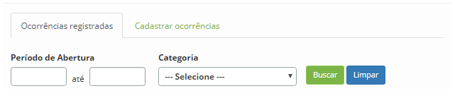
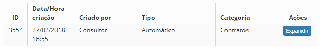
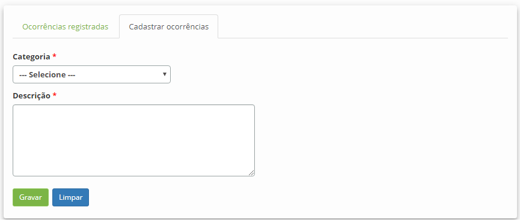

title: Auditoria de serviços
Description: Permite verificar o histórico do serviço para auditoria do mesmo.

# Auditoria de serviços

Esta funcionalidade permite verificar o histórico do serviço para auditoria do
mesmo. As orientações descritas neste “conhecimento” poderão ser seguidas para
verificar o histórico do Serviço de Negócio/TI e do Serviço de Apoio/Técnico.

Como acessar
------------

1.  Acesse a funcionalidade através da navegação no menu principal **Processos
    ITIL > Gerência de Portfólio e Catálogo > Gerenciamento de Portfólio
    e Catálogo**.

2.  Acesse o Portfólio de Serviços que deseja, clicando no botão *Avançar* do
    mesmo;

3.  Clique no botão *Avançar* do serviço para acessá-lo. Após isso, será
    apresentada a de **Informações do Serviço**;

4.  Clique em **Auditoria do Serviço**. Feito isso, será apresentada a tela de
    Auditoria do Serviço, onde se pode verificar o histórico de alterações do
    serviço para auditoria do mesmo e registrar as informações necessárias da
    auditoria realizada.

Pré-condições
-------------

1.  Ter o portfólio de serviços definido (ver conhecimento [Cadastro de
    portfólio de serviços][1]).

Filtros
-------

1.  Os seguintes filtros possibilitam ao usuário restringir a participação de
    itens na listagem padrão da funcionalidade, facilitando a localização dos
    itens desejados:

    -   Período de abertura;

    -   Categoria.

     

    **Figura 1 - Tela de pesquisa de auditoria de serviço**

Listagem de itens
-----------------

1.  Os seguintes campos cadastrais estão disponíveis ao usuário para facilitar a
    identificação dos itens desejados na listagem padrão da
    funcionalidade: ID, Data/hora criação, Criado por, Tipo e Categoria.

2.  Existe um botão de ação disponível ao usuário em relação a cada item da
    listagem: *Expandir*.

    

    **Figura 2 - Tela de auditoria do serviço**

    -  Caso tenha a necessidade de registrar os detalhes da auditoria realizada,
    clique na aba **Cadastrar Ocorrências**. Feito isso, será apresentada a tela
    de cadastro, conforme ilustrada na figura abaixo:

    
    
    **Figura 3 - Tela de cadastro de auditoria**

    -  **Categoria**: selecione a categoria do serviço, na qual foi feita a
    auditoria;

    -  **Descrição**: informe os detalhes da auditoria realizada.

1.  Após os dados informados, clique no botão *Gravar* para efetuar o registro.

Preenchimento dos campos cadastrais
---------------------------------

1.  Não se aplica.

[1]:/pt-br/citsmart-platform-7/processes/portfolio-and-catalog/register.html

!!! tip "About"

    <b>Product/Version:</b> CITSmart | 8.00 &nbsp;&nbsp;
    <b>Updated:</b>07/16/2019 – Anna Martins
