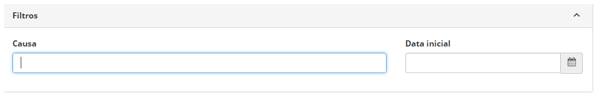
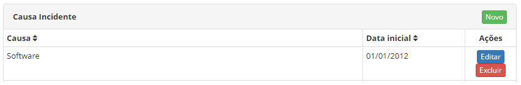
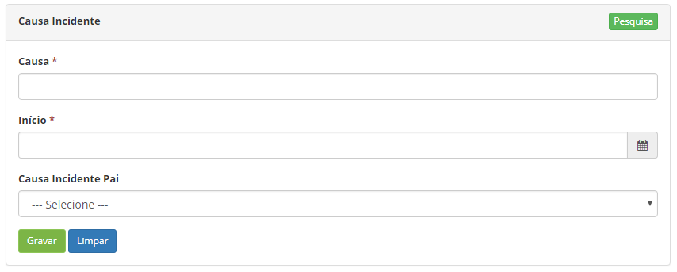

title: Cadastro e pesquisa de causa de incidentes
Description:Esta funcionalidade permite registrar e pesquisar as causas da ocorrência de
incidentes.

# Cadastro e pesquisa de causa de incidentes

Esta funcionalidade permite registrar e pesquisar as causas da ocorrência de
incidentes.

Como acessar
------------

1.  Acesse a funcionalidade de Causa de Incidentes através da navegação no menu
    principal **Processos ITIL > Gerência de Portfólio e
    Catálogo > Causa Incidentes**.

Pré-condições
-------------

1.  Não se aplica.

Filtros
-------

1.  Os seguintes filtros possibilitam ao usuário restringir a participação de
    itens na listagem padrão da funcionalidade, facilitando a localização dos
    itens desejados:

    -   Causa;

    -   Data inicial.

**Figura 1 - Tela de pesquisa de causa incidente**

Listagem de itens
-----------------

1.  Os seguintes campos cadastrais estão disponíveis ao usuário para facilitar a
    identificação dos itens desejados na listagem padrão da
    funcionalidade:** Causa **e** Data inicial.**

    

    **Figura 2 - Tela de causa de incidentes**

1.  Para realizar a busca de uma causa de incidentes, informe a descrição e/ou
    data inicial da mesma. Após isso, será exibido o registro conforme os dados
    informados;

2.  Existem botões de ação disponíveis ao usuário em relação a cada item da
    listagem, são eles: *Editar* e *Excluir*.

Preenchimento dos campos cadastrais
-----------------------------------

1.  Será apresentada a tela de **Causa de Incidentes**;

2.  Clique no botão *Novo*. Feito isso, será apresentada a tela de **Cadastro de
    Causa de Incidentes**, conforme ilustrada na figura a seguir:

    

    **Figura 3 - Tela de cadastro de causa de incidentes**

1.  Preencha os campos conforme orientações abaixo:

    -  **Causa**: informe a descrição da causa do incidente;

    -  **Data Início**: informe a data inicial do registro da causa de
        incidente;

    -  **Causa Incidente Pai**: selecione uma causa incidente superior, caso a
        causa de incidente que está sendo cadastrada faça parte de outra causa
        de incidente.

2.  Após os dados informados, clique no botão *Gravar* para efetuar o registro,
    onde a data, hora e usuário serão gravados automaticamente para uma futura
    auditoria.

!!! tip "About"

    <b>Product/Version:</b> CITSmart | 8.00 &nbsp;&nbsp;
    <b>Updated:</b>07/17/2019 – Anna Martins
