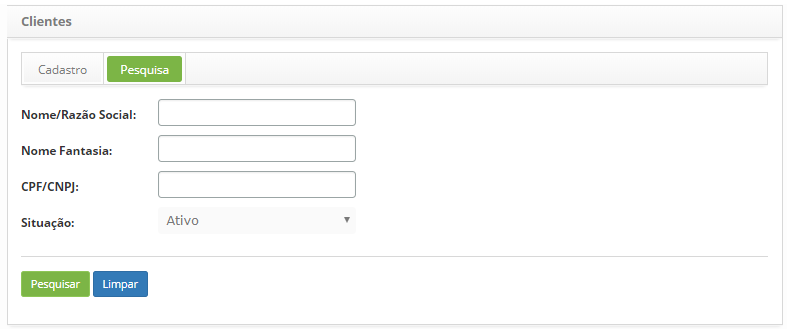
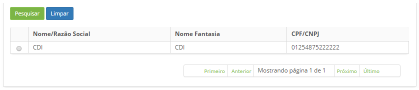
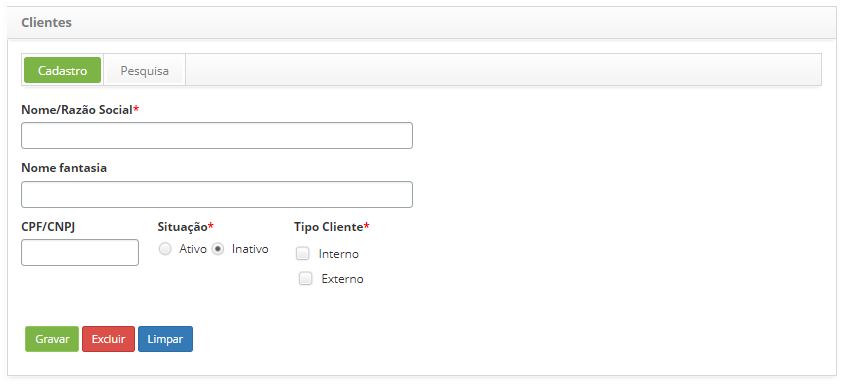

title: Cadastro e pesquisa de cliente
Description: Esta funcionalidade tem por objetivo cadastrar e realizar pesquisa por clientes

# Cadastro e pesquisa de cliente

O cliente é uma organização ou pessoa que solicita produtos e/ou serviços. Ele
pode ser interno e/ou externo à organização.

Esta funcionalidade tem por objetivo cadastrar e realizar pesquisa por clientes.

Como acessar
------------

1.  Acesse a funcionalidade de cliente através da navegação no menu
    principal **Processos ITIL > Gerência de Portfólio e Catálogo > Clientes**.

Pré-condições
-------------

1.  Não se aplica.

Filtros
-------

1.  Os seguintes filtros possibilitam ao usuário restringir a participação de
    itens na listagem padrão da funcionalidade, facilitando a localização dos
    itens desejados:

    -   Nome/Razão Social;

    -   Nome Fantasia;

    -   CPF/CNPJ;

    -   Situação.

1.  Na tela de **Clientes**, clique na aba **Pesquisa**, será apresentada a tela
    de **Pesquisa de Clientes**, conforme ilustrada na figura abaixo:

    

    **Figura 1 - Tela de pesquisa de cliente**

1.  Realize a pesquisa do cliente. Defina o filtro conforme sua necessidade;

    -   **Nome/Razão Social**: informe o nome/razão social do cliente;

    -   **Nome Fantasia**: informe o nome fantasia do cliente;

    -   **CPF/CNPJ**: informe o CPF/CNPJ do cliente;

    -   **Situação**: selecione a situação do cliente;

    -   Após o filtro definido, clique no botão *Pesquisar*. Feito isso, será
        exibido o registro conforme os dados informados.

    -   Caso deseje listar todos os registros de cliente, basta clicar
        diretamente no botão *Pesquisar*.

Listagem de itens
-----------------

1.  Os seguintes campos cadastrais estão disponíveis ao usuário para facilitar a
    identificação dos itens desejados na listagem padrão da
    funcionalidade: Nome/Razão Social, Nome Fantasia e CPF/CNPJ.

    

    **Figura 2 - Listagem de clientes**

1.  Após a pesquisa, selecione o registro desejado. Feito isso, será direcionado
    para a tela de cadastro exibindo o conteúdo referente ao registro
    selecionado;

2.  Para alterar os dados do registro de cliente, basta modificar as informações
    dos campos desejados e clicar no botão *Gravar* para que seja gravada a
    alteração realizada no registro, onde a data, hora e usuário serão gravados
    automaticamente para uma futura auditoria.

Preenchimento dos campos cadastrais
-----------------------------------

1.  Na tela de **Clientes**, clique na aba **Cadastro**, será apresentada a
    tela de **Cadastro de Cliente**, conforme ilustrada na figura abaixo:

    

    **Figura 3 - Tela de cadastro de cliente**

1.  Preencha os campos conforme orientações abaixo:

    -   **Nome/Razão Social**: caso o cliente seja uma pessoa física, informe o
        nome completo do mesmo, caso seja uma pessoa jurídica, informe o nome de
        registro da sua empresa;

    -   **Nome Fantasia**: informe o nome fantasia da empresa do cliente, se
        achar necessário;

    -   **CPF/CNPJ**: se o cliente for pessoa física, informe o CPF, se for
        pessoa jurídica, informe o CNPJ.

    -   **Situação**: selecione a situação do cliente na organização (ativo ou
        inativo);

    -   **Tipo Cliente**: selecione o tipo de cliente;

        -   **Interno**: é aquele que faz parte da mesma organização, como o
            diretor, consultor, gerente, dentre outros.

        -   **Externo**: é aquele que mantêm financeiramente a organização,
            adquirindo produtos ou serviços.

2.  Após informar os dados, clique no botão *Gravar* para efetuar o registro,
    onde a data, hora e usuário serão gravados automaticamente para uma futura
    auditoria;

!!! tip "About"

    <b>Product/Version:</b> CITSmart | 8.00 &nbsp;&nbsp;
    <b>Updated:</b>07/17/2019 – Anna Martins
