title: Configuração dos atributos do serviço
Description: As orientações descritas neste documento poderão ser seguidas
para configurar os atributos tanto do *Serviço de Negócio/TI* quanto do *Serviço
de Apoio/Técnico*.

# Configuração dos atributos do serviço

As orientações descritas neste documento poderão ser seguidas para
configurar os atributos tanto do *Serviço de Negócio/TI* quanto do *Serviço de
Apoio/Técnico*.

Pré-condições
------------

1.  Ter o portfólio com os serviços cadastrados (ver conhecimentos [Cadastro de
    portfólio de
    serviços](), [Cadastro
    de
    serviços]();

2.  Ter o grupo cadastrado (ver conhecimento [Cadastro e pesquisa de
    grupo]();

3.  Ter os itens de configuração cadastrados (ver conhecimento [Gerenciamento de
    itens de
    configuração]();

4.  Ter o calendário definido (ver conhecimento [Cadastro e pesquisa de
    calendário]();

5.  Ter o contrato cadastrado (ver conhecimento [Cadastro e pesquisa de
    contrato]();

6.  Ter um ciclo cadastrado (ver conhecimento [Cadastro e pesquisa de
    ciclos]().

Configurando os atributos do serviço
------------------------------------

### Como acessar

1.  Acesse o menu principal **Processos ITIL > Gerência de Portfólio e
    Catálogo > Gerenciamento de Portfólio e Catálogo**. Após isso, será
    apresentada a tela de Gerenciamento de Portfólio de Serviços;

2.  Acesse o Portfólio de Serviços que deseja, clicando no botão *Avançar* do
    mesmo;

3.  Clique no botão *Avançar* do serviço para acessá-lo.

### Filtros

1.  Não se aplica.

### Listagem de itens

1.  Não se aplica.

### Preenchimento dos campos cadastrais

1.  Será apresentada a tela de **Informações do Serviço**, onde poderá
    configurar os atributos, conforme ilustrada na figura abaixo:

    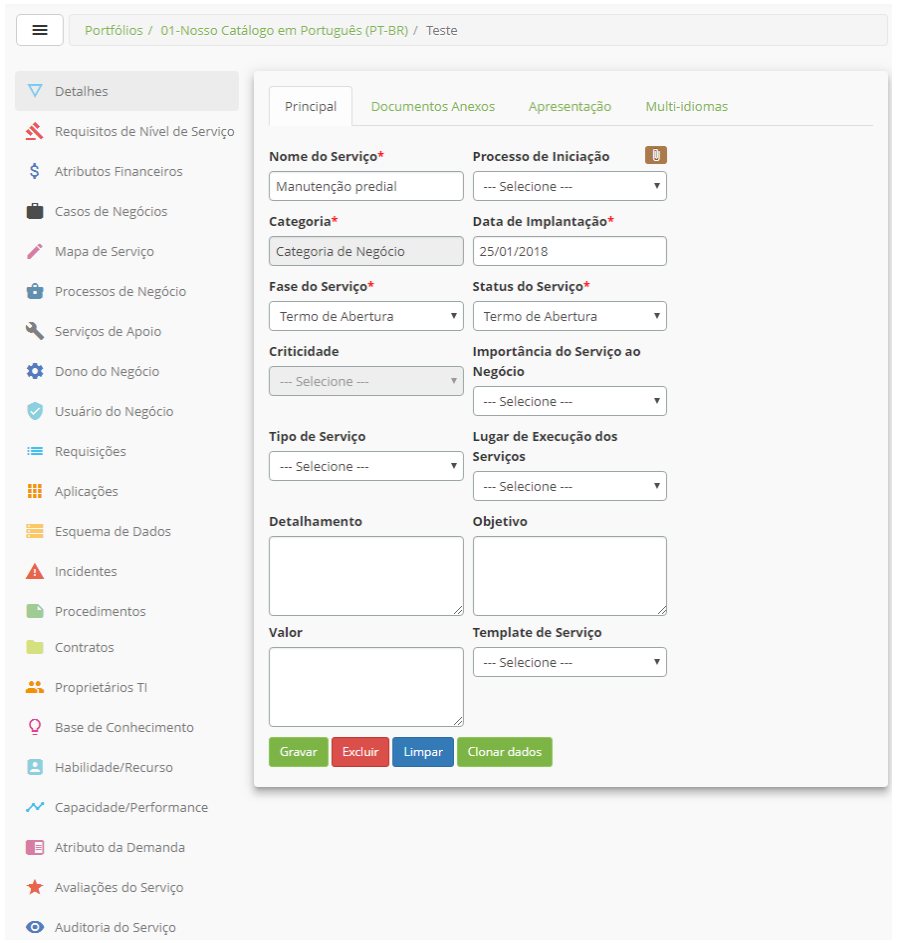

    **Figura 1 - Tela de informações do serviço**

    -   **Detalhes**: permite alterar/atualizar os dados do serviço;

    -   **Requisitos de Nível de Serviço**: permite registrar os requisitos de nível
    de serviço;

    -   **Atributos Financeiros**: permite registrar os atributos financeiros do
    serviço;

    -   **Casos de Negócios**: permite registrar o caso de negócio referente ao
    serviço. Esse caso de negócio é um resumo de todas as informações do
    serviço;

    -   **Mapa de Serviço**: permite definir o desenho do mapa de serviço
    relacionando os serviços de apoio e itens de configuração. Neste desenho é
    definido quais serviços de apoio serão utilizados para realização do serviço
    principal;

    -   **Processos de Negócio**: permite vincular os processos de negócio que são
    suportados pelo serviço;

    -   **Serviços de Apoio**: permite vincular os serviços de apoio/técnicos. Esses
    serviços apoiam, dão suporte, ao serviço principal;

    -   **Dono do Negócio**: permite vincular o dono do negócio ao serviço, o qual
    podem ser colaboradores ou grupos;

    -   **Usuário do Negócio**: permite vincular os usuários do negócio ao serviço;

    -   **Requisições**: permite registrar as atividades de requisição do serviço;

    -   **Aplicações**: permite vincular as aplicações que são utilizadas para
    execução do serviço;

    -   **Esquema de Dados**: permite registrar o esquema de dados referente ao
    serviço;

    -   **Incidentes**: permite registrar as atividades de incidente do serviço;

    -   **Procedimentos**:** **permite registrar os procedimentos referente ao
    serviço, que serão utilizados pelo gerenciamento de continuidade para
    disparar e controlar as atividades de restauração do serviço;

    -   **Contratos**: permite vincular os contratos que provê o serviço;

    -   **Proprietários de TI**: permite vincular os proprietários de serviços de TI
    ao serviço, os quais podem ser usuários ou grupos;

    -   **Base de Conhecimento**: permite vincular um conhecimento ao serviço. O
    conhecimento trata-se de uma informação do provedor de serviços para
    entregar o serviço;

    -   **Habilidade / Recurso**: permite vincular as habilidades/recursos ao
    serviço;

    -   **Capacidade / Performance**: permite vincular indicadores de capacidade /
    performance ao serviço;

    -   **Atributo da Demanda**: permite vincular atributos da demanda ao serviço;

    -   **Avaliações do Serviço**: permite gerenciar as avaliações do serviço que
    foram registradas via Smart Portal;

    -   **Auditoria do Serviço**: permite verificar o histórico do serviço para
    auditoria do mesmo.

Nos itens a seguir será abordado sobre "como" configurar os principais atributos
do serviço.

Definindo os requisitos de nível de serviço
-------------------------------------------

Os Requisitos de Nível de Serviço são definidos quando o serviço está na sua
fase inicial, com status de "Definição".

### Como acessar

1.  Na tela **Informações do Serviço**, clique em **Requisitos de Nível de
    Serviço**.

### Filtros

1.  Não se aplica.

### Listagem de itens

1.  Não se aplica.

### Preenchimento dos campos cadastrais

1.  Após o acesso a funcionalidade, será apresentada a tela **Cadastro de
    Requisitos de Níveis de Serviço**, conforme ilustrada na figura abaixo:

    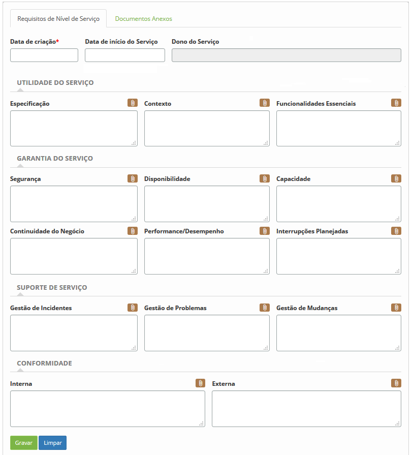

    **Figura 2 - Tela de cadastro de requisitos de níveis de serviço**

1.  Preencha os campos conforme orientações abaixo:

2.  Informe os dados gerais:

    -   **Data de criação**: informe a data de criação dos requisitos;

    -   **Data de início do Serviço**: informe a data de início do serviço;

    -   **Dono do Serviço**: informe o responsável pelo serviço.

3.  Informe os dados referente a utilidade do serviço:

    -   **Especificação**: descreva as especificações do serviço;

    -   **Contexto**: descreva o contexto do serviço;

    -   **Funcionalidades Essenciais**: descreva as funcionalidades essenciais
        do serviço.

4.  Informe os dados referente a garantia do serviço:

    -   **Segurança**: descreva a segurança do serviço;

    -   **Disponibilidade**: descreva a disponibilidade do serviço;

    -   **Capacidade**: descreva a capacidade do serviço;

    -   **Continuidade de Negócio**: descreva a continuidade de negócio do
        serviço;

    -   **Performance/Desempenho**: descreva o desempenho do serviço;

    -   **Interrupções Planejadas**: descreva as interrupções planejadas.

5.  Informe os dados referente ao suporte do serviço:

    -   **Gestão de Incidentes**: descreva sobre a gestão de incidentes
        referente ao serviço;

    -   **Gestão de Problemas**: descreva sobre a gestão de problemas referente
        ao serviço;

    -   **Gestão de Mudanças**: descreva sobre a gestão de mudanças referente ao
        serviço.

6.  Informe os dados da conformidade do serviço:

    -   **Interna**: descreva a conformidade do serviço interno;

    -   **Externa**: descreva sobre a conformidade do serviço externo.

7.  Caso queira anexar um arquivo, clique na aba **Documento Anexos**.

8.  Após o preenchimento dos campos com as informações necessárias, clique no
    botão *Gravar* para efetuar o registro de requisitos de nível de serviço.

Registrando os atributos financeiros
-----------------------------------

### Como acessar

1.  Clique em **Atributos Financeiros**.

### Filtros

1.  Não se aplica.

### Listagem de itens

1.  Não se aplica.

### Preenchimento dos campos cadastrais

1.  Após o acesso a funcionalidade, será apresentada a tela **Cadastro de
    Atributos Financeiros**, conforme ilustrada na figura abaixo:

    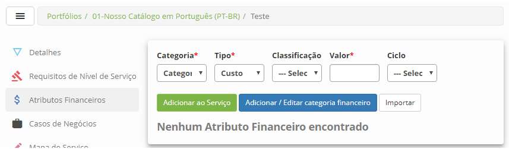

    **Figura 3 - Tela de cadastro de atributos financeiros**

1.  Preencha os campos conforme orientações abaixo:

    -   **Categoria**: informe a categoria do atributo financeiro. Caso não
        exista categoria registrada, clique no botão *Adicionar / Editar
        categoria financeiro* para registro de uma categoria;

    -   **Tipo**: informe o tipo de atributo financeiro: Custo ou Receita;

    -   **Classificação**: informe a classificação do atributo financeiro;

    -   **Valor**: informe o valor do serviço, levando em consideração o tipo de
        atributo financeiro informado.

2.  Após informar os dados, clique no botão *Adicionar ao Serviço*. O atributo
    financeiro será gravado e apresentado na tela.

3.  Caso queira importar os dados de atributos financeiros, clique no
    botão *Importar*. Feito isso, será exibida uma tela para anexar o arquivo de
    atributos financeiros. Nessa tela, são apresentados os modelos de arquivos
    para orientar na forma e ordem que os dados devem estar no arquivo.
    Portanto, antes de selecionar o arquivo, verifique se o mesmo está de acordo
    com o modelo, levando em consideração o formato (.xls, .xlsx, .xml ou .csv).
    Após a verificação, informe o arquivo e clique no botão *Enviar* para
    efetuar a importação.

4.  Para alterar os dados do atributo financeiro do serviço, clique em *Editar*,
    modifique os dados que desejar para efetuar a alteração, onde a data, hora e
    usuário serão gravados automaticamente para uma futura auditoria;

Definindo o caso de negócio
--------------------------

O caso de negócio é definido na fase inicial do serviço. Ele deve apresentar os
objetivos do negócio que devem ser atendidos pelo serviço. É com base neste caso
de negócio que realiza a aprovação ou não do serviço, ou seja, será feito uma
análise para aprovação, para verificar se será utilizado o serviço.

### Como acessar

1.  Clique em **Casos de Negócios**.

### Filtros

1.  Não se aplica.

### Listagem de itens

1.  Não se aplica.

### Preenchimento dos campos cadastrais

1.  Após o acesso a funcionalidade, será apresentada a tela **Cadastro de Caso
    de Negócio**, conforme ilustrada na figura abaixo:

    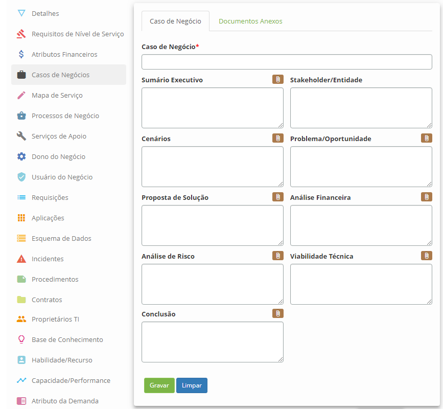

    **Figura 4 - Tela de cadastro de caso de negócio**

1.  Preencha os campos conforme orientações abaixo:

    -   **Caso de Negócio**: defina o nome do caso de negócio;

    -   **Sumário Executivo**: descreva a visão geral do caso de negócio do
        serviço;

    -   **Stakeholder/Entidade**: descreva as pessoas interessadas no serviço;

    -   **Cenários**: descreva os cenários do serviço;

    -   **Problema/Oportunidade**: descreva os problemas;

    -   **Proposta de Solução**: descreva a proposta de solução do serviço para
        o negócio;

    -   **Análise Financeira**: descreva as informações sobre a análise
        financeira;

    -   **Análise de Risco**: descreva os eventos principais que poderão impedir
        o sucesso da execução do serviço;

    -   **Viabilidade Técnica**: descreva a viabilidade técnica;

    -   **Conclusão**: descreva a conclusão;

    -   Após informar os dados e caso queira anexar um arquivo, clique na
        aba **Documento Anexos**.

Vinculando processo de negócio ao serviço
----------------------------------------

### Como acessar

1.  Clique em **Processos de Negócio**.

### Filtros

1.  O seguinte filtro possibilita ao usuário restringir a participação de itens
    na listagem padrão da funcionalidade, facilitando a localização dos itens
    desejados:

-   Nome do Processo de Negócio.

### Listagem de itens

1.  Os seguintes campos cadastrais estão disponíveis ao usuário para facilitar a
    identificação dos itens desejados na listagem padrão da
    funcionalidade: **ID**, **Nome do Processo de Negócio** e **Cliente**.

2.  Existem botões de ação disponíveis ao usuário em relação a cada item da
    listagem, são eles: *Visualizar* e *Excluir*.

    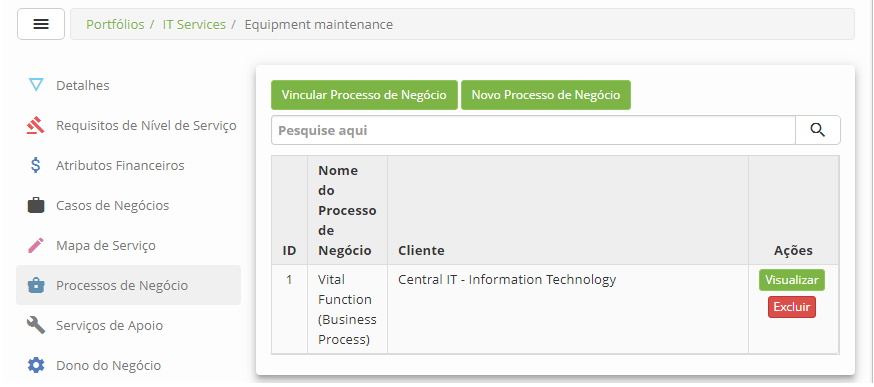

    **Figura 5 - Tela de vínculo do processo de negócio**

1.  Clique no botão *Vincular Processo de Negócio*. Feito isso, será exibida a
    tela para pesquisa de processo de negócio. Realize a pesquisa, selecione os
    processos de negócio que desejar e clique no botão *Enviar* para efetuar a
    operação.

2.  Caso não encontre o registro de processo de negócio e haja a necessidade de
    registrar um para vincular ao serviço, poderá registrá-lo a partir dessa
    tela, basta clicar no botão *Novo Processo de Negócio*.

3.  Após o vínculo do processo de negócio ao serviço, o mesmo será apresentado
    na tela de** **processos de negócio do serviço.

4.  Para visualizar os dados do processo de negócio, basta clicar no
    botão *Visualizar* do mesmo.

5.  Para excluir o vínculo do processo de negócio com o serviço, basta clicar no
    botão *Excluir* do mesmo.

### Preenchimento dos campos cadastrais

1.  Não se aplica.

Vinculando o dono do negócio ao serviço
---------------------------------------

### Como acessar

1.  Clique em **Dono do Negócio**.

### Filtros

1.  O seguinte filtro possibilita ao usuário restringir a participação de itens
    na listagem padrão da funcionalidade, facilitando a localização dos itens
    desejados:

-   Nome .

### Listagem de itens

1.  Os seguintes campos cadastrais estão disponíveis ao usuário para facilitar a
    identificação dos itens desejados na listagem padrão da
    funcionalidade: **ID**, **Nome, Tipo**.

2.  Existem botões de ação disponíveis ao usuário em relação a cada item da
    listagem, são eles: *Desvincular*.

    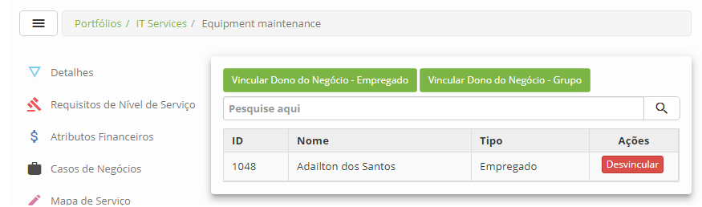

    **Figura 6 - Tela de vínculo de dono do negócio**

1.  Caso o "dono do negócio" seja um ou mais colaboradores, clique no
    botão *Vincular Dono do Negócio - Empregado* para vincular o(s)
    colaborador(es) ao serviço. Após isso, será exibida a tela para pesquisa de
    colaboradores. Realize a pesquisa, selecione o(s) colaborador(es) e clique
    no botão *Enviar* para efetuar o vínculo.

2.  Caso o "dono do negócio" seja um ou mais grupos, clique no botão *Vincular
    Grupos* para vincular o(s) grupo(s) ao serviço. Após isso, será exibida a
    tela para pesquisa de grupos. Realize a pesquisa, selecione o(s) grupo(s) e
    clique no botão *Enviar* para efetuar o vínculo.

3.  Para excluir o vínculo do dono do negócio com o serviço, basta clicar no
    botão *Desvincular* do mesmo.

### Preenchimento dos campos cadastrais

1.  Não se aplica.

Vinculando usuário do negócio ao serviço
--------------------------------------

### Como acessar

1.  Clique em **Usuário do Negócio**.

### Filtros

1.  O seguinte filtro possibilita ao usuário restringir a participação de itens
    na listagem padrão da funcionalidade, facilitando a localização dos itens
    desejados:

-   Nome.

### Listagem de itens

1.  Os seguintes campos cadastrais estão disponíveis ao usuário para facilitar a
    identificação dos itens desejados na listagem padrão da
    funcionalidade: **ID**, **Nome **e** Descrição**.

2.  Existem botões de ação disponíveis ao usuário em relação a cada item da
    listagem, são eles: *Desvincular*.

    

    **Figura 7 - Tela de vínculo de usuário do negócio**

1.  Clique no botão *Vincular usuário* para vincular o(s) usuário(s) ao serviço.
    Feito isso, será exibida a tela para pesquisa de usuários do sistema.
    Realize a pesquisa, selecione o(s) usuário(s) e clique no
    botão *Enviar* para efetuar o vínculo.

2.  Caso o "usuário do negócio" seja um ou mais grupos, clique no
    botão *Vincular grupo de usuário* para vincular o(s) grupo(s) ao serviço.
    Feito isso, será exibida a tela para pesquisa de grupos. Realize a pesquisa,
    selecione o(s) grupo(s) e clique no botão *Enviar*para efetuar o vínculo.

3.  Para excluir o vínculo do usuário do negócio com o serviço, basta clicar no
    botão *Desvincular* do mesmo.

### Preenchimento dos campos cadastrais

1.  Não se aplica.

Vinculando serviço de apoio / técnico
-------------------------------------

### Como acessar

1.  Clique em **Serviços de Apoio**.

### Filtros

1.  O seguinte filtro possibilita ao usuário restringir a participação de itens
    na listagem padrão da funcionalidade, facilitando a localização dos itens
    desejados:

-   Nome do Serviço.

### Listagem de itens

1.  Os seguintes campos cadastrais estão disponíveis ao usuário para facilitar a
    identificação dos itens desejados na listagem padrão da
    funcionalidade:** ID, Nome Serviço de Apoio, Fase **e** Status do Serviço.**

2.  Existem botões de ação disponíveis ao usuário em relação a cada item da
    listagem, são eles: *Editar* e* Desvincular*.

    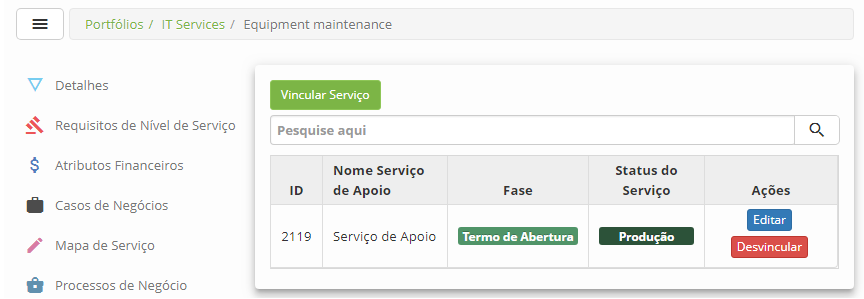

    **Figura 8 - Tela de vínculo de serviço de Apoio / Técnico**

1.  Clique no botão *Vincular Serviço* para vincular os serviços de apoio /
    técnico ao serviço principal. Feito isso, será exibida a tela para pesquisa
    de serviços. Realize a pesquisa, selecione os serviços de apoio / técnico e
    clique no botão *Enviar* para efetuar o vínculo com sucesso.

2.  Após o vínculo do serviço de apoio / técnico ao serviço, o mesmo será
    apresentado na tela de serviços de apoio do serviço;

3.  Para excluir o vínculo do serviço de apoio / técnico com o serviço, basta
    clicar no botão *Desvincular* do mesmo.

### Preenchimento dos campos cadastrais

1.  Não se aplica.

Criando o desenho do mapa de serviço
-----------------------------------

1.  O desenho do mapa de serviço é criado quando o serviço for aprovado e
    estiver no estágio de "Desenho". Neste desenho é definido o que o serviço
    precisa para que possa atender as necessidades do negócio.

    !!! info "IMPORTANTE"

        Para criar o desenho do mapa de serviço, os Serviços de Apoio/Técnico já
        devem estar definidos.

### Como acessar

1.  Clique em **Desenho do Mapa de Serviço**. Após isso, será apresentada a
    respectiva tela para criação do desenho do mapa de serviço, conforme
    ilustrada na figura abaixo:

    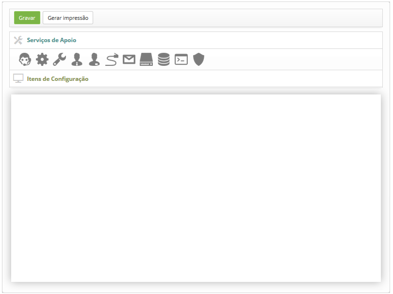

    **Figura 9 - Tela de criação do desenho do mapa de serviços**

1.  Desenhe o mapa do serviço, utilizando os ícones de **Serviços de
    Apoio** para representar os serviços de apoio/técnico e os ícones de **Itens
    de Configuração** para representar os ICs. Siga as orientações abaixo:

    -   Escolha um ícone para representar o serviço de apoio/técnico, clique e
    arraste o mesmo para área de desenho. Após isso, será exibida a tela para
    informar os dados do serviço de apoio/técnico que será representado pelo
    ícone escolhido, conforme ilustrada na figura abaixo:

    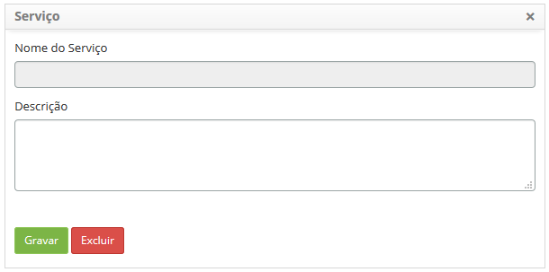

    **Figura 10 - Tela de registro de informações do serviço de Apoio / Técnico**

    -   Informe o serviço de apoio/técnico, sua descrição e clique no
    botão *Gravar* para efetuar a operação;

    -   Clique em **Itens de Configuração** e escolha um ícone para representar o
    IC, clique e arraste o mesmo para área de desenho. Após isso, será exibida a
    tela para informar os dados do IC que será representado pelo ícone
    escolhido, conforme ilustrada na figura abaixo:

    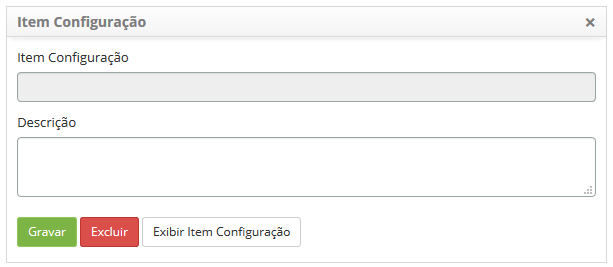

    **Figura 11 - Tela de segistro de informações do Item de Configuração**

    -   Informe o item de configuração e sua descrição. Após isso, caso queira
    verificar as informações do IC, clique no botão *Exibir Item Configuração*;

    -   Após informar todos os dados do IC, clique no botão *Gravar* para efetuar o
    registro das informações do IC representado pelo ícone;

    -   Para alterar as informações do serviço de apoio/técnico ou do IC
    representado por um ícone, basta clicar duas vezes sobre o ícone do mesmo,
    editar as informações e clicar em *Gravar* para efetuar a alteração.

    -   Para excluir o serviço de apoio/técnico ou o IC representado por um ícone,
    basta clicar duas vezes sobre o ícone do mesmo e clicar no botão *Excluir*.

1.  Após criar o desenho do mapa de serviço, clique no botão *Gravar*,
    localizado na parte superior da tela, para efetuar o registro.

2.  Clique no botão *Gerar impressão* para gerar a impressão do desenho, caso
    seja necessário.

    !!! Abstract "SAIBA MAIS"

        Para cadastrar cada atividade de um serviço (requisição ou incidente),
        utilize o conhecimento [Cadastro da atividade de
        serviço]()

Vinculando aplicações ao serviço
-------------------------------

### Como acessar

1.  Clique em de **Aplicações**.

### Filtros

1.  O seguinte filtro possibilita ao usuário restringir a participação de itens
    na listagem padrão da funcionalidade, facilitando a localização dos itens
    desejados:

-   Nome.

### Listagem de itens

1.  Os seguintes campos cadastrais estão disponíveis ao usuário para facilitar a
    identificação dos itens desejados na listagem padrão da
    funcionalidade:** ID, Nome e Nome Responsável.**

2.  Existem botões de ação disponíveis ao usuário em relação a cada item da
    listagem, são eles: *Editar* e *Desvincular*.

    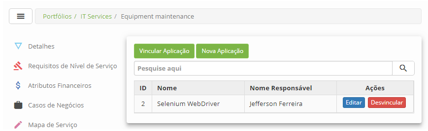

    **Figura 12 - Tela de vínculo de aplicações ao serviço**

1.  Clique no botão *Vincular Aplicação*. Feito isso, será exibida a tela para
    pesquisa da aplicação. Realize a pesquisa e selecione a aplicação para
    realizar o vínculo.

2.  Caso não encontre o registro da aplicação e haja a necessidade de registrar
    uma aplicação para vincular ao serviço, poderá registrá-la a partir dessa
    tela, basta clicar no botão *Nova Aplicação*.

3.  Para alterar os dados da aplicação vinculada ao serviço, clique no
    botão *Editar* da mesma.

4.  Para excluir o vínculo da aplicação com o serviço, basta clicar no
    botão *Desvincular*** **do mesmo.

### Preenchimento dos campos cadastrais

1.  Não se aplica.

Registrando esquema de dados do serviço
--------------------------------------

### Como acessar

1.  Clique em **Esquema de Dados**. Após isso, será apresentada a tela
    de **Cadastro de Esquema de Dados do Serviço**, conforme ilustrada na figura
    abaixo:

    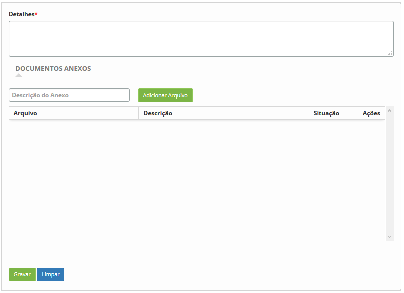

    **Figura 13 - Tela de cadastro de esquema de dados do serviço**

1.  Descreva os detalhes do esquema de dados do serviço;

2.  Adicione o desenho do esquema de dados referente ao serviço:

    -   Informe a descrição do anexo, clique no botão *Adicionar Arquivo* e
        selecione o arquivo desejado. Feito isso, o mesmo será adicionado no
        registro de esquema de dados.

3.  Após os dados registrados, clique no botão *Gravar* para efetuar a operação.

### Filtros

1.  Não se aplica.

### Listagem de itens

1.  Não se aplica.

### Preenchimento de campos cadastrais

1.  Não se aplica.

Vinculando contratos ao serviço
------------------------------

### Como acessar

1.  Clique em **Contratos**.

Filtros

1.  O seguinte filtro possibilita ao usuário restringir a participação de itens
    na listagem padrão da funcionalidade, facilitando a localização dos itens
    desejados:

-   Número do contrato.

### Listagem de itens

1.  Os seguintes campos cadastrais estão disponíveis ao usuário para facilitar a
    identificação dos itens desejados na listagem padrão da
    funcionalidade:** ID, Descrição do Contrato, Cliente **e** Fornecedor.**

2.  Existem botões de ação disponíveis ao usuário em relação a cada item da
    listagem, são eles: *Editar*, *Desvincular* e *Avançar*.

    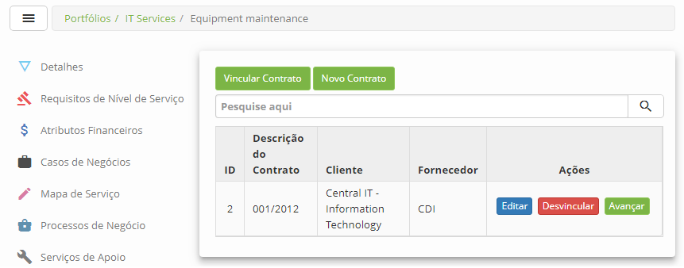

    **Figura 14 - Tela de vínculo de contrato ao serviço**

1.  Clique no botão *Vincular Contrato*. Feito isso, será exibida a tela para
    pesquisa do contrato;

   !!! info "IMPORTANTE"

       Serão disponibilizados somente os contratos do tipo “contrato” para
       vincular ao serviço de negócio/TI e somente os contratos do tipo “contrato
       de apoio” e “acordo de nível operacional” para vincular ao serviço de
       apoio/técnico.

1.  Realize a pesquisa do contrato. Após a isso, basta selecionar o mesmo para
    efetuar o vínculo com sucesso.

2.  Caso não encontre o registro do contrato e haja a necessidade de registrar
    um contrato para vincular ao serviço, poderá registrá-lo a partir dessa
    tela, basta clicar no botão *Nova Contrato*.

3.  Para alterar os dados do contrato, clique no botão *Editar* do mesmo,
    modifique os dados que desejar e clique em *Gravar* para efetuar a
    alteração, onde a data, hora e usuário serão gravados automaticamente para
    uma futura auditoria.

4.  Para excluir o vínculo do contrato com o serviço, basta clicar no
    botão *Desvincular*** **do mesmo.

5.  Para configurar os atributos do contrato do serviço, clique no
    botão *Avançar* do mesmo.

### Preenchimento dos campos cadastrais

1.  Não se aplica.

Vinculando proprietários de ti ao serviço
----------------------------------------

### Como acessar

1.  Clique em **Proprietários de TI**.

### Filtros

1.  Os seguintes filtros possibilitam ao usuário restringir a participação de
    itens na listagem padrão da funcionalidade, facilitando a localização dos
    itens desejados:

-   Nome;

-   CPF;

-   Situação.

### Listagem de itens

1.  Os seguintes campos cadastrais estão disponíveis ao usuário para facilitar a
    identificação dos itens desejados na listagem padrão da
    funcionalidade:** ID, Nome e Tipo**.

2.  Existem botões de ação disponíveis ao usuário em relação a cada item da
    listagem, são eles: *Desvincular* .

    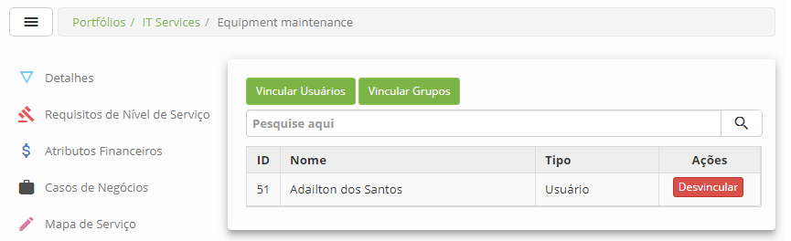

    **Figura 15 - Tela de vínculo de proprietários de TI ao serviço**

1.  Caso o "proprietário de TI" seja um usuário, clique no botão *Vincular
    Usuários*. Feito isso, será exibida a tela para pesquisa de usuários.
    Realize a pesquisa, selecione os usuários e clique no botão *Enviar* para
    efetuar o vínculo.

2.  Caso o "proprietário de TI" seja um grupo, clique no botão *Vincular
    Grupos*. Feito isso, será exibida a tela para pesquisa de grupos. Realize a
    pesquisa, selecione os grupos e clique no botão *Enviar* para efetuar o
    vínculo.

3.  Para excluir o vínculo do usuário ou grupo com o serviço, basta clicar no
    botão *Desvincular*** **do mesmo.

### Preenchimento dos campos cadastrais

1.  Não se aplica.

Vinculando conhecimento ao serviço
---------------------------------

### Como acessar

1.  Clique em **Base de Conhecimento**.

### Filtros

1.  Os seguintes filtros possibilitam ao usuário restringir a participação de
    itens na listagem padrão da funcionalidade, facilitando a localização dos
    itens desejados:

-   Título;

### Listagem de itens

1.  Os seguintes campos cadastrais estão disponíveis ao usuário para facilitar a
    identificação dos itens desejados na listagem padrão da
    funcionalidade:** ID **e** Título.**

2.  Existem botões de ação disponíveis ao usuário em relação a cada item da
    listagem, são eles: *Desvincular*.

    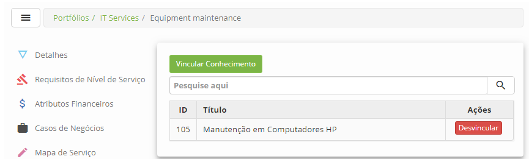

    **Figura 16 - Tela de vínculo de conhecimento ao serviço**

    !!! note "NOTA"

        Se o serviço estiver disponibilizado no Smart Portal, os conhecimentos
        relacionados ao mesmo também serão exibidos no Smart Portal.

1.  Clique no botão *Vincular Conhecimento*. Feito isso, será exibida a tela
    para pesquisa de conhecimentos. Realize a pesquisa, selecione os
    conhecimentos desejados e clique botão *Enviar* para efetuar o vínculo.

2.  Para excluir o vínculo do conhecimento com o serviço, basta clicar no
    botão *Desvincular*** **do mesmo.

### Preenchimento dos campos cadastrais

1.  Não se aplica.

Vinculando habilidades ao serviço
--------------------------------

### Como acessar

1.  Clique em **Habilidade/Recurso**.

### Filtros

1.  O seguinte filtro possibilita ao usuário restringir a participação de itens
    na listagem padrão da funcionalidade, facilitando a localização dos itens
    desejados:

-   Nome da Habilidade.

### Listagem de itens

1.  Os seguintes campos cadastrais estão disponíveis ao usuário para facilitar a
    identificação dos itens desejados na listagem padrão da
    funcionalidade: ID e Nome da Habilidade.

2.  Existem botões de ação disponíveis ao usuário em relação a cada item da
    listagem, são eles: *Editar* e *Desvincular*.

    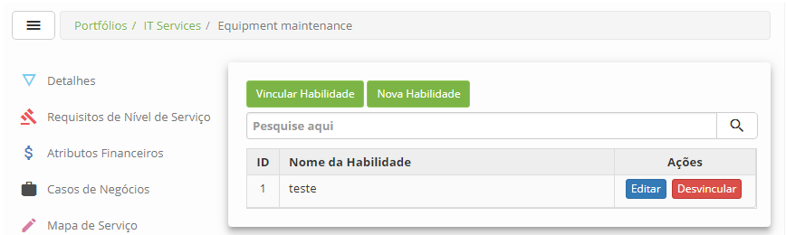

    **Figura 17 - Tela de vínculo de habilidade ao serviço**

1.  Clique no botão *Vincular Habilidade*. Feito isso, será exibida a tela de
    pesquisa de habilidade. Realize a pesquisa, selecione as habilidades
    desejadas e clique no botão *Enviar* para efetuar o vínculo.

2.  Caso não encontre o registro da habilidade e haja a necessidade de registrar
    uma habilidade para vincular ao serviço, poderá registrá-la a partir dessa
    tela, basta clicar no botão *Nova Habilidade* e proceder com o preenchimento
    dos campos.

3.  Para excluir o vínculo da habilidade com o serviço, basta clicar no
    botão *Desvincular*** **do registro da mesma.

### Preenchimento dos campos cadastrais

1.  Não se aplica.

Registrando procedimento do serviço
----------------------------------

O procedimento será utilizado no momento de ocorrência de desastres relacionado
ao serviço.

### Como acessar

1.  Clique em **Procedimentos**.

### Filtros

1.  O seguinte filtro possibilita ao usuário restringir a participação de itens
    na listagem padrão da funcionalidade, facilitando a localização dos itens
    desejados:

-   Nome do Serviço.

### Listagem de itens

1.  Os seguintes campos cadastrais estão disponíveis ao usuário para facilitar a
    identificação dos itens desejados na listagem padrão da
    funcionalidade:** ID **e** Nome Serviço de Procedimento.**

2.  Existem botões de ação disponíveis ao usuário em relação a cada item da
    listagem, são eles: *Editar* e *Desvincular*.

    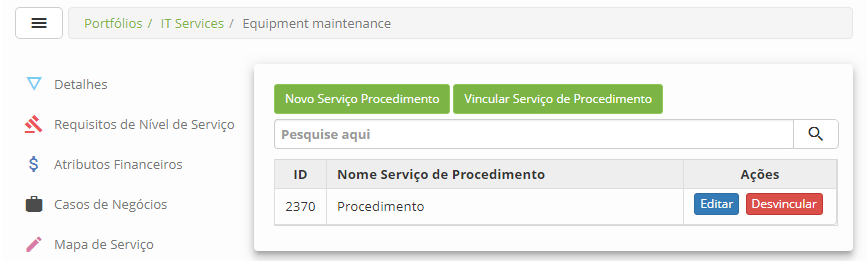

    **Figura 18 - Tela de procedimento do serviço**

### Preenchimento dos campos cadastrais

1.  Clique no botão *Novo Serviço de Procedimento*. Feito isso, será apresentada
    a tela de Cadastro de Procedimento, conforme ilustrada na figura abaixo:

    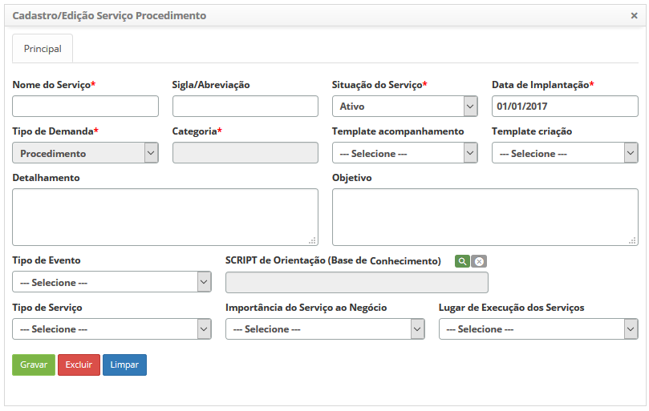

    **Figura 19 - Tela de cadastro de procedimento do serviço**

1.  Preencha os campos conforme orientações abaixo:

    -   **Nome do Serviço**: defina o nome do procedimento;

    -   **Sigla/Abreviação**: informe a sigla ou abreviação que representará da
        atividade de procedimento;

    -   **Situação do Serviço**: selecione a situação do procedimento;

    -   **Data de Implantação**: informe a data da implantação do procedimento;

    -   **Tipo de Demanda**: não é necessário o preenchimento deste campo, pois
        o mesmo já vem preenchido automaticamente com o tipo "Procedimento";

    -   **Categoria**: informe a categoria do procedimento;

    -   **Template acompanhamento**: selecione, caso exista, o template de
        acompanhamento do procedimento;

    -   **Template criação**: selecione, caso exista, o template do
        procedimento;

    -   **Detalhamento**: descreva os detalhes sobre como o procedimento deverá
        ser executado;

    -   **Objetivo**: descreva o objetivo do procedimento;

    -   **Tipo de Evento**: selecione o tipo de evento para o procedimento;

    -   **SCRIPT de Orientação (Base de Conhecimento)**: informe, caso exista, o
        script de apoio armazenado na Base de Conhecimento para orientação na
        execução do procedimento;

    -   **Tipo de Serviço**: selecione o tipo de serviço;

    -   **Importância do Serviço ao Negócio**: selecione a importância do
        procedimento ao negócio;

    -   **Lugar de Execução dos Serviços**: selecione o local de execução do
        procedimento.

2.  Após informar os dados necessários do procedimento, clique no
    botão *Gravar* para efetuar o registro. Feito isso, o procedimento será
    gravado e vinculado ao serviço.

3.  Para alterar os dados do procedimento, clique no botão *Editar* do mesmo,
    modifique os dados que desejar e clique em *Gravar*para efetuar a alteração,
    onde a data, hora e usuário serão gravados automaticamente para uma futura
    auditoria.

4.  Para excluir o procedimento do serviço, clique no botão *Editar* do mesmo e
    logo em seguida clique no botão *Excluir*.

5.  Para desvincular a procedimento do serviço, basta clicar no
    botão *Desvincular*** **do mesmo.

6.  Para vincular novamente um procedimento ao serviço, clique no
    botão *Vincular Serviço de Procedimento*. Feito isso, será exibida a tela
    para pesquisa dos procedimentos que foram desvinculados do serviço. Realize
    a pesquisa e selecione o procedimento para realizar o vínculo com sucesso.

Administração das avaliações do serviço
--------------------------------------

### Como acessar

1.  Clique em **Avaliações do Serviço**.

### Filtros

1.  O seguinte filtro possibilita ao usuário restringir a participação de itens
    na listagem padrão da funcionalidade, facilitando a localização dos itens
    desejados:

-   Data.

### Listagem de itens

1.  Os seguintes campos cadastrais estão disponíveis ao usuário para facilitar a
    identificação dos itens desejados na listagem padrão da
    funcionalidade:** ID, Usuário, Nota Avaliação, Comentário,
    Aprovado **e** Data Criação.**

2.  Existem botões de ação disponíveis ao usuário em relação a cada item da
    listagem, são eles: *Excluir* e *Aprovar Avaliação*.

    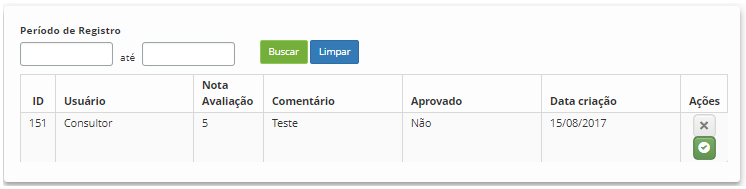

    **Figura 20 - Tela de administração de avaliações**

1.  Informe o período do registro da avaliação do serviço e clique no
    botão *Buscar*. Após isso, serão listadas as avaliações (nota e comentário)
    do serviço.

2.  Para aprovar a avaliação do serviço, basta clicar no ícone  da mesma.

### Preenchimento dos campos cadastrais

1.  Não se aplica.

!!! tip "About"

    <b>Product/Version:</b> CITSmart | 8.00 &nbsp;&nbsp;
    <b>Updated:</b>07/17/2019 – Anna Martins
