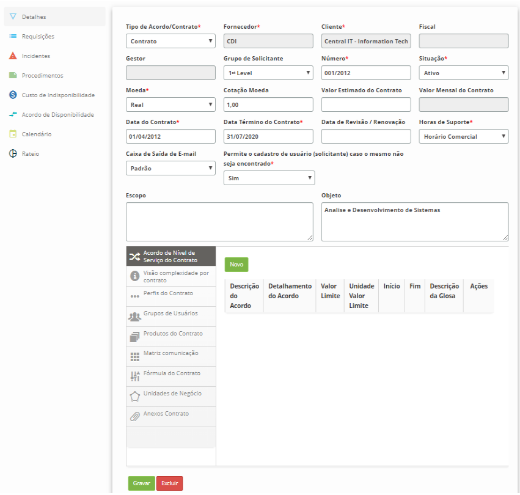
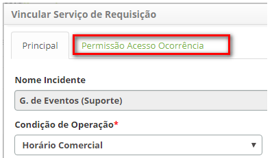

title: Configuração dos atributos do contrato do serviço
Description: As orientações devem ser seguidas para configurar os atributos
tanto do *Contrato do Serviço de Negócio/TI* quanto do *Contrato do Serviço de
Apoio/Técnico*.

# Configuração dos atributos do contrato do serviço

As orientações devem ser seguidas para configurar os atributos tanto
do *Contrato do Serviço de Negócio/TI* quanto do *Contrato do Serviço de
Apoio/Técnico*.

Pré-condições
-------------

1.  Ter permissão de acesso às funcionalidades de Gerenciamento de Portfólio e
    Catálogo (ver conhecimento [Permissão de Acesso do Gerenciamento de
    Portfólio]();

2.  Ter o portfólio com os serviços cadastrados (ver conhecimentos [Cadastro de
    Portfólio de
    Serviços](), [Cadastro
    de
    Serviços]();

3.  Ter o contrato vinculado ao serviço (ver conhecimento [Configuração dos
    Atributos do
    Serviço]();

4.  Ter o fornecedor cadastrado (ver conhecimento [Cadastro e Pesquisa de
    Fornecedor]();

5.  Ter o cliente cadastrado (ver conhecimento [Cadastro e Pesquisa de
    Cliente]();

6.  Ter a moeda cadastrada (ver conhecimento [Cadastro e Pesquisa de
    Moeda]();

7.  Ter a condição de operação cadastrada (ver conhecimento [Cadastro e Pesquisa
    de Condição de
    Operação]();

8.  Ter o calendário definido (ver conhecimento [Cadastro e Pesquisa de
    Calendário]();

9.  Ter o tempo de atendimento de serviços definido (ver conhecimento [Cadastro
    e Pesquisa de Tempo de
    Atendimento]();

10. Ter modelos de e-mails definidos (ver conhecimento [Cadastro e Pesquisa de
    Configuração de Modelo de
    E-mail]();

11. Ter o fluxo de trabalho definido (ver conhecimento [Manutenção de Fluxo de
    Trabalho]();

12. Ter definidas as pesquisas (ver conhecimento [Cadastro e pesquisa de
    Pesquisa de
    Satisfação]().

Configurando os atributos do contrato
------------------------------------

### Como acessar

1.  Acesse a funcionalidade através da navegação no menu principal Processos
    ITIL > Gerência de Portfólio e Catálogo > Gerenciamento de Portfólio e
    Catálogo.

2.  Acesse o menu principal. Após isso, será apresentada a tela de Gerenciamento
    de Portfólio de Serviços;

3.  Acesse o Portfólio de Serviços que deseja, clicando no botão *Avançar* do
    mesmo;

4.  Clique no botão *Avançar* do serviço para acessá-lo. Após isso, será
    apresentada a tela de **Informações do Serviço**;

5.  Clique em **Contratos** e logo em seguida clique no botão *Avançar* do
    contrato do serviço para acessá-lo.

-   Nos itens a seguir será abordado sobre "como" configurar os atributos do
    contrato.

### Filtros

1.  Não se aplica.

Listagem de itens

1.  Não se aplica.

### Preenchimento de campos cadastrais

1.  Executado as orientações contidas em Como Acessar, será apresentada a tela
    de **Informações do Contrato**, onde poderá realizar as configurações
    necessárias, conforme ilustrada na figura abaixo:

    

    **Figura 1 - Tela de informações do contrato**

-   **Detalhes**: permite verificar e/ou atualizar os dados do contrato;

-   **Requisições**: permite vincular as atividades de requisição do serviço ao
    contrato;

-   **Incidentes**: permite vincular as atividades de incidente do serviço ao
    contrato;

-   **Procedimentos**: permite vincular os procedimentos do serviço ao contrato;

-   **Custo de Indisponibilidade**: permite registrar o valor da hora da
    indisponibilidade dos serviços do contrato;

-   **Acordo de Disponibilidade**: permite vincular um acordo de nível de
    serviço do tipo "disponibilidade" ao contrato;

-   **Calendário**: permite vincular um calendário ao contrato.

-   **Rateio**: permite informar um percentual de rateio para um determinado
    serviço.

Vinculando atividades de requisição ao contrato
---------------------------------------------

### Como acessar

1.  Na tela Informações do Contrato, clique na guia **Requisições** e após isso,
    será apresentada uma tela onde permite vincular a atividade de requisição ao
    contrato.

### Pré-condições

1.  Para realizar o vínculo das atividades de requisição ao contrato, as mesmas
    já devem estar registradas e vinculadas ao serviço.

### Filtros

1.  O seguinte filtro possibilita ao usuário restringir a participação de itens
    na listagem padrão da funcionalidade, facilitando a localização dos itens
    desejados:

-   Nome Serviço de Requisição

### Listagem de itens

1.  Os seguintes campos cadastrais estão disponíveis ao usuário para facilitar a
    identificação dos itens desejados na listagem padrão da
    funcionalidade: ID e Nome Serviço de Requisição.

2.  Existem botões de ação disponíveis ao usuário em relação a cada item da
    listagem, são eles: *Editar* e *Excluir*.

    

    **Figura 2 - Tela de vínculo de atividade de requisição ao contrato**

### Preenchimento dos campos cadastrais

1.  Clique no botão *Vincular Serviço de Requisição* (segundo a figura
    anterior). Será exibida a tela para realizar o vínculo da atividade de
    requisição, conforme ilustrada na figura abaixo:

    

    **Figura 3 - Tela de registro do vínculo da atividade de requisição ao
    contrato**

1.  Preencha os campos conforme orientações abaixo:

    - **Condição de Operação**: selecione o período de disponibilidade da operação
    da(s) atividade(s) de requisição. Exemplo:

       -  **24 x 7**: 24 horas por dia, 7 dias por semana, ou seja, serviço disponível
    o tempo todo, sem interrupção;

       -  **Horário Comercial: **disponível de segunda-feira à sexta-feira de 8:00 às
    18:00.

    -  **Data de Início**: informe a data inicial da atividade de requisição no
    contrato;

    -  **Data Fim**: o preenchimento deste campo pode ser feito no momento do
    cadastro, informando uma data futura para inativação da(s) atividade(s) de
    requisição no contrato ou somente quando for inativar a(s) atividade(s) de
    requisição;

    -  **Observação**: descreva as possíveis observações referentes à(s)
    atividade(s) de requisição no contrato;

    -  **Restrições e Pressupostos**: informe as possíveis restrições e
    pressupostos para a execução da(s) atividades(s) de requisição no contrato;

    -  **Objetivo**: informe o objetivo do(s) serviço(s) de requisição no contrato;

    -  **Descrição do Processo**: descreva o processo da(s) atividades(s) de
    requisição no contrato;

    -  **Link do Processo**: informe o link do desenho do processo da(s)
    atividades(s) de requisição, caso exista;

    -  **Área requisitante**: informe quem poderá solicitar as(s) atividade(s) de
    requisição;

    -  **Modelo de E-mail Abertura**: selecione o modelo de e-mail de abertura de
    requisição para envio de notificação quando registrar as solicitações
    referente à(s) atividade(s) de requisição;

    -  **Modelo de E-mail Finalização**: selecione o modelo de e-mail de
    finalização de solicitações para envio de notificação quando finalizar as
    solicitações referente à(s) atividade(s) de requisição;

    -  **Modelo de E-mail Demais Ações**: selecione o modelo de e-mail para envio
    de notificação nas demais ações realizadas nas solicitações referente à(s)
    atividade(s) de requisição;

    -  **Grupo Escalação 1º Nível**: selecione o grupo de 1º nível para escalação
    do atendimento da(s) atividade(s) de requisição;

    -  **Grupo Executor**: defina o grupo executor da(s) atividade(s) de
    requisição, caso não informe-o, será considerado o grupo definido no
    parâmetro "ID Grupo Nível 1";

    -  **Grupo Aprovador**: defina o grupo aprovador das solicitações da(s)
    atividade(s) de requisição;

    -  **Pesquisa de Satisfação**: selecione a pesquisa desejada, caso contrário a
    pesquisa padrão do produto estará sempre disponível;

    -  **Calendário**: selecione o calendário de trabalho para a(s) atividade(s) de
    requisição.

    -  **Tempo de Atendimento**: informe o tempo de atendimento das) atividade(s)
    de requisição;

    -  **Custo do Serviço**: informe o valor da(s) atividade(s) de requisição;

    -  **Expandir tela de solicitação de serviço**: caso queira a tela de
    solicitação do serviço de requisição seja ampliada, marque a opção "sim";

    -  **Reiniciar SLA na reabertura**: defina se o tempo de atendimento da(s)
    atividade(s) será reiniciado quando realizar a reabertura da(s)
    solicitação(ões) da(s) mesma(s);

    -  **Aplicar permissões de acesso nas ocorrências?**: defina se as ocorrências
    das requisições/incidentes serão mostradas para grupos específicos de
    usuários ou se todos os usuários visualizam todas as ocorrências. Caso o
    campo

    -  **Aplicar permissões de acesso nas ocorrências?**:** **tenha sua opção "Sim"
    selecionada, uma nova aba aparece ao lado da aba Principal:

    

    **Figura 4 - Aba de permissões**

    -  Na guia Principal, ao clicar na nova aba uma lista de Grupos que já tiveram
    sua permissão configurada:

    

    **Figura 5 - Lista de grupos vinculados com permissão configurada**

    -  Ao clicar no **Adicionar **(segundo a figura anterior) um painel com todas
    as categorias de ocorrência surge para permitir ao Administrador marcar
    aquelas que devem ser liberadas para o Grupo selecionado:

    

    **Figura 6 - Painel de seleção das categorias de ocorrências e do grupo
     desejado**

   !!! note "NOTA"

       Esta configuração não muda em nada o aspecto das demais funcionalidades do
       sistema, apenas restringe alguns registros de serem visualizados por
       usuários que não estão nos grupos liberados para a categoria de ocorrência.

   -  Adicione a(s) atividade(s) de requisição:

       -  Na seção **Requisição**, são apresentadas as atividades de requisição do
       serviço, deixe somente as que irão serem vinculadas ao contrato;

   -  Caso tenha removido uma atividade de requisição e queira vincular ela no
    contrato, clique no botão *Adicionar*. Será exibida uma janela para pesquisa
    de atividades de requisição do serviço. Realize a pesquisa, selecione a
    atividade de requisição e clique no botão *Enviar* para vincular a atividade
    ao contrato.

   -  Adicione o fluxo de trabalho da(s) atividade(s) de requisição:

       -  Na seção **Fluxo Serviço**, clique no botão *Adicionar* (segundo a figura
         anterior). Será exibida uma tela para informar o fluxo da(s) atividade(s) de
         requisição, conforme ilustrada na figura abaixo:

   

   **Figura 7 - Fluxo de trabalho**

   -  Selecione o fluxo que a(s) atividade(s) deverá(ão) seguir e clique no
    botão *Gravar* para efetuar a operação.

1.  Após informar os dados necessários, clique no botão *Gravar* para efetuar a
    operação. Feito isso, a(s) atividade(s) de requisição será(ão) vinculada(s)
    ao contrato.

2.  Para alterar os dados do vínculo da atividade de requisição com o contrato,
    clique no botão *Editar* do registro do mesmo.

3.  Para excluir o vínculo da atividade de requisição com o contrato, basta
    clicar no botão *Excluir* do registro do mesmo.

Vinculando atividades de incidente ao contrato
----------------------------------

### Como acessar

1.  Na guia **Contratos**, clique em *Avançar* após isso, clique na
    aba **Incidentes**, será apresentada a tela onde permite vincular a(s)
    atividade(s) de incidente ao contrato.

### Pré-condições

1.  Para realizar o vínculo das atividades de incidente ao contrato, as mesmas
    já devem estar registradas e vinculadas ao serviço.

### Filtros

1.  O seguinte filtro possibilita ao usuário restringir a participação de itens
    na listagem padrão da funcionalidade, facilitando a localização dos itens
    desejados:

-   Nome Incidente.

### Listagem de itens

1.  Os seguintes campos cadastrais estão disponíveis ao usuário para facilitar a
    identificação dos itens desejados na listagem padrão da
    funcionalidade: ID e Nome Incidente.

2.  Existem botões de ação disponíveis ao usuário em relação a cada item da
    listagem, são eles: *Editar* e *Excluir*.

    

    **Figura 8 - Tela de vínculo de atividade de incidente ao contrato**

### Preenchimento dos campos cadastrais

1.  Clique no botão *Vincular Incidente* (segundo a figura anterior). Será
    exibida a tela para realizar o vínculo da atividade de incidente, conforme
    ilustrada na figura abaixo:

    

    **Figura 9 - Tela de registro do vínculo da atividade de incidente ao contrato**

1.  Preencha os campos conforme orientações descritas no item anterior
    "Vinculando Atividades de Requisição ao Contrato";

2.  Após informar os dados necessários, clique no botão *Gravar* para efetuar a
    operação. Feito isso, a(s) atividade(s) de incidente será(ão) vinculada(s)
    ao contrato.

Vinculando procedimento do serviço ao contrato
-------------------------------

### Como acessar

1.  Na guia **Contratos**, clique em *Avançar* após isso, clique na
    guia **Procedimentos** e após isso, será apresentada a tela onde permite
    vincular o procedimento ao contrato.

#### Pré-condições

1.  Para realizar o vínculo dos procedimentos ao contrato, os mesmos já devem
    estar registrados e vinculados ao serviço.

### Filtros

1.  O seguinte filtro possibilita ao usuário restringir a participação de itens
    na listagem padrão da funcionalidade, facilitando a localização dos itens
    desejados:

-   Nome Serviço de Procedimento.

### Listagem de itens

1.  Os seguintes campos cadastrais estão disponíveis ao usuário para facilitar a
    identificação dos itens desejados na listagem padrão
    dafuncionalidade: ID e Nome Serviço de Procedimento.

2.  Existem botões de ação disponíveis ao usuário em relação a cada item da
    listagem, são eles: *Editar* e *Excluir*.

    

    **Figura 10 - Tela de vínculo de procedimento ao contrato**

### Preenchimento dos campos cadastrais

1.  Clique no botão *Vincular Procedimento* (segundo a figura anterior). Será
    exibida a tela para realizar o vínculo do procedimento, conforme ilustrada
    na figura abaixo:

    

    **Figura 11 - Tela de registro do vínculo do procedimento ao contrato**

1.  Preencha os campos conforme orientações descritas no item "Vinculando
    Atividades de Requisição ao Contrato";

2.  Após informar os dados necessários, clique no botão *Gravar* para efetuar a
    operação. Feito isso, o(s) procedimento(s) será(ão) vinculado(s) ao
    contrato.

Registrando custo de indisponibilidade
------------------------------------

### Como acessar

1.  Na tela Informações do Contrato, clique em **Custo de Indisponibilidade** e
    após isso, será apresentada uma tela onde permite registar o custo da
    disponibilidade do contrato.

    

    **Figura 12 - Tela de registro de valor da hora de indisponibilidade**

1.  Informe o valor da hora da indisponibilidade dos serviços do contrato e
    clique no botão *Gravar* para efetuar o registro.

### Filtros

1.  Não se aplica.

### Listagem de itens

1.  Não se aplica.

### Preenchimento dos campos cadastrais

1.  Não se aplica.

Vinculando acordo de disponibilidade ao contrato
--------------------------------------

### Como acessar

1.  Na tela Informações do Contrato, clique em **Acordo de Disponibilidade** e
    após isso, será apresentada a tela onde permite vincular o acordo de nível
    de serviço do tipo "disponibilidade" ao contrato.

### Filtros

1.  O seguinte filtro possibilita ao usuário restringir a participação de itens
    na listagem padrão da funcionalidade, facilitando a localização dos itens
    desejados:

-   Título SLA.

### Listagem de itens

1.  Os seguintes campos cadastrais estão disponíveis ao usuário para facilitar a
    identificação dos itens desejados na listagem padrão da
    funcionalidade: ID, Título SLA, Índice de Disponibilidade, Data
    Início e Data Fim.

2.  Existem botões de ação disponíveis ao usuário em relação a cada item da
    listagem, são eles: *Desativar*.

3.  Clique no botão *Vincular Acordo de Disponibilidade*. Feito isso, será
    exibida a tela de pesquisa de acordo de nível de serviço do tipo
    "disponibilidade". Realize a pesquisa e selecione o acordo de
    disponibilidade desejado para efetuar a operação. Feito isso, o acordo será
    vinculado ao contrato.

    

    **Figura 13 - Tela de acordo de disponibilidade**

1.  Para desvincular o acordo de disponibilidade, basta clicar no
    botão *Desativar* do mesmo.

### Preenchimento dos campos cadastrais

1.  Não se aplica.

Vinculando calendário ao contrato
---------------------

### Como acessar

1.  Na tela Informações do Contrato, clique em **Calendário** e após isso, será
    apresentada a tela onde permite vincular o calendário ao contrato.

### Filtros

1.  O seguinte filtro possibilita ao usuário restringir a participação de itens
    na listagem padrão da funcionalidade, facilitando a localização dos itens
    desejados:

-   Nome.

### Listagem de itens

1.  Os seguintes campos cadastrais estão disponíveis ao usuário para facilitar a
    identificação dos itens desejados na listagem padrão da
    funcionalidade: ID, Nome, Data Início e Data Fim;

2.  Existem botões de ação disponíveis ao usuário em relação a cada item da
    listagem, são eles: *Desativar;*

3.  Clique no botão *Vincular Calendário*. Feito isso, será exibida a tela de
    pesquisa de calendário. Realize a pesquisa, selecione o calendário desejado
    e clique no botão *Adicionar* para efetuar a operação. Feito isso, o
    calendário será vinculado ao contrato;

    

    **Figura 14 - Tela de vínculo de calendário ao contrato**

1.  Para desvincular o calendário, basta clicar no botão *Desativar* do mesmo.

### Preenchimento dos campos cadastrais

1.  Não se aplica.

Vinculando rateio ao contrato
---------------------------

*Rateio é o percentual que aquele contrato paga sobre o Serviço de Negócio
contratado*

### Como acessar

1.  Na tela Informações do Contrato, clique na aba **Rateio **e após isso, será
    apresentada a tela onde permite vincular o rateio ao contrato.

### Pré-condições

1.  É necessário permitir o acesso a opção rateio (ver conhecimento [Permissão
    de acesso do gerenciamento de
    portfólio]().

### Filtros

1.  Não se aplica.

### Listagem de itens

1.  Os seguintes campos cadastrais estão disponíveis ao usuário para facilitar a
    identificação dos itens desejados na listagem padrão da
    funcionalidade: Percentual e Ciclo;

2.  Existem botões de ação disponíveis ao usuário em relação a cada item da
    listagem, são eles: *Editar* e *Excluir*;

    

    **Figura 15 - Tela de vínculo de rateio**

### Preenchimento dos campos cadastrais

1.  Clique no botão em *Adicionar rateio* (conforme a figura anterior). Feito
    isso, será exibida a tela de cadastro do rateio, conforme ilustrado na
    figura abaixo:

    

    **Figura 16 - Tela de cadastro de rateio**

1.  Preencha os campos conforme orientações abaixo:

    -  **Percentual**: informe um percentual de 1 a 100%.

    !!! note "NOTA"

        O percentual deve ser acima de 0%.

    -  **Ciclo**: descreva o ciclo vinculado ao rateio.

    !!! note "NOTA"

        Não é permitido rateios com percentuais diferentes para o mesmo ciclo no
        mesmo serviço/negócio/contrato.

        Não é permitido cadastros ou alterações de rateios cujos ciclos já tenham
        se encerrado.

1.  Clique no botão *Gravar* para efetuar a operação

2.  Para alterar os dados do vínculo do rateio (já cadastrado) com o contrato,
    clique no botão *Editar* do registro do mesmo.

    !!! info "IMPORTANTE"

        Ao editar, é possível alterar os campos Percentual e Ciclo, porém este
        percentual deve ser acima de 0%.

1.  Para excluir o vínculo do rateio com o contrato, basta clicar no
    botão *Excluir* do registro do mesmo.

!!! note "NOTA"

    Não é possível excluir um rateio cujo ciclo tenha serviços encerrados
    com as configurações cadastradas.

!!! tip "About"

    <b>Product/Version:</b> CITSmart | 8.00 &nbsp;&nbsp;
    <b>Updated:</b>07/17/2019 – Anna Martins
