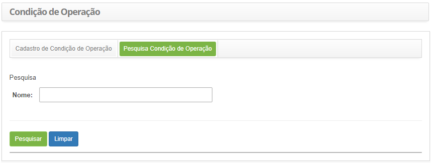
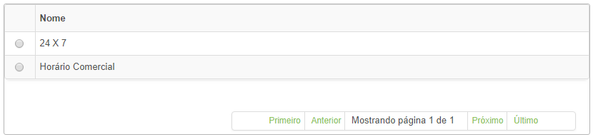
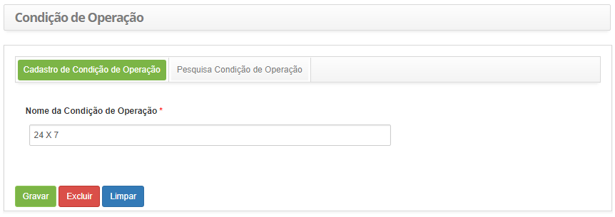

title: Cadastro e pesquisa de condição de operação
Description: Esta funcionalidade tem o objetivo de registrar e pesquisar a disponibilidade da operação de serviços.

# Cadastro e pesquisa de condição de operação

Esta funcionalidade tem o objetivo de registrar e pesquisar a disponibilidade da
operação de serviços.

Como acessar
------------

1.  Acesse a funcionalidade de Condição de Operação através da navegação no menu
    principal **Processos ITIL > Gerência de Portfólio e
    Catálogo > Condição de Operação**.

Pré-condições
-------------

1.  Não se aplica.

Filtros
-------

1.  O seguinte filtro possibilita ao usuário restringir a participação de itens
    na listagem padrão da funcionalidade, facilitando a localização dos itens
    desejados:

    -   Nome

2.  Na tela Condição de operação, clique na guia **Pesquisa Condição de
    Operação**.

    

    **Figura 1 - Tela de pesquisa de condição de operação**

3.  Realize a pesquisa de condição de operação;

    -  Informe a descrição da condição de operação que deseja pesquisar e
        clique no botão *Pesquisar*. Após isso, será exibido o registro conforme
        o nome informado.

    -  Caso deseje listar todos as condições de operação, basta clicar
        diretamente no botão *Pesquisar*.

Listagem de itens
-----------------

1.  O seguinte campo cadastral está disponível ao usuário para facilitar a
    identificação dos itens desejados na listagem padrão da
    funcionalidade: **Nome**.

    

    **Figura 2 -Listagem de condição de operação**

2.  Após a pesquisa, selecione o registro desejado. Feito isso, será direcionado
    para a tela de cadastro exibindo o conteúdo referente ao registro
    selecionado;

Preenchimento dos campos cadastrais
-----------------------------------

1.  Será apresentada a tela de Condição de Operação, conforme abaixo:

    

    **Figura 3 - Tela de cadastro de condição de operação**

2.  Informe a descrição da condição de operação dos serviços. Ex.: 24 x 7 ou
    Horário Comercial.

3.  Clique no botão *Gravar* para efetuar o registro, onde a data, hora e
    usuário serão gravados automaticamente para uma futura auditoria.

!!! tip "About"

    <b>Product/Version:</b> CITSmart | 8.00 &nbsp;&nbsp;
    <b>Updated:</b>07/17/2019 – Anna Martins
