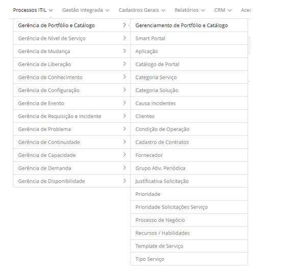

title:  Módulo Gerenciamento de Portfólio e Catálogo
Description: O processo de Gerenciamento de Portfólio de Serviço é responsável por gerenciar o portfólio de serviços. 
# Módulo Gerenciamento de Portfólio e Catálogo

Objetivo do módulo
---------------------

*Gerenciamento de portfólio de serviço*

O processo de Gerenciamento de Portfólio de Serviço é responsável por gerenciar o portfólio de serviços durante todo o ciclo de vida
de um serviço, focando no valor que os serviços entregam ao negócio.

O Portfólio é a representação de todos os serviços e seus status. O comando do mesmo é um método dinâmico para administrar os
investimentos em gerenciamento de serviços por toda a organização e dirigir esses investimentos para gerar valor.

*Gerenciamento de catálogo de serviços*

O Gerenciamento de Catálogo de Serviços tem por objetivo manter os serviços prestados aos clientes de forma integrada com todas as
atividades do gerenciamento de serviços e prover aos clientes uma visão de quais serviços o provedor de serviços oferece.

O Catálogo de Serviço é um subconjunto do portfólio, listando todos os serviços de TI em produção, incluindo os disponíveis para
liberação. É a única parte do Portfólio publicada para os clientes usada para apoiar a venda e entrega dos serviços de TI e incluir
informações sobre os entregáveis, preços e pontos de contato.

Onde estão suas funcionalidades
---------------------------------

Acesse a funcionalidade através da navegação no menu principal **Processos ITIL > Gerência de Portfólio e Catálogo**.

**Figura 1 - Menu do módulo Gerência de Portfólio e Catálogo**

Principal funcionalidade (em destaque)
----------------------------------------

Na seção "Veja também" é possível acessar a(s) funcionalidade(s) principal(is) deste módulo, desta forma se pode obter um
conhecimento mais detalhado.

Veja também
--------------

- [Cadastro de portfólio de serviço](/pt-br/citsmart-platform-7/processes/portfolio-and-catalog/register.html)

!!! tip "About"

    <b>Product/Version:</b> CITSmart | 7.00 &nbsp;&nbsp;
    <b>Updated:</b>07/29/2019 - Larissa Lourenço
