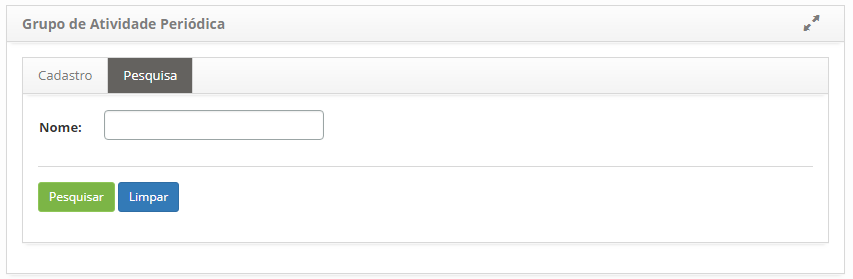
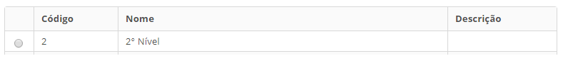
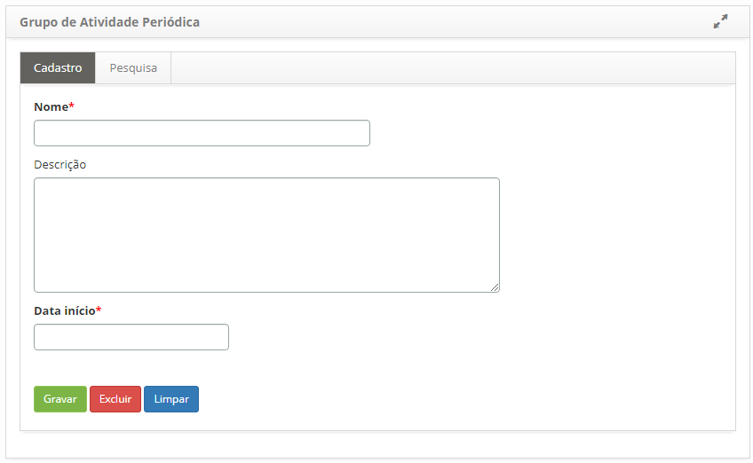

title: Cadastro e pesquisa de grupo de atividade periódica
Description: Esta funcionalidade tem o objetivo de registrar os grupos de atividades periódica, os quais são responsáveis por executar as atividades periódicas.

# Cadastro e pesquisa de grupo de atividade periódica

Esta funcionalidade tem o objetivo de registrar os grupos de atividades
periódica, os quais são responsáveis por executar as atividades periódicas.

Como acessar
------------

1.  Acesse a funcionalidade de Grupo de Atividade Periódica através da navegação
    no menu principal **Processos ITIL > Gerência de Portfólio e
    Catálogo > Grupo Ativ. Periódica**.

Pré-condições
-------------

1.  Não se aplica.

Filtros
-------

1.  O seguinte filtro possibilita ao usuário restringir a participação de itens
    na listagem padrão da funcionalidade, facilitando a localização dos itens
    desejados, conforme ilustrado na figura abaixo:

    -   Nome.

2.  Na tela de Grupo de Atividade Periódica, clique na guia
    de **Pesquisa**. Será apresentada a tela de pesquisa, conforme ilustrada na
    figura abaixo:

    

    **Figura 1 - Tela de pesquisa de grupo de atividade periódica**

3.  Realize a pesquisa do grupo de atividade periódica:

    - Informe o nome do grupo de atividade periódica e clique no
    botão *Pesquisar*. Após isso, será exibido o registro conforme o nome
    informado.

    - Caso deseje visualizar todos os registros de grupo de atividade
      periódica, basta clicar diretamente no botão *Pesquisar*.

Listagem de itens
-----------------

1.  Os seguintes campos cadastrais estão disponíveis ao usuário para facilitar a
    identificação dos itens desejados na listagem padrão da
    funcionalidade: Código, Nome e Descrição, conforme a figura
    abaixo:

    

    **Figura 2 - Tela de itens**

2.  Após a pesquisa, selecione o registro desejado. Feito isso, será direcionado
    para a tela de cadastro exibindo o conteúdo referente ao registro
    selecionado.

3.  Para alterar os dados do registro do grupo de atividade periódica, basta
    modificar as informações desejadas e clicar no botão *Gravar* para que seja
    gravada a alteração realizada no registro, onde a data, hora e usuário serão
    gravados automaticamente para uma futura auditoria;

Preenchimento dos campos cadastrais
-----------------------------------

1.  Acesse a funcionalidade, após isso, será apresentada a tela de **Cadastro de
    Grupo de Atividade Periódica**, conforme ilustrada na figura abaixo:

    

    **Figura 3 - Tela de cadastro de grupo de atividade periódica**

2.  Preencha os campos conforme orientações abaixo:

    -   **Nome**: informe o nome do grupo de atividade periódica;

    -   **Descrição**: informe a descrição do grupo de atividade periódica;

    -   **Data Início**: informe a data inicial do grupo de atividade periódica.

3.  Clique no botão *Gravar Dados* para efetuar o registro, onde a data, hora e
    usuário serão gravados automaticamente para uma futura auditoria.

!!! tip "About"

    <b>Product/Version:</b> CITSmart | 8.00 &nbsp;&nbsp;
    <b>Updated:</b>07/17/2019 – Anna Martins
