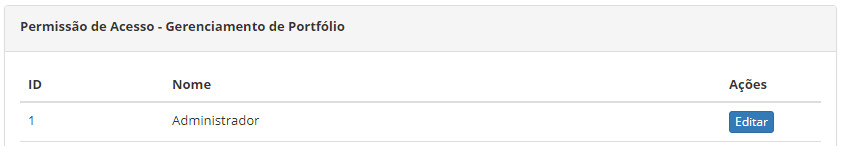
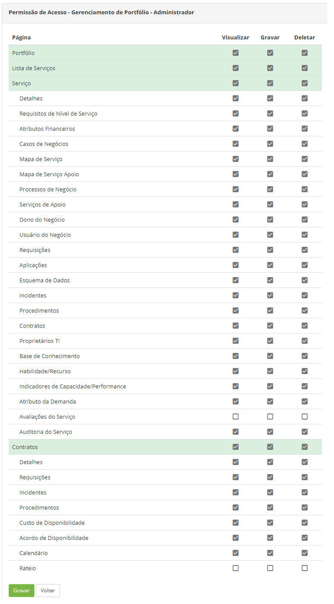

title:  Permissão de acesso do gerenciamento de portfólio
Description: Definir quem terá acesso às funcionalidades do Gerenciamento de Portfólio de Serviços. 
# Permissão de acesso do gerenciamento de portfólio

A ITIL recomenda que um produto ITSM seja capaz de atribuir níveis de responsabilidades específicos para um Gerente de Portfólio ou
outros, com base nesta recomendação, o CITSmart adota esta forma diferenciada de controle de permissões, por módulo. Vale a pena
ressaltar que a funcionalidade ‘Perfil de Acesso’ continua existindo e controlando todos os tipos de acessos sem separação por módulos
para que o administrador do produto possa intervir com mais propriedade, sempre que necessário.

A funcionalidade de Gerência de Portfólio permite definir quem terá acesso às funcionalidades do Gerenciamento de Portfólio de 
Serviços e qual tipo de acesso é permitido (visualização, gravação e/ou exclusão).

Como acessar
--------------

1. Acesse a funcionalidade de permissão de acesso do Gerenciamento de Portfólio através da navegação no menu principal 
**Acesso e Permissão > Gerência de Portfólio**.

Pré-condições
---------------

1. Ter o perfil de acesso cadastrado (ver conhecimento [Cadastro e pesquisa de perfil de acesso][1]).

Filtros
---------

1. Não se aplica.

Listagem de itens
-------------------

1. Os seguintes campos cadastrais estão disponíveis ao usuário para facilitar a identificação dos itens desejados na listagem padrão
da funcionalidade: **ID** e **Nome**;

2. Existe um botão de ação disponível ao usuário em relação a cada item da listagem, é ele: "Editar";

3. Será apresentada a tela para definição da **Permissão de Acesso** às funcionalidades do **Gerenciamento de Portfólio**, na qual 
exibe os **Perfis de Acesso** já registrados no sistema. A figura a seguir ilustra essa tela:

    
    
    **Figura 1 - Tela de permissão de acesso - Gerenciamento de portfólio**
    
4. Clique no botão "Editar" do Perfil de Acesso para o qual irá definir o tipo de acesso ao Gerenciamento de Portfólio. Feito isso, 
serão apresentadas as funcionalidades do Gerenciamento de Portfólio.

Preenchimento dos campos cadastrais
--------------------------------------

1. Para cada funcionalidade do Gerenciamento de Portfólio, selecione as ações (visualizar, gravar e/ou deletar) que o perfil poderá 
realizar:

    
    
    **Figura 2 - Definição do tipo de acesso**
    
    - **Visualizar**: o usuário com este perfil poderá fazer consultas e visualizar os dados;
    - **Gravar**: o usuário com este perfil poderá fazer o “Pesquisar” e ainda incluir e alterar os dados;
    - **Deletar**: o usuário com este perfil poderá fazer o “Gravar” e ainda excluir os dados do sistema.
    
    !!! warning "ATENÇÃO"
    
        Ao determinar o tipo de perfil de acesso, marcando/desmarcando um checkbox, todos os checkboxs subordinados a este na 
        estrutura são igualmente marcados/desmarcados em cascata.
        
    !!! info "IMPORTANTE"
    
        Os perfis de acesso ficarão desabilitados (os checkbox de todos os perfis de acessos pré-existentes ficarão desmarcados), 
        por default, quando for criadas novas funcionalidades, exigindo, portanto, que o administrador explicitamente habilite 
        esta para os perfis que desejar, tornando-a disponível para os perfis pretendidos.
        
2. Após definição da permissão de acesso, clique no botão "Gravar" para efetuar o registro, onde a data, hora e usuário serão 
gravados automaticamente para uma futura auditoria.

!!! info "IMPORTANTE"

    As exclusões executadas no produto são exclusões lógicas (e não físicas), portanto em casos extremos há como recuperar algo 
    excluído, porém isso exigirá apoio técnico de um analista/consultor.
    
!!! tip "About"

    <b>Product/Version:</b> CITSmart | 7.00 &nbsp;&nbsp;
    <b>Updated:</b>08/05/2019 - Larissa Lourenço

[1]: /pt-br/citsmart-platform-7/initial-settings/access-settings/profile/user-profile.html

