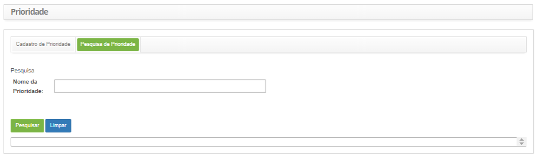

title: Cadastro e pesquisa de prioridade
Description: Esta funcionalidade permite definir a prioridade a qual será usada
para identificar a importância do serviço e identificar os tempos requeridos
para que ações adequadas sejam tomadas.

# Cadastro e pesquisa de prioridade

Esta funcionalidade permite definir a prioridade a qual será usada para
identificar a importância do serviço e identificar os tempos requeridos para que
ações adequadas sejam tomadas.

A prioridade deve ser de 1 a 5, sendo que o 1 é a prioridade mais alta e 5 é a
mais baixa.

Como acessar
-----------

1.  Acesse a funcionalidade de Prioridade através da navegação no menu
    principal **Processos ITIL > Gerência de Portfólio e Catálogo > Prioridade**.

Pré-condições
------------

1.  Não se aplica.

Filtros
------

1.  O seguinte filtro possibilita ao usuário restringir a participação de itens
    na listagem padrão da funcionalidade, facilitando a localização dos itens
    desejados, conforme ilustrado na figura abaixo:

    -   Nome da Prioridade.

1.  Na tela de **Prioridade**, clique na aba Pesquisa de Prioridade, conforme a
    figura abaixo:

    

    **Figura 1 - Tela de pesquisa de prioridade**

1.  Realize a pesquisa de prioridade;

2.  Informe o nome da prioridade que deseja pesquisar e clique no
    botão *Pesquisar*. Após isso, será exibido o registro conforme o nome
    informado;

3.  Caso deseje listar todos os registros de prioridade, basta clicar
    diretamente no botão *Pesquisar*;

Listagem de itens
----------------

1.  Os seguintes campos cadastrais estão disponíveis ao usuário para facilitar a
    identificação dos itens desejados na listagem padrão da
    funcionalidade: Nome da Prioridade e Grupo da Prioridade.

    

    **Figura 2 - Tela de itens**

1.  Após a pesquisa, selecione o registro desejado. Feito isso, será direcionado
    para a tela de cadastro exibindo o conteúdo referente ao registro
    selecionado.

Preenchimento dos campos cadastrais
-----------------------------------

1.  Após o acesso a funcionalidade, será apresentada a tela de **Cadastro de
    Prioridade**, conforme ilustrada na figura abaixo:

     

    **Figura 3 - Tela de cadastro de prioridade**

1.  Preencha os campos conforme orientações abaixo:

    -  **Nome de Prioridade**: informe a identificação da prioridade, por
        exemplo: 1;

    -  **Grupo da Prioridade**: selecione o grupo da prioridade a qual a
        prioridade pertencerá;

2.  Clique no botão *Gravar* para efetuar o registro, onde a data, hora e
    usuário serão gravados automaticamente para uma futura auditoria.

!!! tip "About"

    <b>Product/Version:</b> CITSmart | 8.00 &nbsp;&nbsp;
    <b>Updated:</b>07/17/2019 – Anna Martins
