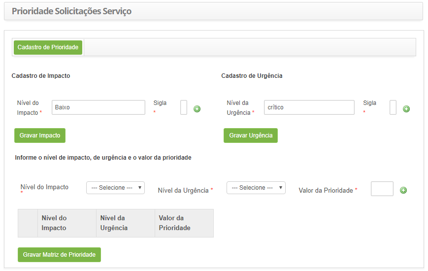
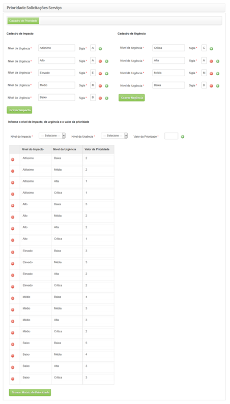

title: Cadastro de prioridade de solicitações de serviço
Description: Permite definir a matriz de prioridade para calcular o tempo de
atendimento (SLA) da solicitação de serviço dinamicamente.

# Cadastro de prioridade de solicitações de serviço

A funcionalidade de prioridade de solicitações de serviço permite definir a
matriz de prioridade para calcular o tempo de atendimento (SLA) da solicitação
de serviço dinamicamente. A prioridade será usada para identificar a importância
relativa da solicitação de serviço e para identificar os tempos requeridos para
que ações adequadas sejam tomadas.

Como acessar
------------

1.  Acesse a funcionalidade de Prioridade de Solicitação de Serviço** **através
    da navegação no menu principal **Processos ITIL > Gerência de Portfólio e
    Catálogo > Prioridade Solicitações Serviço**.

Pré-condições
-------------

1.  Configure o parâmetro abaixo (ver conhecimento [Regras de parametrização -
    Ticket]():

-   Parâmetro 104: valor S.

Filtros
-------

1.  Não se aplica.

Listagem de itens
-----------------

1.  Não se aplica.

Preenchimento dos campos cadastrais
-----------------------------------

1.  Será apresentada a tela de Prioridade de Solicitações de Serviço, conforme
    ilustrada na figura abaixo:

    

    **Figura 1 - Tela de cadastro de prioridade de solicitações de serviço**

1.  Preencha os campos conforme orientações abaixo:

    1.  Cadastro de Impacto:

        -   **Nível do Impacto**: descreva o nível do impacto. Exemplo: Alto,
            Médio, Baixo;

        -   **Sigla**: informe a sigla referente ao nível de impacto;

    !!! note "NOTA"

       Pode ser adicionado vários níveis de impacto, conforme sua necessidade,
       basta clicar no ícone basta clicar no ícone com sinal positivo (+). 

    -   Após informar os níveis de impacto, clique no botão *Gravar Impacto* para
    efetuar a operação.

1.  Cadastro de Urgência:

    -   **Nível da Urgência**: defina o nível de urgência. Exemplo: Alta, Média,
        Baixa;

    -   **Sigla**: informe a sigla referente ao nível de urgência

    !!! note "NOTA"

        Pode-se adicionar vários níveis de urgência, conforme sua necessidade, basta
        clicar no ícone** com sinal positivo (+).

    -   Após informar os níveis de urgência, clique no botão *Gravar Urgência* para
    efetuar a operação.

1.  Cadastro da Matriz de Prioridade:

    -   Clique no botão *Cadastrar Matriz de Prioridade*. Feito isso, serão
        apresentados os campos para definir a matriz de prioridade;

        -   **Nível do Impacto**: selecione o nível do impacto;

        -   **Nível da Urgência**: selecione o nível da urgência;

        -   **Valor da Prioridade**: defina o valor da prioridade, com base no
            impacto e urgência informados. Lembrando que esse valor deve ser de
            1 a 5, sendo que o 1 é a prioridade mais alta e 5 é a mais baixa;

2.  Feito isso, clique no ícone  para adição das informações de prioridade na
    matriz;

3.  Após definir a matriz de prioridade, clique no botão *Gravar Matriz de
    Prioridade* para efetuar a operação.

    

    **Figura 2 - Registro de prioridade de solicitações de serviço**

    !!! note "NOTA"

        Após registro da matriz de prioridade, quando registrar uma solicitação de
        serviço, o tempo de atendimento (SLA) será estabelecido de acordo com o
        nível de impacto e nível de urgência informados, sendo considerado a matriz
        de prioridade. Lembrando que para isso ocorrer o parâmetro deve estar
        habilitado.
        
 !!! tip "About"

    <b>Product/Version:</b> CITSmart | 8.00 &nbsp;&nbsp;
    <b>Updated:</b>07/16/2019 – Anna Martins
       
