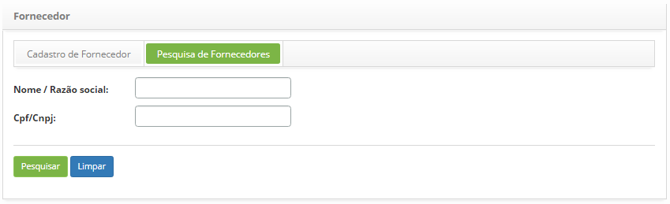
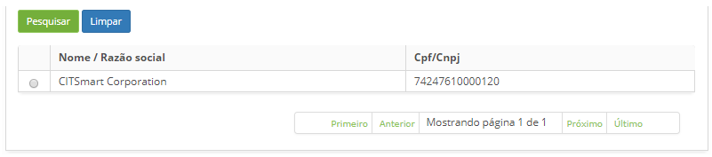
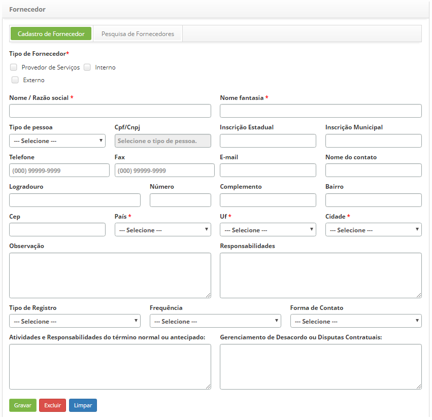

title: Cadastro e pesquisa de fornecedor
Description: Esta funcionalidade tem por objetivo cadastrar e pesquisar um fornecedor.

# Cadastro e pesquisa de fornecedor

O fornecedor é uma organização ou uma pessoa física, responsável por prover
produtos ou serviços a alguém. Ele pode ser do tipo *provedor de
serviços*, *interno* e/ou *externo*.

Esta funcionalidade tem por objetivo cadastrar e pesquisar um fornecedor.

Como acessar
------------

1.  Acesse a funcionalidade de fornecedor através da navegação no menu
    principal **Processos ITIL > Gerência de Portfólio e Catálogo > Fornecedor**.

Pré-condições
-------------

1.  Realizar a carga de países (ver conhecimento [Carga de
    países].

Filtros
-------

1.  Os seguintes filtros possibilitam ao usuário restringir a participação de
    itens na listagem padrão da funcionalidade, facilitando a localização dos
    itens desejados:

    -   Nome/Razão social;

    -   CPF/CNPJ

2.  Na tela de **Fornecedor**, clique na guia **Pesquisa de Fornecedores, **será
    apresentada a respectiva tela de pesquisa conforme ilustrada na figura
    abaixo:

    

    **Figura 1 - Tela de pesquisa de fornecedor**

3.  Realize a pesquisa de fornecedor;

    -   **Nome/Razão social**: informe a razão social do fornecedor;

    -   **CPF/CNPJ**: informe o CPF/CNPJ do fornecedor;

4.  Após o filtro definido, clique no botão *Pesquisar*. Feito isso, será
    exibido o registro conforme os dados informados.

5.  Caso deseje listar todos os registros de fornecedor, basta clicar
    diretamente no botão *Pesquisar*.

Listagem de itens
-----------------

1.  Os seguintes campos cadastrais estão disponíveis ao usuário para facilitar a
    identificação dos itens desejados na listagem padrão da
    funcionalidade: **Nome/Razão social** e **CPF/CNPJ**.

    

    **Figura 2 - Listagem de fornecedores**

2.  Após a pesquisa, selecione o registro desejado. Feito isso, será direcionado
    para a tela de cadastro exibindo o conteúdo referente ao registro
    selecionado;

3.  Para alterar os dados do registro de fornecedor, basta modificar as
    informações dos campos desejados e clicar no botão *Gravar* para que seja
    gravada a alteração realizada no registro, onde a data, hora e usuário serão
    gravados automaticamente para uma futura auditoria.

Preenchimento dos campos cadastrais
-----------------------------------

1.  Na tela de **Fornecedor**, clique na guia **Cadastro de Fornecedor**,
    será apresentada a tela de **Cadastro de Fornecedor**, conforme ilustrada na
    figura abaixo:

    

    **Figura 3 - Tela de cadastro de fornecedor**

2.  Preencha os campos conforme orientação abaixo:

    -  **Tipo de Fornecedor**: selecione o(s) tipo(s) de fornecedor(es):

        -  **Provedor de Serviços**: é aquele que fornece produtos ou serviços
            para clientes internos ou externos;

        -  **Interno**: é aquele que fornece produtos ou serviços para sua
            própria organização;

        -  **Externo**: é aquele que fornece produtos ou serviços para clientes
            de outras organizações.

    -  **Nome/Razão social**: caso o fornecedor seja uma pessoa física, informe
        o nome completo do mesmo, caso seja uma pessoa jurídica, informe o nome
        de registro da sua organização;

    -  **Nome fantasia**: informe o nome fantasia da organização do fornecedor;

    -  **Tipo de pessoa**: informe se o fornecedor é pessoa jurídica ou física;

    -  **CPF/CNPJ**: se o fornecedor for pessoa física, informe o CPF, se for
        pessoa jurídica, informe o CNPJ;

    -  **Inscrição Estadual**: informe a inscrição estadual do fornecedor;

    -  **Inscrição Municipal**: informe a inscrição municipal do fornecedor;

    -  **Telefone**: informe o código de área (DDD) e o número do telefone do
        fornecedor;

    -  **Fax**: informe o código de área (DDD) e o número do fax do fornecedor,
        caso tenha;

    -  **E-mail**: informe o e-mail do fornecedor;

    -  **Nome do contato**: informe um nome para contato com fornecedor;

    -  **Logradouro**: informe o endereço do fornecedor;

    -  **Número**: informe o número de endereço do fornecedor;

    -  **Complemento**: informe o complemento de endereço do fornecedor;

    -  **Bairro**: informe nome do bairro do fornecedor;

    -  **CEP**: informe o CEP (código de endereço postal) do fornecedor;

    -  **País**: selecione o país do fornecedor;

    !!! info "IMPORTANTE"

        O conteúdo dos campos País, UF e Cidade são sincronizados, portanto, ao
        selecionar um país, somente os estados deste aparecerão no campo UF. De
        forma análoga, ao selecionar uma Unidade Federativa (UF), somente as cidades
        desta estarão disponíveis.

    -  **UF**: selecione o estado do fornecedor;

    -  **Cidade**: selecione a cidade do fornecedor;

    -  **Observação**: informe alguma observação que achar conveniente sobre o
    fornecedor;

    -  **Responsabilidades**: descreva as responsabilidades do fornecedor com a
    organização;

    -  **Tipo de Registro**: selecione o tipo de registro do fornecedor;

    -  **Frequência**: selecione a frequência que serão fornecidos os produtos ou
    serviços;

    -  **Forma de Contato**: selecione a forma de contato com o fornecedor;

    -  **Atividades e Responsabilidades do término normal ou antecipado**: descreva
    as atividades e responsabilidades após o término do contrato. Este término
    pode ser normal (dentro do prazo estabelecido) ou antecipado (antes do
    período final contratado) e informe sobre a desmobilização do contrato.
    Exemplo: Banco de dados deverão ser entregues de volta para a empresa
    contratante do serviço dentro de um prazo de 24 horas, etc.;

    -  **Gerenciamento de Desacordo ou Disputas Contratuais**: descreva quais
    procedimentos a serem tomados no caso de desacordos ou disputas contratuais.

3.  Após informar os dados, clique no botão *Gravar* para efetuar o registro,
    onde a data, hora e usuário serão gravados automaticamente para uma futura
    auditoria.

!!! tip "About"

    <b>Product/Version:</b> CITSmart | 8.00 &nbsp;&nbsp;
    <b>Updated:</b>07/17/2019 – Anna Martins
