title: Cadastro de portfolio de serviços
Description: Permite cadastrar portrfólios de serviço.

# Cadastro de portfólio de serviços

Como acessar
------------

1.  Acesse a funcionalidade de Gerenciamento de Portfólio de Serviços através da
    navegação no menu principal **Processos ITIL > Gerência de Portfólio e
    Catálogo >  Gerenciamento de Portfólio e Catálogo**.

Pré-condições
-------------

1.  Ter definido a permissão de acesso às funcionalidades do Gerenciamento de
    Portfólio (ver conhecimento [Permissão de acesso do gerenciamento de
    portfólio]().

Filtros
-------

1.  O seguinte filtro possibilita ao usuário restringir a participação de itens
    na listagem padrão da funcionalidade, facilitando a localização dos itens
    desejados:

-   Descrição portfólio

    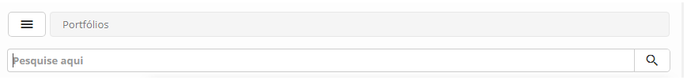

**Figura 1 - Tela de pesquisa de portfólio de serviços**

Listagem de itens
-----------------

1.  Os seguintes campos cadastrais estão disponíveis ao usuário para facilitar a
    identificação dos itens desejados na listagem padrão da
    funcionalidade: **ID** e **Descrição Portfólio**.

2.  Existem botões de ação disponíveis ao usuário em relação a cada item da
    listagem, são eles: *Editar* e *Avançar*.

    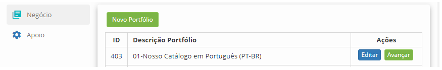

**Figura 2 - Tela de listagem de portfólio de serviços**

Preenchimento dos campos cadastrais
-----------------------------------

1.  Clique no botão *Novo Portfólio*, será apresentada a tela de **Cadastro de
    Portfólio**, conforme ilustrada na figura abaixo:

    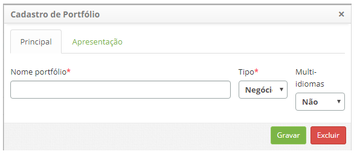

    **Figura 3 - Tela de cadastro de portfólio**

1.  Preencha os campos conforme orientação abaixo:

    -  **Nome Portfólio**: informe o nome do portfólio de serviços;

    -  **Tipo**: informe o tipo do portfólio de serviços:

        -  **Negócio**: provê os serviços de negócios/TI;

        -  **Apoio**: provê os serviços de apoio/técnico.

    -  **Multi-idiomas**: escolha se o portfólio terá ou não disponibilidade em
    três línguas diferentes (Português/Inglês/Espanhol). Ao clicar em SIM, uma
    nova aba aparecerá para o cadastro nos idiomas.

   !!! note "NOTA"

        A escolha do tipo Negócio/Apoio deve estar alinhada com o tipo do contrato
        que se pretende vincular ao Portfólio. Somente contratos do tipo “Contrato”
        são vinculados ao tipo "Negócio" e somente contratos do tipo “Contrato de
        Apoio” e “Acordo de Nível Operacional” são vinculados ao tipo "Apoio".

1.  Caso queira disponibilizar o portfólio de serviços nos 3 idiomas disponíveis
    a aba correspondente aparecerá, conforme figura abaixo:

    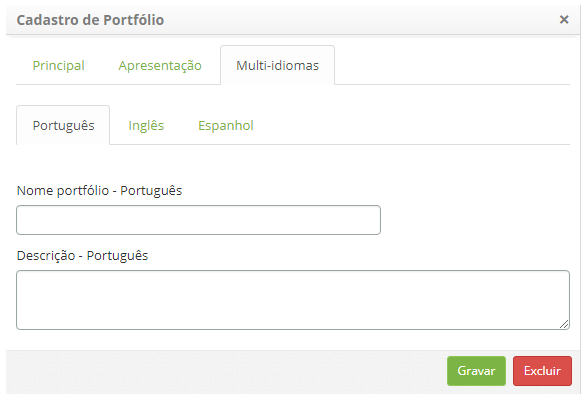

    **Figura 4 - Internacionalização do portfólio**

   !!! info "IMPORTANTE"

        Caso uma das 3 línguas nessa aba ficar em branco, as informações serão
        preenchidas com as que estiver contidas na aba "Apresentação".

1.  Caso queira disponibilizar o portfólio de serviços no Portal Smart e/ou
    Chat, clique na aba **Apresentação**;

    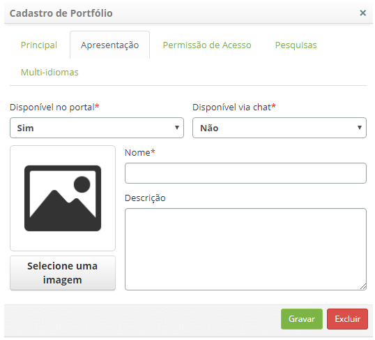

    **Figura 5 - Disponibilização do portfólio no Smart Portal e chat**

        -  **Disponível no portal**: selecione a opção "Sim" para disponibilizar o
           portfólio no Smart Portal. Ao selecionar a opção "Sim", duas novas abas
           chamadas "Permissão de Acesso" e " Pesquisas" ficarão disponíveis (para
           maiores informações, leia a seção "Vinculando com Pesquisas");

        -  **Disponível via chat**: selecione a opção “Sim” para disponibilizar o
            portfólio no Chat;

        -  **Nome**: informe o nome do portfólio que será exibido no Smart Portal e
           Chat;

        -  **Descrição**: informe uma breve descrição do portfólio de serviços, a qual
           será exibida no Smart Portal e Chat;

    -  Clique no botão *Selecione uma imagem* e será apresentada uma tela para
       selecionar uma imagem que representará o Portfólio de Serviços:

    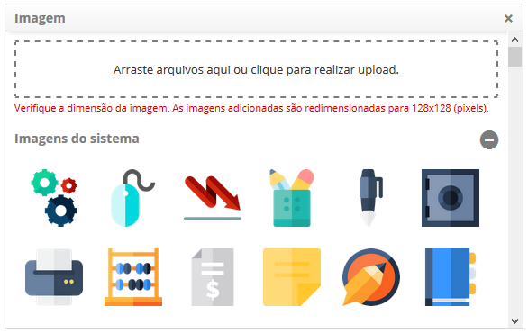

    **Figura 6 - Tela de seleção de imagem**

    !!! note "NOTA"

        A configuração da permissão de acesso do grupo para visualização do Portfólio
        no Smart Portal, somente será aplicada caso o parâmetro 293 “Habilita permissão
        de acesso para grupos de usuário no portal” esteja habilitado.

1.  Clique na aba **Permissão de Acesso**, será apresentada a tela para vínculo
    dos grupos, conforme ilustrada na figura abaixo:

    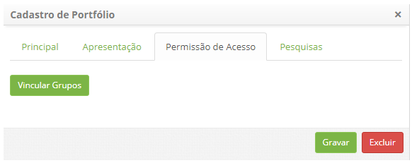

    **Figura 7 - Permissão de acesso por grupo**

    -  Clique no botão *Vincular Grupos*. Após isso, será exibida a tela de
    pesquisa de grupos;

    -  Realize a pesquisa, selecione os grupos que terão permissão para visualizar
    o portfólio no Smart Portal e no Chat, e clique no botão *Enviar* para
    efetuar a operação;

    -  Para desvincular o grupo, basta clicar no botão *Desvincular* do mesmo.

    !!! note "NOTA"

        Podem ser adicionados vários grupos, quantos desejar

1.  Após informar os dados do portfólio, clique no botão *Gravar* para efetuar o
    registro.

Vinculando com pesquisas
------------------------

Ao cadastrar um portfólio, é possível vinculá-lo a pesquisas previamente
cadastradas.

    !!! Abstract "SAIBA MAIS"

        Para maiores informações sobre como cadastrar uma pesquisa, ver
        conhecimento [Cadastro e pesquisa de pesquisa de
        satisfação]()

1.  Preencha os campos cadastrais referentes ao novo portfólio. Logo após, na
    aba Apresentação, selecione "*Sim*" na opção "disponível no portal",
    conforme a figura abaixo. Será apresentado então, a aba "Pesquisas":

   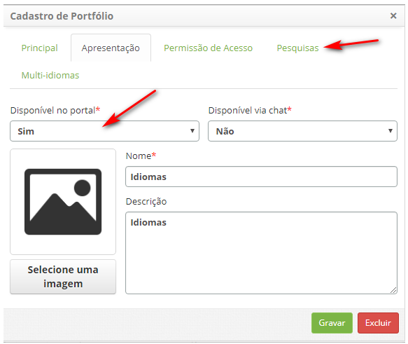
   
   **Figura 8 - Tela de apresentação**

1.  Clique na aba *Pesquisas*. Será apresentada a tela de vínculo de pesquisas,
    conforme ilustrada na figura abaixo:

   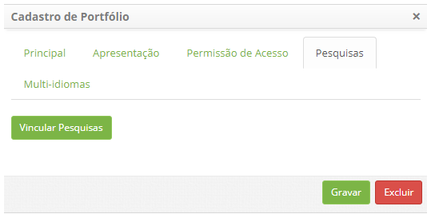
   
   **Figura 9 - Tela de vinculação de pesquisas**

1.  Vincule pesquisas ao portfólio;

-   Clique no botão *Vincular pesquisas*. Após isso, será apresentada a tela de
    pesquisa de pesquisas;

-   Realize a pesquisa, selecione a pesquisa que deseja vincular ao portfólio e
    clique no botão *Enviar* para efetuar a operação;

-   Para remover o vínculo da pesquisa selecionada com o portfólio, clique
    em *Excluir*.

Uma visão rápida da principal funcionalidade do módulo
------------------------------------------------------

1.  Após criar o **Portfólio de Serviços**, clique no botão *Avançar* para
    acessar o mesmo. Será apresentada a tela do **Portfólio de Serviços**,
    conforme ilustrada na figura abaixo:

    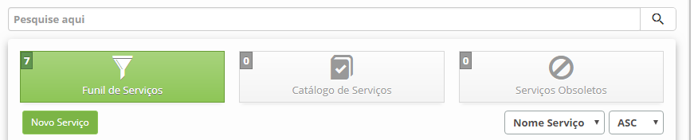

    **Figura 10 - Portfólio de serviços**

1.  Note que o **Portfólio de Serviços** é dividido em três partes, sendo:

    -   **Funil de Serviços**: inclui todos os serviços que estão propostos ou em
    desenvolvimento. Esses serviços são para ser aplicados na fase de produção
    via fase de transição de serviço.

    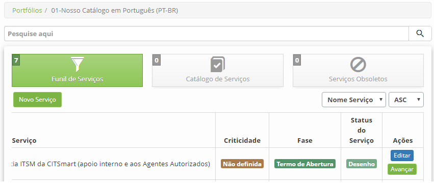

    **Figura 11 - Funil de serviços**

    -   **Catálogo de Serviços**: inclui todos os serviços que a TI oferece aos seus
    clientes e serviços que já foram liberados e vão entrar em operação. Nesta
    parte do portfólio de serviços são apresentados os serviços que estão em uso
    na produção e aqueles disponíveis para implantação.

    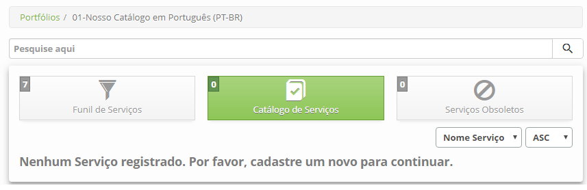

    **Figura 12 - Catálogo de serviços**

    -   **Serviços Obsoletos**: inclui os serviços que estão aposentados e os que
    estão fora de operação. Nesta parte do portfólio de serviços estão
    registrados os serviços que não estão mais na operação. É utilizado para
    manter um histórico dos serviços.

    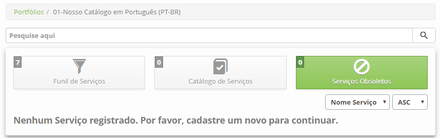

    **Figura 13 - Serviços obsoletos**

1.  O Portfólio é responsável por gerenciar o serviço durante o seu ciclo de
    vida. A figura abaixo apresenta uma visão da gestão do Portfólio de
    Serviços:

    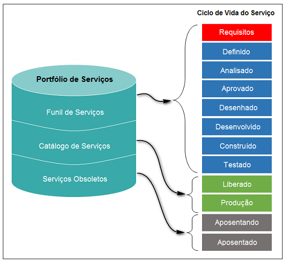

    **Figura 14 - Gestão do portfólio de serviços**

   !!! info "IMPORTANTE"

   O Portfólio de Serviços irá fazer o controle de todos novos serviços
   propostos, em desenvolvimento, em produção e aposentado.

Visão geral das funções da tela principal
-----------------------------------------

    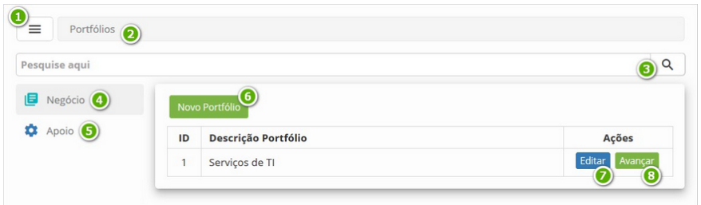  
    
    **Figura 15 - Gerenciamento de portfólio de serviços**

-   **1**: Botão de menu -** ao clicar neste botão, permite esconder/exibir o menu
    do Gerenciamento de Portfólio;

-   **2**: Barra de navegação** - permite navegar entre os dados do portfólio;

-   **3**: Campo de pesquisa** - permite realizar a busca de portfólios de
    serviços;

-   **4**: Negócio** - local para armazenar os portfólios de serviços de negócio;

-   **5**: Apoio** - local para armazenar os portfólios de serviços de apoio;

-   **6**: Novo Portfólio** - permite criar um novo portfólio de serviços;

-   **7**: Editar** - permite editar o registro de portfólio de serviços;

-   **8**: Avançar** - permite acessar o portfólio de serviços.

Veja também
-----------

-   [Cadastro de
    serviços]().

!!! tip "About"

    <b>Product/Version:</b> CITSmart | 8.00 &nbsp;&nbsp;
    <b>Updated:</b>07/16/2019 – Anna Martins
