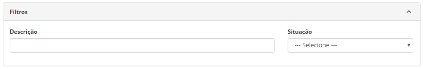
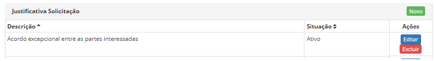
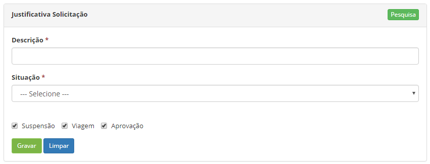

title: Cadastro e pesquisa de justificativa de solicitação
Description: Essa funcionalidade permite registrar as justificativas de solicitação de serviços.

# Cadastro e pesquisa de justificativa de solicitação

Essa funcionalidade permite registrar as justificativas de solicitação de
serviços.

Como acessar
------------

1.  Acesse a funcionalidade de Justificativa de Solicitação através da
    navegação no menu principal **Processos ITIL > Gerência de Portfólio e
    Catálogo > Justificativa Solicitação**.

Pré-condições
------------

1.  Não se aplica.

Filtros
-------

1.  Os seguintes filtros possibilitam ao usuário restringir a participação de
    itens na listagem padrão da funcionalidade, facilitando a localização dos
    itens desejados:

    -  Descrição;

    -  Situação.

2.  Para realizar a busca de uma justificativa de solicitação, informe a
    descrição e/ou situação da mesma. Após isso, será exibido o registro
    conforme os dados informados.

**Figura 1 - Tela de pesquisa de justificativa de solicitação**

Listagem de itens
----------------

1.  Os seguintes campos cadastrais estão disponíveis ao usuário para facilitar a
    identificação dos itens desejados na listagem padrão da
    funcionalidade: **Descrição** e **Situação**;

2.  Existem botões de ação disponíveis ao usuário em relação a cada item da
    listagem, são eles: *Editar* e *Excluir*.

**Figura 2 - Listagem de justificativa de solicitação**

Preenchimento dos campos cadastrais
---------------------------------

1.  Será apresentada a tela de Justificativa de Solicitação;

2.  Clique no botão *Novo*. Feito isso, será apresentada a tela de **Cadastro de
    Justificativa de Solicitação**, conforme ilustrada na figura a seguir:

    

    **Figura 3 - Tela de cadastro de justificativa de solicitação**

3.  Preencha os campos conforme orientações abaixo:

    -  **Descrição**: informe a descrição da justificativa de solicitação;

    -  **Situação**: selecione a situação da justificativa de solicitação,
        ativo ou inativo;

    -  **Suspensão**: defina se a justificativa é para ser utilizada na
        suspensão da solicitação;

    -  **Viagem**: defina se a justificativa de solicitação é para ser
        utilizada na aprovação de requisição de viagem;

    -  **Aprovação**: defina se a justificativa de solicitação é para ser
        utilizada na fase de aprovação da solicitação de serviço.

4.  Clique no botão *Gravar* para efetuar o registro, onde a data, hora e
    usuário serão gravados automaticamente para uma futura auditoria

!!! tip "About"

    <b>Product/Version:</b> CITSmart | 8.00 &nbsp;&nbsp;
    <b>Updated:</b>07/17/2019 – Anna Martins
