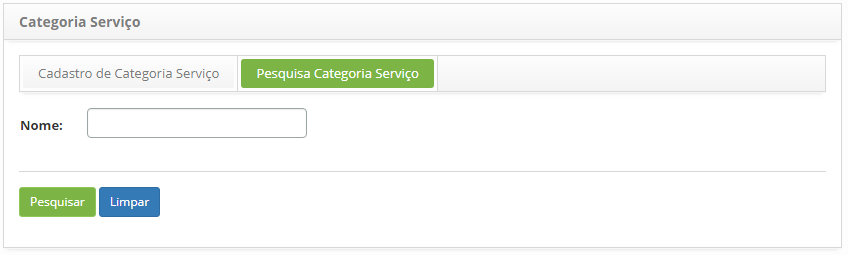
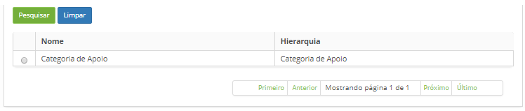
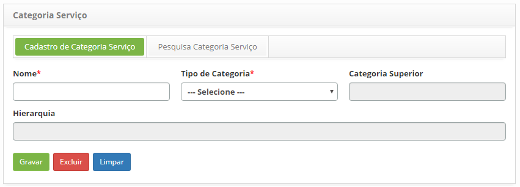

title: Cadastro e pesquisa de categoria de serviço
Description: Permite registrar e pesquisar as categorias para posicionar os
serviços de negócio, apoio, requisição, incidente e procedimento, dentro de
grupos semelhantes de atuação

# Cadastro e pesquisa de categoria de serviço

A funcionalidade de Categoria de Serviço permite registrar e pesquisar as
categorias para posicionar os serviços de negócio, apoio, requisição, incidente
e procedimento, dentro de grupos semelhantes de atuação.

Como acessar
------------

1.  Acesse a funcionalidade através da navegação no menu
    principal **Processos ITIL >  Gerência de Portfólio e Catálogo >  Categoria
    Serviço**.

Pré-condições
-------------

1.  Não se aplica.

Filtros
-------

1.  O seguinte filtro possibilita ao usuário restringir a participação de itens
    na listagem padrão da funcionalidade, facilitando a localização dos itens
    desejados:

    -   Nome.

1.  Na tela de **Categoria Serviço**, clique na guia **Pesquisa Categoria
    Serviço** conforme ilustrada na figura abaixo:

    

    **Figura 1 - Tela de pesquisa de categoria de serviço**

1.  Realize a pesquisa de categoria de serviço;

    -  Informe o nome da categoria de serviço e clique no botão *Pesquisar*. Após
    isso, será exibido o registro conforme o nome informado.

    -  Caso deseje listar todos os registros de categoria de serviço, basta
        clicar diretamente no botão *Pesquisar*.

Listagem de itens
-----------------

1.  Os seguintes campos cadastrais estão disponíveis ao usuário para facilitar a
    identificação dos itens desejados na listagem padrão da
    funcionalidade: **Nome** e **Hierarquia**.

    

    **Figura 2 - Tela de listagem de categoria de serviço**

1.  Após a pesquisa, selecione o registro desejado. Feito isso, será direcionado
    para a tela de cadastro exibindo o conteúdo referente ao registro
    selecionado, podendo editar a Categoria de Serviço.

Preenchimento dos campos cadastrais
-----------------------------------

1.  Será apresentada a tela de cadastro de categoria, conforme ilustrada na
    figura abaixo:

    

    **Figura 3 - Tela de cadastro de categoria de serviço**

1.  Preencha os campos conforme orientações abaixo:

    -  **Nome**: informe o nome da categoria de serviço;

    -  **Tipo de Categoria**: selecione o tipo de categoria do serviço;

    -  **Categoria Serviço Superior**: informe a categoria de serviço superior,
        caso a categoria que está sendo cadastrada pertence a outra categoria.
        Será disponibilizado somente as categorias referentes ao "tipo de
        categoria" selecionado;

    -  **Hierarquia**: este campo é para simples conferência. Após gravar os
        dados, será exibida a hierarquia da categoria de serviço.

3.  Após informar os dados, clique no botão *Gravar* para efetuar o registro,
    onde a data, hora e usuário serão gravados automaticamente para uma futura
    auditoria.

!!! tip "About"

    <b>Product/Version:</b> CITSmart | 8.00 &nbsp;&nbsp;
    <b>Updated:</b>07/16/2019 – Anna Martins
