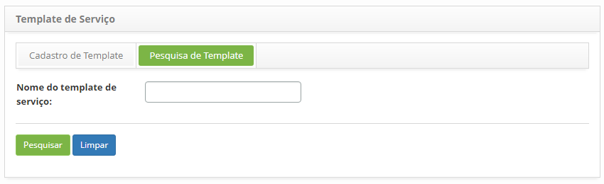
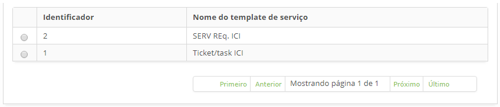
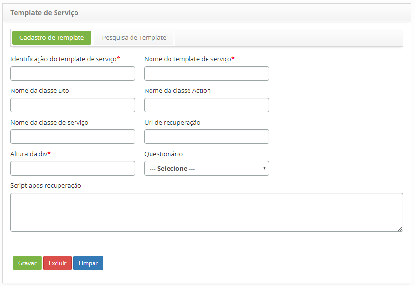

title: Cadastro e pesquisa de template de serviço
Description: Esta funcionalidade permite registrar um modelo, o qual será utilizado para personalizar a tela de serviço.

# Cadastro e pesquisa de template de serviço

Esta funcionalidade permite registrar um modelo, o qual será utilizado para
personalizar a tela de serviço.

Como acessar
-----------

1.  Acesse a funcionalidade de Template de Serviço através da navegação no
    menu principal **Processos ITIL > Gerência de Portfólio e
    Catálogo > Template de Serviço**.

Pré-condições
------------

1.  Ter o questionário cadastrado.

Filtros
-------

1.  O seguinte filtro possibilita ao usuário restringir a participação de itens
    na listagem padrão da funcionalidade, facilitando a localização dos itens
    desejados:

    -   Nome do template de serviço

2.  Na tela de Template de Serviço, clique na guia **Pesquisa de Template**.
    Será apresentada a tela de pesquisa conforme ilustrada na figura abaixo:

    

    **Figura 1 - Tela de pesquisa de template de serviço**

3.  Realize a pesquisa do template de serviço:

    -   Informe o nome do template de serviço que deseja pesquisar e clique no
        botão *Pesquisar*. Após isso, será exibido o registro conforme o nome
        informado.

    -   Caso deseje listar todos os registros de template de serviço, basta
        clicar diretamente no botão *Pesquisar*.

Listagem de itens
-----------------

1.  Os seguintes campos cadastrais estão disponíveis ao usuário para facilitar a
    identificação dos itens desejados na listagem padrão da
    funcionalidade: Identificador e Nome do template de serviço.

    

    **Figura 2 - Lista de template de serviço**

2.  Após a pesquisa, selecione o registro desejado. Feito isso, será direcionado
    para tela de cadastro exibindo o conteúdo referente ao registro selecionado;

3.  Para alterar os dados do registro de template de serviço, basta modificar as
    informações dos campos desejados e clicar no botão *Gravar* para que seja
    gravada a alteração realizada no registro, onde a data, hora e usuário serão
    gravados automaticamente para uma futura auditoria.

Preenchimento dos campos cadastrais
-----------------------------------

1.  Será apresentada a tela de Template de Serviço, conforme ilustrada na figura
    abaixo:

    

    **Figura 3 - Tela de Cadastro de Template de Serviço**

2.  Preencha os campos conforme orientação abaixo:

    -  **Identificação do template de serviço**: informe a identificação do
        template de serviço;

    -  **Nome do template de serviço**: informe o nome do template de serviço;

    -  **Nome da classe Dto**: informe o nome da classe Dto;

    -  **Nome da classe Action**: informe o nome classe Action;

    -  **Nome da classe de serviço**: informe o nome da classe de serviço;

    -  **Url de recuperação**: informe a URL de recuperação;

    -  **Altura da div**: informe a altura da div;

    -  **Questionário**: informe o questionário do serviço. O mesmo é definido
        na funcionalidade de Questionário;

    -  **Script após recuperação**: informe o script após recuperação;

3.  Após o informar todos os dados, clique no botão *Gravar* para efetuar o
    registro, onde a data, hora e usuário serão gravados automaticamente para
    uma futura auditoria.

!!! tip "About"

    <b>Product/Version:</b> CITSmart | 8.00 &nbsp;&nbsp;
    <b>Updated:</b>07/17/2019 – Anna Martins
