title:Cadastro de serviços
Description: O cadastro de serviços é dividido em dois tipos: Negócio e Apoio.

# Cadastro de serviços

O cadastro de serviços é dividido em dois tipos: Negócio e Apoio.

Pré-condições
-------------

1.  Ter permissão de acesso às funcionalidades do Gerenciamento de Portfólio
    (ver conhecimento [Permissão de acesso do gerenciamento de
    portfólio]();

2.  Ter o portfólio de serviços cadastrado (ver conhecimento [Cadastro de
    portfólio de
    serviços]();

3.  Ter a categoria de serviço cadastrada (ver conhecimento [Cadastro e pesquisa
    de categoria de
    serviço]();

4.  Ter o grupo cadastrado (ver conhecimento [Cadastro e pesquisa de
    grupo]().

Como acessar
------------

1.  Acesse a funcionalidade de Gerenciamento de Portfólio de Serviços através da
    navegação no menu principal **Processos ITIL > Gerência de Portfólio e
    Catálogo > Gerenciamento de Portfólio e Catálogo**.

Filtros
-------

1.  O seguinte filtro possibilita ao usuário restringir a participação de itens
    na listagem padrão da funcionalidade, facilitando a localização dos itens
    desejados:

-   Descrição Portfólio

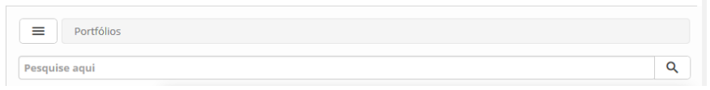

**Figura 1 - Tela de pesquisa de serviço**

Cadastrando serviço de negócio
------------------------------

### Listagem de itens

1.  Os seguintes campos cadastrais estão disponíveis ao usuário para facilitar a
    identificação dos itens desejados na listagem padrão da
    funcionalidade: ID e Descrição Portfólio.

2.  Existem botões de ação disponíveis ao usuário em relação a cada item da
    listagem, são eles: *Editar* e *Avançar*.

3.  Será apresentada a tela de Gerenciamento de Portfólio, clique
    em **Negócio**, serão exibidos os Portfólios de Serviços de Negócio,
    conforme exemplo ilustrado na figura abaixo:

    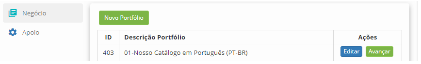

    **Figura 2 - Tela de gerenciamento de portfólio de serviços de negócio**

1.  Clique no botão *Avançar* do portfólio para acessá-lo. Feito isso, será
    apresentada a tela do **Portfólio de Serviços de Negócio**;

    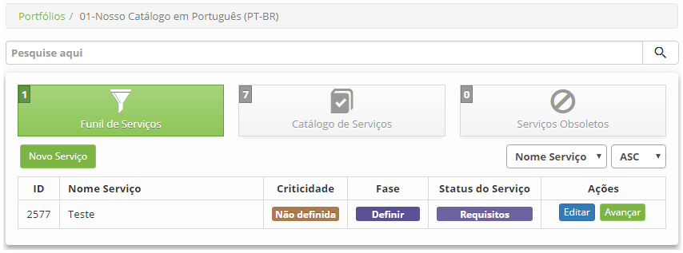

    **Figura 3 - Portfólio de serviços de negócio**

### Preenchimento dos campos cadastrais

1.  Clique no botão *Novo Serviço*, será apresentada a tela de **Cadastro de
    Serviço de Negócio**, conforme ilustrada na figura abaixo:

    

    **Figura 4 - Tela de cadastro de serviço**

1.  Preencha os campos conforme orientação abaixo:

    -  **Nome do Serviço**: informe o nome do serviço;

    -  **Processo de Iniciação**: informe de qual processo o serviço se originou;

    -  **Categoria**: informe a categoria do serviço. Ao clicar neste campo, será
    apresentada a tela de pesquisa de categoria, realize a pesquisa da categoria
    desejada e selecione a mesma. Mas, caso não tenha uma categoria registrada,
    poderá registrar uma a partir dessa tela, basta clicar na aba “Cadastro de
    Categoria de Serviço”;

    -  **Data da Implantação**: informe a data de implantação do serviço;

    -  **Fase do Serviço**: selecione a fase do serviço;

       -  **Definir**: esta fase indica que o serviço está em inicialização. Nesta
          fase se inicia a coleta de informações sobre todos os serviços existentes e
          propostos, a definição de novos serviços, casos de negócio e validação dos
          dados do portfólio.

       -  **Analisar**: esta fase indica que o serviço está sendo analisado. Nesta
          fase é analisado se o serviço vai dar retorno ao negócio e fazemos um
          balanceamento entre oferta e demanda. Identificando também o que serviço
          representa para o negócio. Nesta atividade faremos um levantamento macro
          prévio de quais recursos serão utilizados por estes serviços: pessoas,
          hardware, software, treinamento, etc. Quando essa opção for selecionada,
          serão apresentados campos para serem preenchidos, conforme ilustrado na
          figura abaixo:

      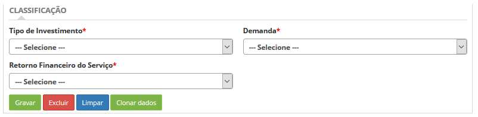

      **Figura 5 - Tela de análise do serviço**

       -  **Tipo de Investimento**: indique o tipo de investimento referente ao
    serviço;

       -  **Demanda**: indique o tipo de demanda do serviço;

       -  **Retorno Financeiro do Serviço**: indique o retorno financeiro do serviço.

          -  **Aprovar**: esta fase indica que o serviço proposto está em aprovação. Fase
             para finalizar o serviço proposto, autorizar serviços e recursos e tomar
             decisões para o futuro. Nesta fase é feita a aprovação do serviço proposto,
             o serviço é analisado e verifica-se se o mesmo está dando retorno para o
             negócio. Se ele não der retorno, significa que virou custo, e aí devemos
             considerá-los como obsoleto.

          -  **Termo de Abertura**: esta fase indica que o serviço está seguindo para
             fase de desenho de serviços e os serviços existentes são renovados no
             catálogo de serviços. Nesta fase comunica-se as decisões, aloca recursos e
             contrata serviços.

    -  **Status do Serviço**: informe o status do serviço;

    -  **Criticidade**: este campo será ativado quando o serviço estiver na fase de
    análise para informar o nível crítico do serviço;

    -  **Importância do Serviço ao Negócio**: informe a importância do serviço ao
    negócio:

       -  **Alta**: informá-lo caso o serviço seja imprescindível para o funcionamento
    do negócio.

       -  **Média**: informá-la caso o serviço seja importante para o negócio, mas a
    produtividade não seja totalmente dependente dele.

       -  **Baixa**: informá-lo se o serviço a ser realizado for necessário para o
    dia-a-dia da empresa, mas a sua ausência não cause situações drásticas.

       -  **Normal**: informá-lo caso o serviço a ser realizado não interfira no
    cotidiano produtivo da organização.

       -  **A combinar**: informá-lo quando não se sabe o tipo de importância do
    serviço ao negócio no momento do registro.

    -  **Tipo de Serviço**: informe o tipo do serviço;

    -  **Lugar de Execução dos Serviços**: informe o local onde o serviço será
    executado;

       -  **Interno**: o serviço será realizado dentro da organização;

       -  **Externo**: o serviço será realizado fora da organização. Por exemplo: em
        outra organização ou em uma filial;

       -  **Interno/Externo**: o serviço poderá ser realizado dentro da organização
        como fora.

    -  **Detalhamento**: descreva os detalhes do serviço;

    -  **Objetivo**: descreva o objetivo do serviço;

    -  **Valor**: informe o valor do serviço para o negócio;

    -  **Template de Serviço**: informe o template do serviço para personalização
    da tela de registro do serviço, por exemplo: ao selecionar um template que
    consta um questionário, será apresentada na tela de registro de serviço uma
    aba de "questionário" para inserção de informações a respeito do serviço;

1.  Caso queira anexar um arquivo, clique na aba **Documentos Anexos**. Será
    exibida a tela para anexo de arquivos, conforme ilustrada na figura abaixo:

    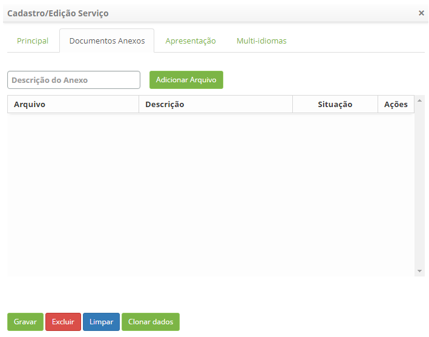

    **Figura 6 - Tela de anexo de documentos**

    -  Selecione o tipo de anexo, clique no botão *Adicionar Arquivo* e selecione o
    arquivo desejado.

1.  Caso queira disponibilizar o serviço no Portal Smart e Chat, clique na
    aba **Apresentação:**

    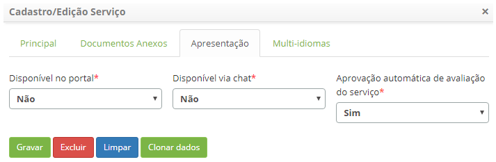

    **Figura 7 - Disponibilização do serviço no Smart Portal e chat**

    -  **Disponível no portal**: selecione a opção "Sim" para disponibilizar o
    serviço no Smart Portal. Ao selecionar a opção "Sim", uma nova aba chamada
    "Pesquisas " aparecerá (Para maiores informações, leia a seção "Vinculando
    com Pesquisas").

    -  **Disponível via chat**: selecione a opção “Sim” para disponibilizar o
    serviço no Chat;

    -  **Aprovação automática de avaliação do serviço**: defina se a avaliação do
    serviço, realizada no Smart Portal, passará por uma aprovação automática;

    -  **Nome**: informe o nome do serviço para ser exbido no Smart Portal e Chat;

    -  **Descrição**: informe uma breve descrição do serviço, a qual será exibida
    no Smart Portal e Chat;

    -  Clique no botão *Selecione uma imagem* e será apresentada uma tela para
    selecionar uma imagem que representará o serviço:

    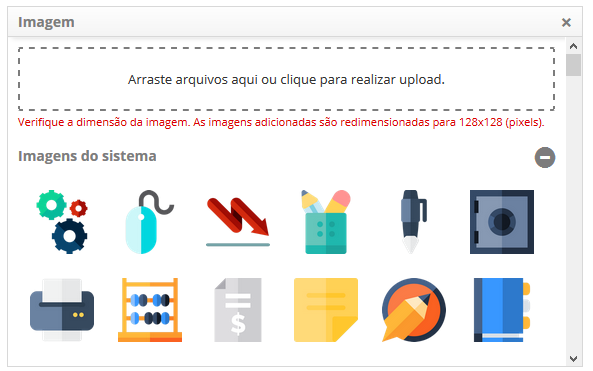

    **Figura 8 - Tela de seleção de imagem**

    -  Vincule os grupos que terão acesso ao serviço no Portal e no Chat:

    !!! note "NOTA"

        A configuração da permissão de acesso do grupo para visualização do
        Serviço no Portal, somente será aplicada caso o parâmetro “Habilita
        permissão de acesso para grupos de usuário no portal” esteja habilitado.

1.  Clique na aba **Permissão de Acesso**, será apresentada a tela para vincular
    os grupos, conforme ilustrada na figura abaixo:

    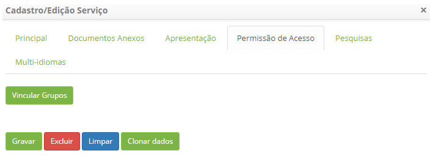

    **Figura 9 - Permissão de acesso por grupo**

    -  Clique no botão *Vincular Grupos*, será exibida a tela de pesquisa de grupo.
    Nesta tela, serão listados somente os grupos que foram vinculados no
    registro do portfólio de serviço;

    -  Realize a pesquisa, selecione os grupos que terão permissão para visualizar
    o serviço no Portal Smart e no Chat, e clique no botão *Enviar* para efetuar
    a operação.

    -  Para desvincular o grupo, basta clicar no botão *Desvincular* do mesmo.

1.  Após informar os dados do serviço de negócio, clique no botão *Gravar*.
    Feito isso, o serviço será gravado e apresentado no **Portfólio de Serviços
    de Negócio**. Será apresentada tela com listagem de serviços.

2.  Para configurar os atributos do Serviço de Negócio, clique no
    botão *Avançar*.

3.  Para excluir o Serviço de Negócio, clique no botão *Editar* do mesmo e logo
    em seguida clique no botão *Excluir* para efetuar a operação.

     !!! note "NOTA"

         Quando o serviço estiver com status em "requisitos", "definição",
         "análise", "aprovado", "termo de abertura", "desenho", "desenvolvimento",
         "construção" ou "teste", ele se encontrará na parte de "Funil de
         Serviços". Quando o serviço estiver com o status em "liberação" ou
         "produção", ele se encontrará na parte de "Catálogo de Serviços". Quando o
         serviço estiver com o status em "aposentando" ou "aposentado", ele se
         encontrará na parte de "Serviço Obsoletos".

1.  Caso queira disponibilizar o serviço nas 3 línguas disponíveis
    (Português/Inglês/Espanhol), clique na aba Multi-idiomas conforme figura
    abaixo:
    
   !!! info "IMPORTANTE"
         
           O campo Multi-idiomas somente aparecerá no cadastro/edição de serviço se o mesmo estiver com opção SIM na aba                      principal do portfólio escolhido.

    
   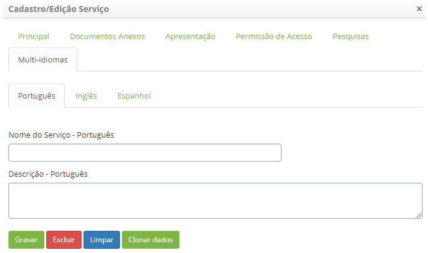
   
   **Figura 10 - Tela de internacionalização de serviços**

   !!! note "NOTA"

        Caso uma das 3 línguas nessa aba ficar em branco, as informações serão
        preenchidas com as que estiver contidas na aba "Apresentação".

Vinculando com pesquisas
------------------------

Ao cadastrar um serviço, é possível vinculá-lo a pesquisas previamente
cadastradas.

   !!! Abstract "SAIBA MAIS"

         Para maiores informações sobre como cadastrar uma pesquisa, ver
         conhecimento [Cadastro e pesquisa de pesquisa de
         satisfação]().

1.  Preencha os campos cadastrais referentes ao novo serviço. Na aba
    Apresentação, selecione "*Sim*" na opção "disponível no portal", conforme a
    figura abaixo. Será apresentado então, a aba "Pesquisas":

    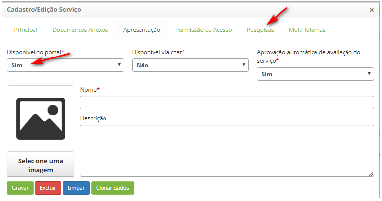

    **Figura 11 - Tela de apresentação**

1.  Clique na aba *Pesquisas*. Será apresentada a tela de vínculo de pesquisas,
    conforme ilustrada na figura abaixo:

    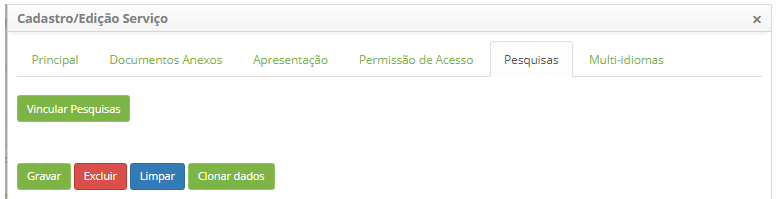

    **Figura 12 - Tela de vinculação de pesquisas**

1.  Vincule pesquisas ao serviço:

    -   Clique no botão *Vincular pesquisas*. Após isso, será apresentada a tela
    pesquisas;

    -   Realize a pesquisa, selecione a pesquisa que deseja vincular ao serviço e
    clique no botão *Enviar* para efetuar a operação;

    -   Para remover o vínculo da pesquisa selecionada com o serviço, clique
    em *Excluir*.

Registrando serviço de apoio
----------------------------

### Listagem de itens

1.  Os seguintes campos cadastrais estão disponíveis ao usuário para facilitar a
    identificação dos itens desejados na listagem padrão da
    funcionalidade: ID e Descrição Portfólio.

2.  Existem botões de ação disponíveis ao usuário em relação a cada item da
    listagem, são eles: *Editar* e *Avançar*.

3.  Após isso, será apresentada a tela de Gerenciamento de Portfólio, clique
    em **Apoio**, serão exibidos os Portfólios de Serviços de Apoio, conforme
    exemplo ilustrado na figura abaixo:

    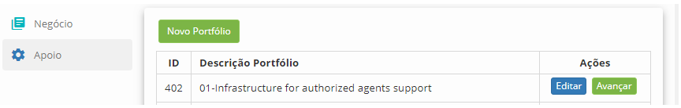

    **Figura 13 - Tela de gerenciamento de portfólio**

1.  Clique no botão *Avançar* do portfólio para acessá-lo. Feito isso, será
    apresentada a tela do **Portfólio de Serviços de Apoio**;

    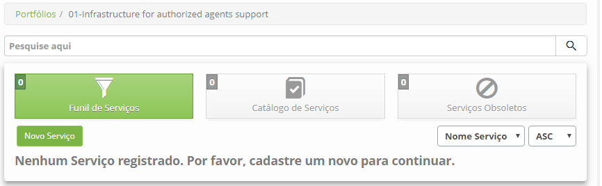

    **Figura 14 - Portfólio de serviços de apoio**

### Preenchimento dos campos cadastrais

1.  Clique no botão *Novo Serviço*, será apresentada a tela de **Cadastro de
    Serviço de Apoio**, conforme ilustrada na figura abaixo:

    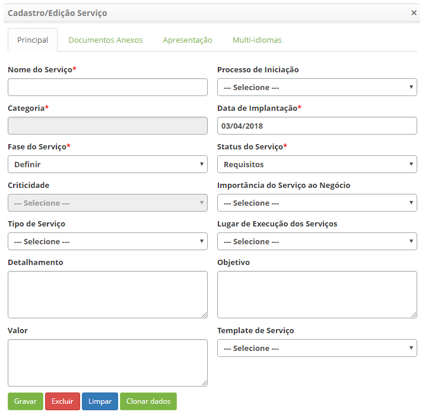

    **Figura 15 - Tela de cadastro de serviço de apoio / técnico**

1.  Preencha os campos seguindo as orientações descrita no item anterior
    “Cadastrando Serviço de Negócio”.

2.  Após informar os dados do Serviço de Apoio, clique no botão *Gravar* para
    efetuar a operação. Feito isso, o serviço será gravado e apresentado na tela
    no Portfólio de Serviços de Apoio e uma tela será apresentada com a
    listagem de serviços.

3.  Para configurar os atributos do Serviço de Apoio , clique no
    botão *Avançar*.

Veja também
-----------

-   [Configuração dos atributos do
    serviço]().

!!! tip "About"

    <b>Product/Version:</b> CITSmart | 8.00 &nbsp;&nbsp;
    <b>Updated:</b>07/16/2019 – Anna Martins
