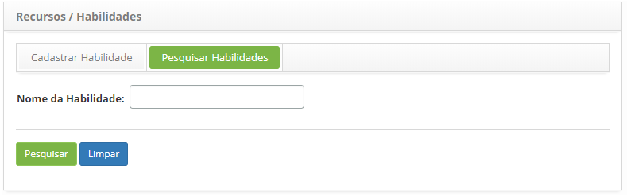
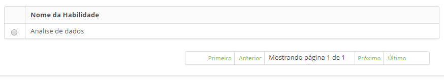
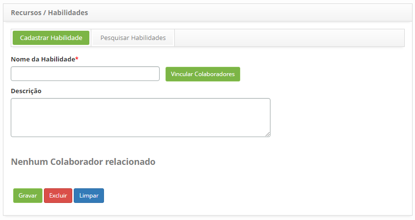

title: Cadastro e pesquisa de habilidade
Description: Essa funcionalidade permite registrar as habilidades dos
colaboradores.

# Cadastro e pesquisa de habilidade

Como acessar
------------

1.  Acesse a funcionalidade de Recursos/Habilidades através da navegação no menu
    principal **Processos ITIL > Gerência de Portfólio e
    Catálogo > Recursos/Habilidades**.

Pré-condições
-------------

1.  Não se aplica.

Filtros
-------

1.  O seguinte filtro possibilita ao usuário restringir a participação de itens
    na listagem padrão da funcionalidade, facilitando a localização dos itens
    desejados, conforme ilustrado na figura abaixo:

    -   Nome.

1.  Na tela de Recursos/Habilidades, clique na guia
    Pesquisar Habilidades. Será apresentada a tela Pesquisa de Habilidade,
    conforma a figura abaixo:

    

    **Figura 1 - Tela de pesquisa de habilidade**

1.  Realize a pesquisa de habilidades:

-   Informe o nome da habilidade que deseja pesquisar e clique no
    botão *Pesquisar*. Após isso, será exibido o registro conforme o nome
    informado.

-   Caso deseje listar todos os registros de habilidades, basta clicar
    diretamente no botão *Pesquisar*.

Listagem de itens
----------------

1.  O seguinte campo cadastral está disponível ao usuário para facilitar a
    identificação dos itens desejados na listagem padrão da
    funcionalidade:** Nome da Habilidade**

    

    **Figura 2 - Tela de itens**

1.  Depois de pesquisar, selecione o registro desejado. Uma vez feito isso, será
    direcionado para a tela de registro exibindo o conteúdo do registro
    selecionado;

2.  Para alterar os dados do registro de habilidade, basta modificar as
    informações dos campos desejados e clicar no botão *Gravar* para que seja
    gravada a alteração realizada no registro, onde a data, hora e usuário serão
    gravados automaticamente para uma futura auditoria.

Preenchimento dos campos cadastrais
-----------------------------------

1.  Acesse a funcionalidade, após isso, será apresentada a tela de** Cadastro de
    Habilidades**, conforme a figura abaixo:

    

    **Figura 3 - Tela de cadastro de habilidades**

1.  Preencha os campos conforme orientação abaixo:

    -   **Nome da Habilidade**: informe o nome da habilidade;

    -   **Descrição**: descreva os detalhes sobre a habilidade;

    -   Vincule os colaboradores à habilidade.

1.  Clique no botão *Vincular Colaboradores*. Feito isso, será apresentada uma
    tela para pesquisa de colaboradores, conforme ilustrada na figura abaixo:

    

    **Figura 4 - Tela de pesquisa de colaborador**

    -   Realize a pesquisa, selecione o(s) colaborador(es) e clique no
    botão *Enviar* para efetuar o vínculo do(s) colaborador(es) à habilidade.

1.  Após informar todos os dados, clique no botão *Gravar* para efetuar o
    registro, onde a data, hora e usuário serão gravados automaticamente para
    uma futura auditoria.

!!! tip "About"

    <b>Product/Version:</b> CITSmart | 8.00 &nbsp;&nbsp;
    <b>Updated:</b>07/17/2019 – Anna Martins
