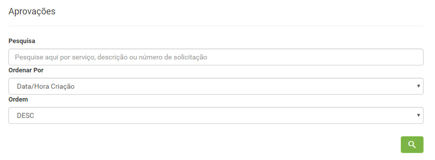
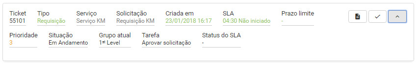
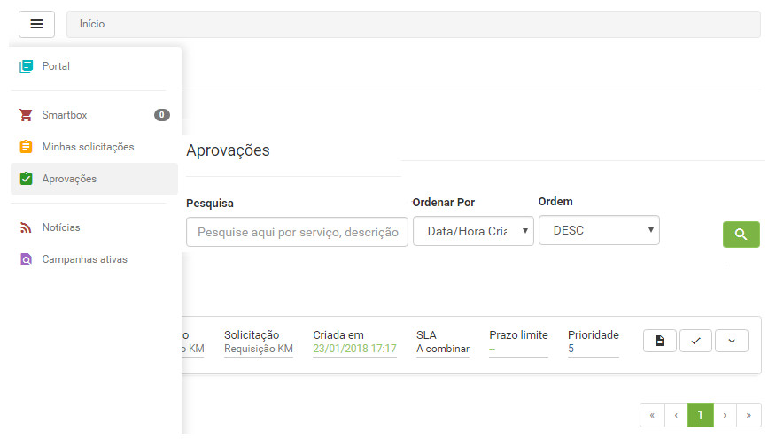
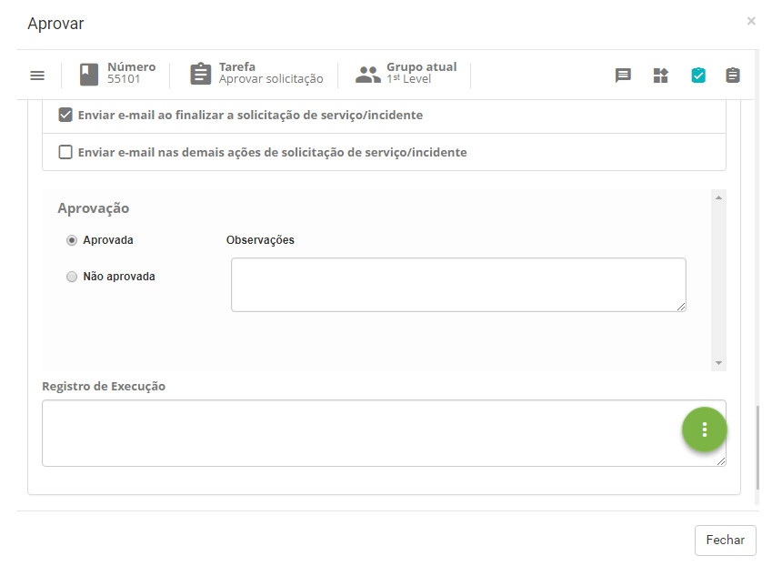

title:  Aprovação da solicitação de serviço via Smart Portal
Description: Aprovar da solicitaçã de serviço via Smart Portal. 
# Aprovação da solicitação de serviço via Smart Portal

Como acessar
---------------

1. Na tela inicial do **Smart Portal**, clique no botão de menu  e logo após clique na aba
**Aprovações**.

Pré-condições
---------------

1. Ter a solicitação de serviço registrada (ver conhecimento [Gerenciamento de ticket (serviços)][1]);

2. Ser membro do grupo aprovador de solicitação de serviço.

Filtros
-----------

1. Os seguintes filtros possibilitam ao usuário restringir a participação de itens na listagem padrão da funcionalidade, facilitando a
localização dos itens desejados:

    - Pesquisa;
    - Ordenar por;
    - Ordem.

    
    
    **Figura 1 - Tela de pesquisa de solicitações**
    
Listagem de itens
--------------------

1. Os seguintes campos cadastrais estão disponíveis ao usuário para facilitar a identificação dos itens desejados na listagem
padrão da funcionalidade: **Ticket, Tipo, Serviço, Solicitação, Título, Criada em, SLA, Prazo limite, Prioridade, Situação, Grupo
atual, Tarefa** e **Status do SLA**.

2. Existem botões de ação disponíveis ao usuário em relação a cada item da listagem, são eles: *Registrar opinião, Reabrir
solicitação, Pesquisa de satisfação, Descrição, Anexos, Ocorrências, Registrar Ocorrência, Cancelar Solicitação* e *Mensagem*.

**Figura 2 - Tela de listagem de solicitação**

Preenchimentos dos campos cadastrais
---------------------------------------

1. Não se aplica.

Aprovação de solicitação de serviço
---------------------------------------

1. Serão exibidas as solicitações de serviço para aprovação, conforme exemplo ilustrado na figura abaixo:

    
    
    **Figura 3 - Aprovação de solicitação de serviço**
    
2. Clique no ícone  da solicitação que irá aprovar para ser realizado o atendimento. Após isso,
será apresentada a tela de registro de informações referente à aprovação da mesma, conforme ilustrada na figura a seguir:

    
    
    **Figura 4 – Cadastro de aprovação da solicitação de serviço**
    
    - Marque uma das opções de aprovação: **Aprovada** ou **Não aprovada**;
    - Caso tenha marcado "Aprovada", descreva as observações, se achar necessário;
    - Caso tenha marcado "Não aprovada", descreva as observações, informe a justificativa e o complementa da justificativa.
    
3. Após registro das informações sobre a aprovação da solicitação, clique no botão de opções  e 
logo em seguida clique no botão  para gravar e avançar o fluxo. Feito isso, se a solicitação estiver
sido aprovada, a mesma será encaminhada para a fase de execução, ou seja, para o atendimento da mesma. Mas, caso a solicitação não 
seja aprovada, a mesma será encerrada.

!!! tip "About"

    <b>Product/Version:</b> CITSmart | 7.00 &nbsp;&nbsp;
    <b>Updated:</b>08/06/2019 - Larissa Lourenço

[1]:/pt-br/citsmart-platform-7/processes/tickets/ticket-management.html
