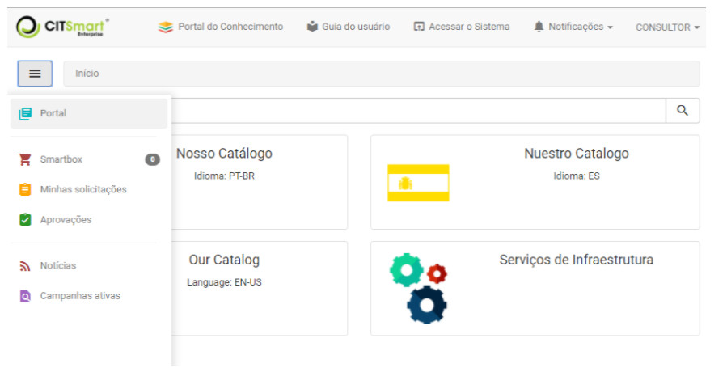
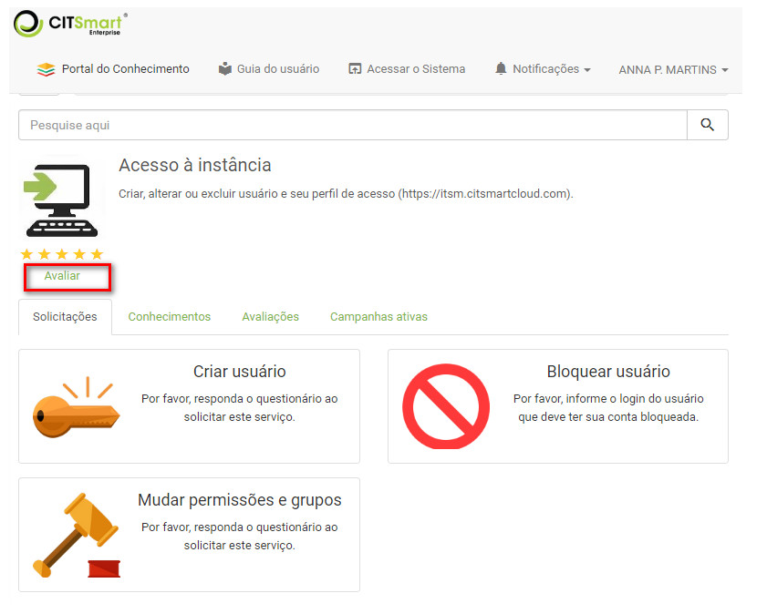
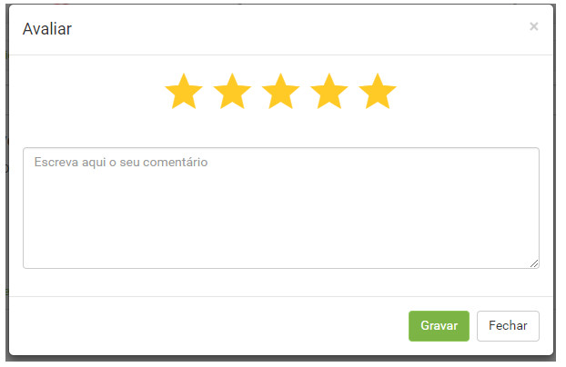
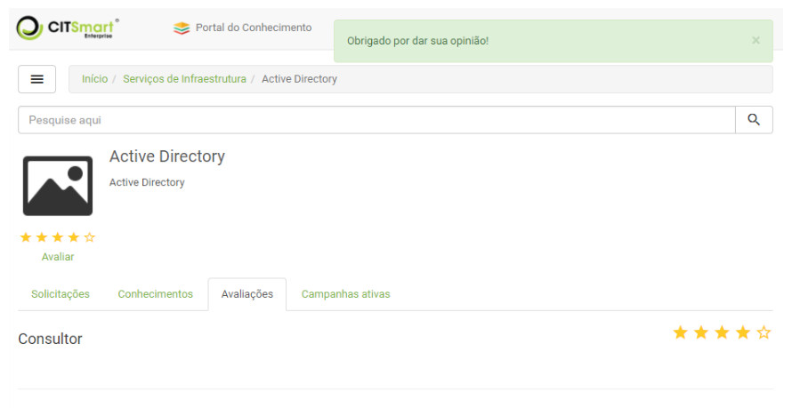

title:  Avaliação de serviços via smart portal
Description: Disponibiliza a avaliação de serviços via smart portal. 
# Avaliação de serviços via smart portal

Como acessar
---------------

1. Na tela inicial do **Smart Portal**, clique no botão de menu .

Pré-condições
----------------

1. Ter o portfólio com os serviços e as atividades de requisição/incidente cadastrados e disponibilizados no Smart Portal (ver
conhecimento [Cadastro de portfólio de serviços][1].

Avaliando os serviços
-------------------------

1. Clique em Portal e será apresentado seus respectivos serviços, conforme exemplo ilustrado na figura abaixo:

    
    
    **Figura 1 - Catálogo de serviços**
    
2. Selecione o serviço o qual irá avaliar;

    
    
    **Figura 2 - Serviço**
    
3. Clique em "Avaliar". Após isso, será apresentada a tela para de avaliação do serviço, conforme ilustrada na figura abaixo:

    
    
    **Figura 3 - Avaliação do serviço**
    
    - Informe uma nota para o serviço marcando as estrelas e escreva um comentário, caso achar necessário. Feito isso, clique no
    botão "Gravar" para efetuar a operação.
    
4. Para visualizar as avaliações do serviço que foram realizadas, clique em "Avaliações".

    
    
    **Figura 4 - Avaliações do serviço**
    
!!! tip "About"

    <b>Product/Version:</b> CITSmart | 7.00 &nbsp;&nbsp;
    <b>Updated:</b>08/06/2019 - Larissa Lourenço

[1]:/pt-br/citsmart-platform-7/processes/portfolio-and-catalog/register.html
