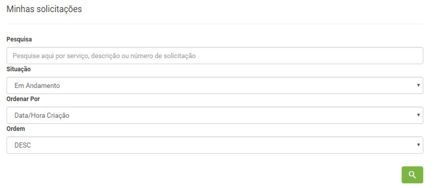
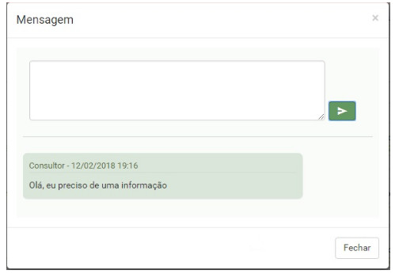
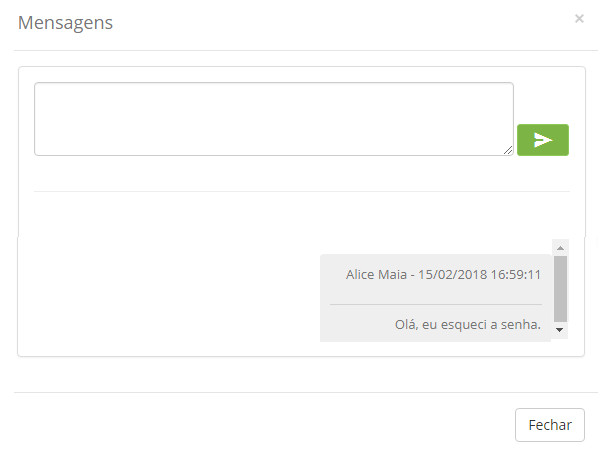

title:  Comunicação por mensagens dentro de um ticket pelo Smart Portal
Description: Tem por objetivo a troca de mensagem entre o Solicitante (Emissor) e o Atendente (Receptor). 
# Comunicação por mensagens dentro de um ticket pelo Smart Portal

Esta funcionalidade tem por objetivo a troca de mensagem entre o Solicitante (Emissor) e o Atendente (Receptor) dentro da solicitação
de serviço.

Pré-condições
---------------

1. Informe o conteúdo abaixo nos parâmetros (ver conhecimento [Regras de parametrização - ticket][1]);

    - Parâmetro 299: deverá estar setado em 'S';
    - Parâmetro 300: deverá estar setado em 'S'.
    
2. Existir ao menos uma solicitação de serviço aberta pelo Portal de Serviços (ver conhecimento 
[Cadastro de solicitação de serviço via smart portal][2]);

3. Ter permissão para executar a solicitação de serviço (ver conhecimento [Cadastro e pesquisa de grupo][3]);

4. Para haver troca de mensagens a solicitação deverá estar capturada pelo atendente.

Trocando mensagem - solicitante
----------------------------------

*Como acessar*

1. Na tela inicial do **Smart Portal**, clique no botão de menu   e logo após clique em 
**Minhas solicitações**, localize a solicitação desejada e clique no ícone  da mesma.

*Filtros*

1. Os seguintes filtros possibilitam ao usuário restringir a participação de itens na listagem padrão da funcionalidade, facilitando
a localização dos itens desejados:

    - Pesquisa;
    - Situação;
    - Ordenar Por;
    - Ordem.
    
    
    
    **Figura 1 - Tela de pesquisa de solicitação**
    
*Listagem de itens*

1. Os seguintes campos cadastrais estão disponíveis ao usuário para facilitar a identificação dos itens desejados na listagem padrão
da funcionalidade:**Ticket, Tipo, Serviço, Atividade, Título, Criada em, Tarefa, Grupo atual, Situação, SLA, Prazo limite, Status do
SLA** e **Prioridade**.

2. Existem botões de ação disponíveis ao usuário em relação a cada item da listagem, são eles: *Registar opinião, Reabrir 
solicitação, Pesquisa de satisfação, Descrição, Anexos, Ocorrências, Registrar Ocorrência, Cancelar Solicitação* e *Mensagem*.

    
    
    **Figura 2 - Tela de listagem de solicitação**
    
3. Clique no ícone destacado na figura anterior, logo após será aberta a tela de troca de mensagens e envie a informação desejada.

    
    
    **Figura 3 - Tela de mensagem**
    
*Preenchimento dos campos cadastrais*

1. Não se aplica.

Trocando mensagem - atendente
--------------------------------

1. Após o solicitante enviar a mensagem, o atendente (receptor) será notificado sobre a mesma em sua janela de trabalho, conforme a
figura abaixo (para que as notificações enviadas pelo solicitante seja visualizada pelo atendente e respondida em menor tempo, a
tela de trabalho necessita ser atualizada periodicamente):

    
    
    **Figura 4 - Tela de notificações de mensagem**
    
2. Posteriormente, o atendente clica no botão "Visualizar". Feito isso, será aberta uma nova tela, informando o conteúdo da 
mensagem enviada previamente pelo Solicitante;

3. Para responder alguma mensagem, é necessário seguir os passos das próximas sub-seções.

*Como acessar*

1. Acesse o menu principal **Processos ITIL > Gerência de Requisição e Incidente > Requisição de Serviços e Incidentes**;

*Filtros*

1. O seguinte filtro possibilita ao usuário restringir a participação de itens na listagem padrão da funcionalidade, facilitando a 
localização dos itens desejados:

    - Número
    
2. No campo de pesquisa, é permitido a busca por número, descrição da tarefa e responsável pelo atendimento;

3. Caso realizar a busca utilizando outros filtros, basta clicar no ícone  do campo de 
pesquisa.

*Listagem de itens*

1. Os seguintes campos cadastrais estão disponíveis ao usuário para facilitar a identificação dos itens desejados na listagem 
padrão da funcionalidade: **Número, Prioridade, Serviço, Atividade, Solicitante, Contrato, Criado por, Data criação** e **Tarefa**.

    
    
    **Figura 6 - Tela de listagem de solicitações**
    
2. Ao clicar no botão destacado na figura anterior, será aberta a tela de troca de mensagem entre o solicitante e o receptor;

3. A comunicação entre o emissor e receptor também pode ser iniciada clicando no ícone  da 
solicitação. Feito isso, a tela de requisição e incidente será aberta, clique em  para iniciar a 
troca de mensagens.

    
    
    **Figura 7 - Tela de troca de mensagem pelo modo de visualização de serviço**
    
!!! tip "About"

    <b>Product/Version:</b> CITSmart | 7.00 &nbsp;&nbsp;
    <b>Updated:</b>08/06/2019 - Larissa Lourenço

[1]:/pt-br/citsmart-platform-7/plataform-administration/parameters-list/parametrizaion-ticket.html
[2]:/pt-br/citsmart-platform-7/processes/portfolio-and-catalog/smart-portal/service-request.html
[3]:/pt-br/citsmart-platform-7/initial-settings/access-settings/user/group.html

