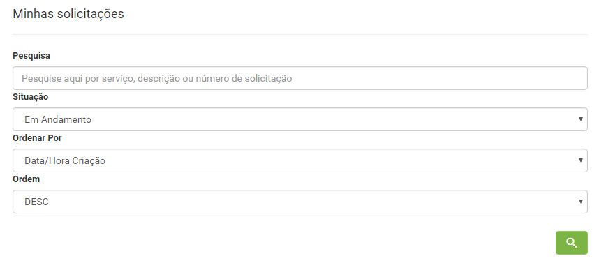
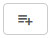
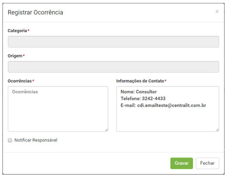

title:  Cadastro de ocorrência da solicitação de serviço via smart portal
Description: Disponibiliza o cadastro de ocorrência. 
# Cadastro de ocorrência da solicitação de serviço via smart portal

Como acessar
---------------

1. Na tela inicial do **Smart Portal**, clique no botão de menu  e logo após clique em **Minhas 
solicitações**. Após isso, serão exibidas as solicitações de serviço;

Pré-condições
---------------

1. Ter a solicitação de serviço registrada e a mesma deve estar com o status “em andamento” (ver conhecimento [Gerenciamento de 
ticket (serviços)][1], seção "Preenchimento Dos Campos Cadastrais - Cadastro De Ticket");

2. Ter habilitado o parâmetro “**Registrar Ocorrência pelo Portal**”;

3. Ter configurado o parâmetro abaixo (ver conhecimento [Regras de parametrização - Smart Portal][2]):

    - Parâmetro 253.
    
Filtros
-----------

1. Os seguintes filtros possibilitam ao usuário restringir a participação de itens na listagem padrão da funcionalidade, facilitando
a localização dos itens desejados:

    - Pesquisa;
    - Situação;
    - Ordenar Por;
    - Ordem.
    
    
    
    **Figura 1 - Tela de pesquisa de solicitação**
    
Listagem de itens
--------------------

1. Os seguintes campos cadastrais estão disponíveis ao usuário para facilitar a identificação dos itens desejados na listagem padrão
da funcionalidade: **Ticket, Tipo, Serviço, Atividade, Criada em, Tarefa, Grupo atual, Situação, SLA, Prazo limite, Status do SLA** e 
**Prioridade**.

2. Existem botões de ação disponíveis ao usuário em relação a cada item da listagem, são eles: *Registar opinião, Reabrir 
solicitação, Pesquisa de satisfação, Descrição, Anexos, Ocorrências, Registrar Ocorrência, Cancelar Solicitação* e *Mensagem*.

**Figura 2 - Tela de listagem de solicitação**

Preenchimento dos campos cadastrais
--------------------------------------

!!! info "IMPORTANTE"

    Somente se o parâmetro “Registrar Ocorrência pelo Portal” estiver habilitado, será exibido o ícone
     na solicitação “em andamento” o qual permite o registro da ocorrência.
    
1. Busque a solicitação de serviço (em andamento) que deseja registrar uma ocorrência e clique no ícone 
 da mesma. Feito isso, será apresentada a tela de **Cadastro de Ocorrência**, conforme ilustrada na
figura abaixo:

    
    
    **Figura 3 - Tela de Cadastro de Ocorrência**
    
2. Informe os dados da ocorrência;

    - **Categoria**: selecione a categoria da ocorrência da solicitação de serviço;
    - **Origem**: selecione a origem da ocorrência da solicitação de serviço;
    - **Ocorrências**: descreva a ocorrência referente à solicitação de serviço;
    - **Notificar responsável**: marque essa opção, caso queira que o responsável pela solicitação de serviço receba uma 
    notificação por e-mail referente a ocorrência da solicitação.
    
3. Após informar os dados, clique no botão "Gravar" para efetuar o registro.

!!! tip "About"

    <b>Product/Version:</b> CITSmart | 7.00 &nbsp;&nbsp;
    <b>Updated:</b>08/06/2019 - Larissa Lourenço

[1]:/pt-br/citsmart-platform-7/processes/tickets/ticket-management.html
[2]:/pt-br/citsmart-platform-7/plataform-administration/parameters-list/parametrization-smart-portal.html
