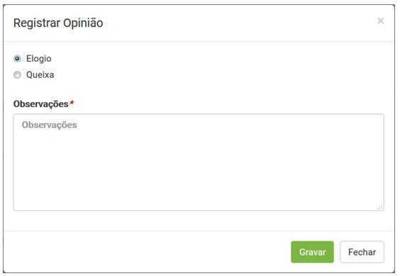

title:  Cadastro da opinião sobre o atendimento de uma solicitação de serviço via smart Portal
Description: Disponibiliza o cadastro de opiniões via Smart Portal. 
# Cadastro da opinião sobre o atendimento de uma solicitação de serviço via smart Portal

Como acessar
---------------

1. Na tela inicial do **Smart Portal**, clique no botão de menu   e logo após clique em 
**Minhas solicitações**.

Pré-condições
----------------

1. A solicitação de serviço deverá estar com a situação “fechada” (ver conhecimento [Gerenciamento de ticket (serviços)][1], seção 
"Preenchimento Dos Campos Cadastrais - Cadastro De Ticket").

Filtros
----------

1. Não se aplica.

Listagem de itens
--------------------

1. Não se aplica.

Registrando opinião sobre o atendimento da solicitação de serviço
-------------------------------------------------------------------

1. Serão exibidas as solicitações de serviço;

2. Busque a solicitação de serviço (fechada) que deseja registrar sua opinião e clique ícone  da 
mesma. Feito isso, será apresentada a tela de **Registro de Opinião**, conforme ilustrada na figura abaixo:

    
    
    **Figura 1 - Tela de registro de opinião**
    
3. Preencha os campos necessários e clique no botão "Gravar" para efetuar o registro. Após isso, será exibida uma mensagem 
agradecendo a opinião registrada.

!!! tip "About"

    <b>Product/Version:</b> CITSmart | 7.00 &nbsp;&nbsp;
    <b>Updated:</b>08/06/2019 - Larissa Lourenço
        
[1]:/pt-br/citsmart-platform-7/processes/tickets/ticket-management.html
