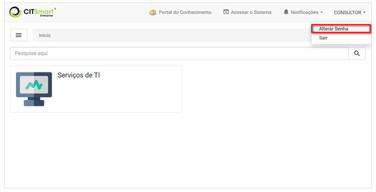
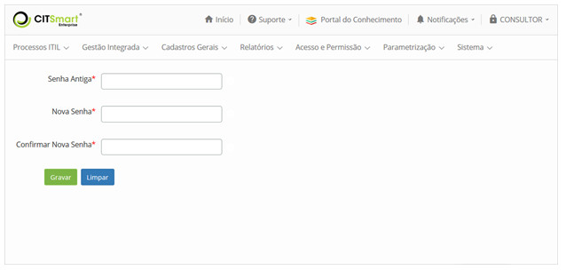

title:  Alteração da senha via Smart Portal
Description: Disponibiliza a mudança de senha. 
# Alteração da senha via Smart Portal

Mudando a senha
-----------------

1. Na tela inicial do **Smart Portal**, clique na identificação do usuário e logo em seguida em Alterar Senha, conforme indicado na figura abaixo:

    
    
    **Figura 1 - Alterar senha**
    
2. Será exibida a tela de alteração da senha de acesso ao sistema, conforme ilustrada na figura abaixo:

    
    
    **Figura 2 - Tela de alteração de senha de acesso ao sistema**
    
    - **Senha Antiga**: informe a senha atual de acesso ao sistema;
    - **Nova Senha**: defina na nova senha de acesso ao sistema;
    - **Confirmar Nova Senha**: informe a nova senha para confirmação.

3. Após os dados informados, clique no botão "Gravar" para efetuar a operação.

!!! tip "About"

    <b>Product/Version:</b> CITSmart | 7.00 &nbsp;&nbsp;
    <b>Updated:</b>08/06/2019 - Larissa Lourenço

