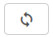

title:  Reabertura de solicitação de serviço via Smart Portal
Description: Disponibiliza a reabertura de solicitação de serviço via Smart Portal. 
# Reabertura de solicitação de serviço via Smart Portal

Como acessar
----------------

1. Na tela inicial do **Smart Portal**, clique no botão de menu  e logo após clique em **Minhas 
solicitações**.

Pré-condições
----------------

1. A solicitação de serviço deverá estar com a situação “fechada” (ver conhecimento [Gerenciamento de ticket (serviços)][1], 
precisamente a seção "Preenchimento Dos Campos Cadastrais - Cadastro De Ticket");

2. Ter permissão no fluxo de trabalho que faz vínculo com a atividade de requisição/incidente para reabrir solicitação. Essa permissão
é definida no cadastro de grupo (ver conhecimento [Cadastro e pesquisa de grupo][2]);

3. Configure o parâmetro abaixo (ver conhecimento [Regras de parametrização - ticket][3]):

    - Parâmetro 171.
    
Filtros
----------

1. Os seguintes filtros possibilitam ao usuário restringir a participação de itens na listagem padrão da funcionalidade, facilitando
a localização dos itens desejados:

    - Pesquisa;
    - Situação;
    - Ordenar por;
    - Ordem.
    
    
    
    **Figura 1 - Tela de pesquisa de solicitação**
    
Listagem de itens
------------------

1. Os seguintes campos cadastrais estão disponíveis ao usuário para facilitar a identificação dos itens desejados na listagem padrão
da funcionalidade: **Ticket, Tipo, Serviço, Atividade, Criada em, Tarefa, Grupo atual, Situação, SLA, Prazo limite, Status do SLA**
e **Prioridade**.

2. Existem botões de ação disponíveis ao usuário em relação a cada item da listagem, são eles: *Registar opinião, Reabrir 
solicitação, Pesquisa de satisfação, Descrição, Anexos, Ocorrências, Registrar Ocorrência, Cancelar Solicitação* e *Mensagem*.

**Figura 2 - Tela de listagem de solicitação**

Reabertura da solicitação de serviço
----------------------------------------

1. Busque a solicitação de serviço (fechada) que deseja reabrir, clique no ícone  da mesma e 
confirme a reabertura. Feito isso, a solicitação será reaberta para ser realizado um novo atendimento.

!!! tip "About"

    <b>Product/Version:</b> CITSmart | 7.00 &nbsp;&nbsp;
    <b>Updated:</b>08/07/2019 - Larissa Lourenço

[1]:/pt-br/citsmart-platform-7/processes/tickets/ticket-management.html
[2]:/pt-br/citsmart-platform-7/initial-settings/access-settings/user/group.html
[3]:/pt-br/citsmart-platform-7/plataform-administration/parameters-list/parametrizaion-ticket.html
