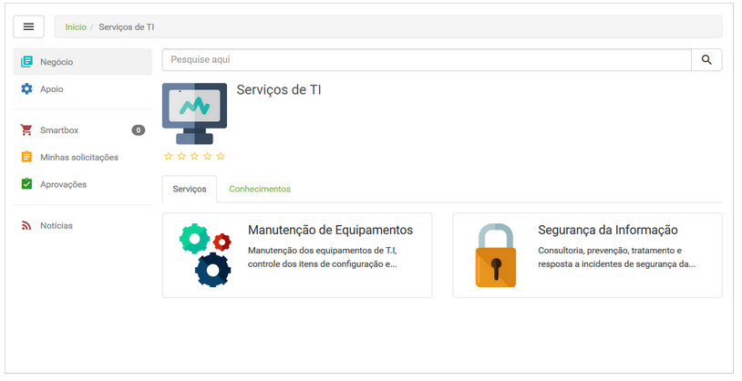
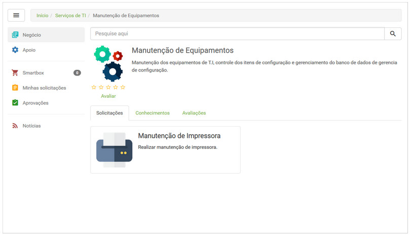
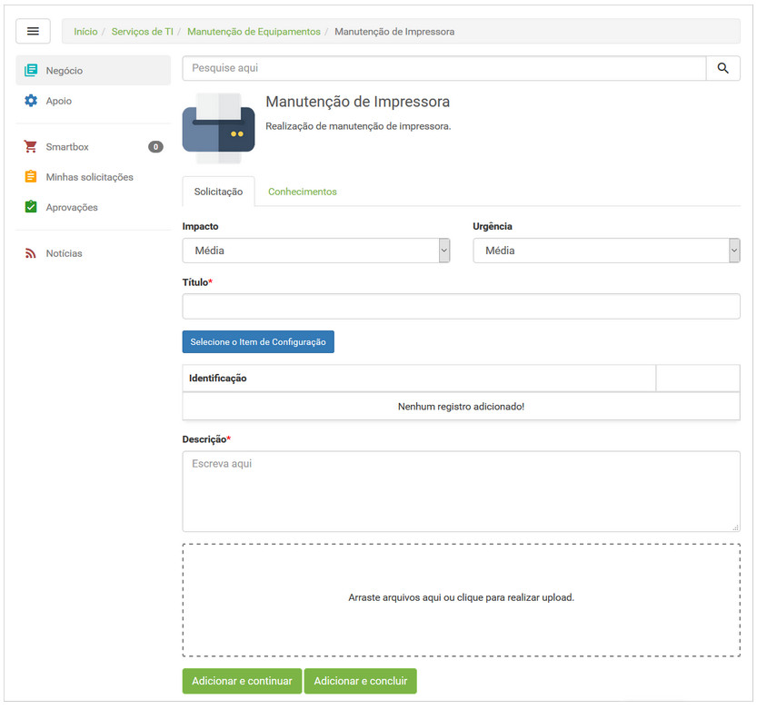
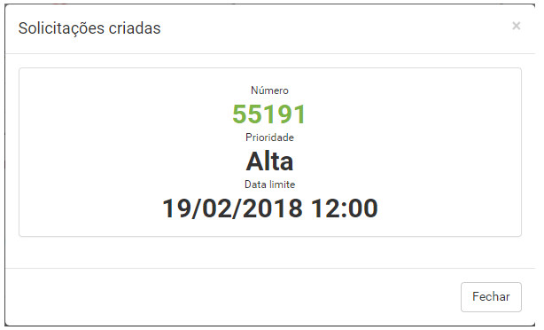

title:  Cadastro de solicitação de serviço via Smart Portal
Description: Disponibiliza o cadastro de solicitações via Smart Portal. 
# Cadastro de solicitação de serviço via Smart Portal

Como acessar
--------------

1. Na tela inicial do **Smart Portal**, clique no botão de menu , selecione o tipo de catálogo 
de serviços (Negócio ou Apoio) e selecione o catálogo de serviços desejado. 

Pré-condições
------------------

1. Ter o contrato cadastrado (ver conhecimento Cadastro e pesquisa de contrato );

2. Ter o portfólio com os serviços e as atividades de requisição/incidente cadastrados e disponibilizados no Smart Portal (ver 
conhecimento Cadastro de portfólio de serviços, Cadastro de serviços e Cadastro da atividade de serviço );

3. Ter o tempo de atendimento das atividades de requisição/incidente definido (ver conhecimento Cadastro e pesquisa de tempo de 
atendimento );

4. Ter permissão no fluxo de trabalho que faz vínculo com a atividade de requisição/incidente para criar solicitação. Essa permissão é
definida no cadastro de grupo (ver conhecimento Cadastro e pesquisa de grupo ) ;

5. Ser membro do grupo que tem permissão de acesso ao portfólio, serviços e atividades de requisição/incidente que estão 
disponibilizados no Smart Portal, caso o parâmetro “**Habilita permissão de acesso para grupos de usuário no portal**” esteja
habilitado;

6. Ter configurado o parâmetro "*Identifica o id de origem do chamado padrão da solicitação de serviço*" com o número de identificação
da origem;

7. Ter a unidade (a qual o usuário logado está relacionado) vinculada ao contrato relacionado à atividade de requisição/incidente do
serviço, caso o parâmetro "**Vincula contratos a unidade**" esteja habilitado (ver conhecimento Como relacionar unidade ao contrato? );

8. Ser membro do grupo que faz vínculo ao contrato relacionado à atividade de requisição/incidente do serviço, caso o parâmetro “Faz o
controle de vínculo de colaboradores aos contratos" esteja habilitado (ver conhecimento Como relacionar grupo ao contrato? );

9. Ter parametrizado a prioridade e data limite da solicitação (ver conhecimento Cadastro da atividade de serviço).

Filtros
----------

1. Não se aplica.

Listagem de itens
-------------------

1. Não se aplica.

Preenchimento dos campos cadastrais
-------------------------------------

1. Serão apresentados seus respectivos serviços, conforme exemplo ilustrado na figura abaixo:

    
    
    **Figura 1 - Catálogo de serviços**
    
2. Selecione o serviço desejado. Após isso, serão exibidas as atividades de requisição e/ou incidente relacionadas ao mesmo, 
conforme exemplo ilustrado na figura abaixo:

    
    
    **Figura 2 - Serviço**
    
3. Selecione a atividade do serviço para solicitação da mesma e após isso, será apresentada a tela de registro da solicitação, 
conforme ilustrada na figura abaixo:

    
    
    **Figura 3 - Tela de registro da solicitação**
    
4. Informe os dados da solicitação;

    !!! note "NOTA"
    
        Os campos referentes à Impacto, Urgência, Descrição, Item de Configuração e Anexo, somente serão exibidos na tela de 
        registro de solicitação se no registro da atividade de requisição/incidente estiver habilitado para apresentação dos mesmos.
        
    - As informações dos campos **impacto** e **urgência** são estabelecidas conforme configurado no registro do tempo de 
    atendimento vinculado à atividade de requisição/incidente;
    - **Título**: informe o título da solicitação;
    - Adicione o item de configuração referente à solicitação, se for necessário;
    - **Descrição**: informe a descrição da solicitação. A descrição deve ser objetiva, incluindo toda informação necessária para o
    atendimento da mesma;
    - Após informar a descrição da solicitação, o sistema faz a busca dos conhecimentos referentes à descrição e exibe os mesmos 
    para visualização;
    - Anexe um arquivo à solicitação, se achar necessário.
    
    !!! info "IMPORTANTE"
    
        Se o parâmetro “Habilita botão “Adicionar e continuar” na popup de nova solicitação no portal” estiver habilitado, será 
        exibido o botão “Adicionar e continuar” na tela de registro de solicitação de serviço. Esse botão permite adicionar o 
        serviço no Smartbox e continuar selecionando mais serviços para solicitação.
        
5. Após os dados informados, clique no botão "Adicionar e concluir" para efetuar a operação.

6. Ao cadastrar uma nova solicitação de serviço via Smart Portal é aberta uma nova aba com as informações referentes a mesma, tais
como seu número, prioridade e data limite , conforme a figura abaixo:

    
    
    **Figura 4 - Tela de solicitações criadas**
    
    !!! note "NOTA"
    
        As informações sobre o prazo da solicitação criada (prioridade e data limite) podem ser excluídas conforme a necessidade do
        cliente.
        
!!! tip "About"

    <b>Product/Version:</b> CITSmart | 7.00 &nbsp;&nbsp;
    <b>Updated:</b>08/06/2019 - Larissa Lourenço
        
