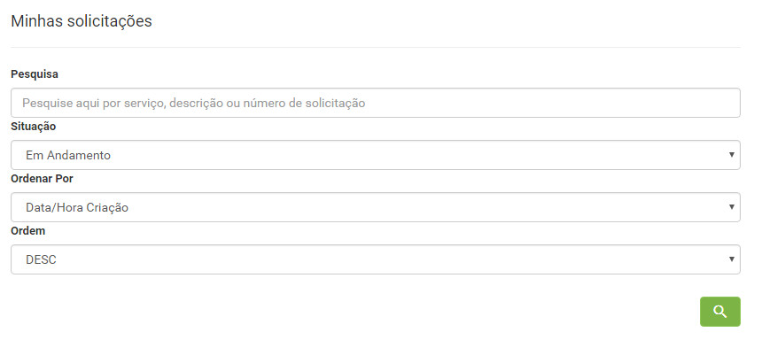
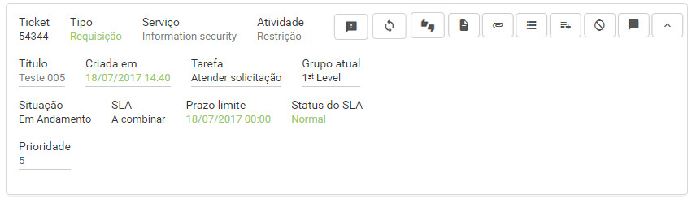
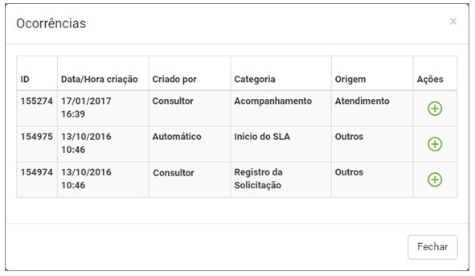

title:  Verificação das ocorrências de uma solicitação de serviço via Smart Portal
Description: Disponibiliza verificar as ocorrências de uma solicitação de serviço via Smart Portal. 
# Verificação das ocorrências de uma solicitação de serviço via Smart Portal

Como acessar
---------------

1. Na tela inicial do **Smart Portal**, clique no botão de menu  e logo após clique em **Minhas 
solicitações**.

Pré-condições
----------------

1. Ter a solicitação de serviço registrada (ver conhecimento [Cadastro de solicitação de serviço via smart portal][1]);

2. Ter habilitado o parâmetro abaixo (ver conhecimento [Regras de parametrização - Smart portal][2]):

    - Parâmetro 298: "S".
    
Filtros
----------

1. Os seguintes filtros possibilitam ao usuário restringir a participação de itens na listagem padrão da funcionalidade, facilitando
a localização dos itens desejados:

    - Pesquisa;
    - Situação;
    - Ordenar Por;
    - Ordem.
    
    
    
    **Figura 1 - Tela de pesquisa de solicitação**
    
Listagem de itens
-------------------

1. Os seguintes campos cadastrais estão disponíveis ao usuário para facilitar a identificação dos itens desejados na listagem 
padrão da funcionalidade: **Ticket, Tipo, Serviço, Atividade, Criada em, Tarefa, Grupo atual, Situação, SLA, Prazo limite, Status do
SLA** e **Prioridade**.

2. Existem botões de ação disponíveis ao usuário em relação a cada item da listagem, são eles: *Registar opinião, Reabrir 
solicitação, Pesquisa de satisfação, Descrição, Anexos, Ocorrências, Registrar Ocorrência, Cancelar Solicitação* e *Mensagem*.

**Figura 2 - Tela de listagem de solicitação**

Preenchimento dos campos cadastrais
-------------------------------------

1. Não se aplica.

Verificando as ocorrências
-----------------------------

1. Clique no ícone  da solicitação desejada. Feito isso, será apresentada a tela de Ocorrências, 
conforme exemplo ilustrado na figura abaixo:

    
    
    **Figura 3 - Tela de ocorrências**
    
    !!! info "IMPORTANTE"
    
        Somente são exibidas as últimas 10 ocorrências da solicitação.
    
2. Para verificar os detalhes da ocorrência, clique no ícone .

!!! tip "About"

    <b>Product/Version:</b> CITSmart | 7.00 &nbsp;&nbsp;
    <b>Updated:</b>08/07/2019 - Larissa Lourenço

[1]:/pt-br/citsmart-platform-7/processes/portfolio-and-catalog/smart-portal/service-request.html
[2]:/pt-br/citsmart-platform-7/plataform-administration/parameters-list/parametrization-smart-portal.html
