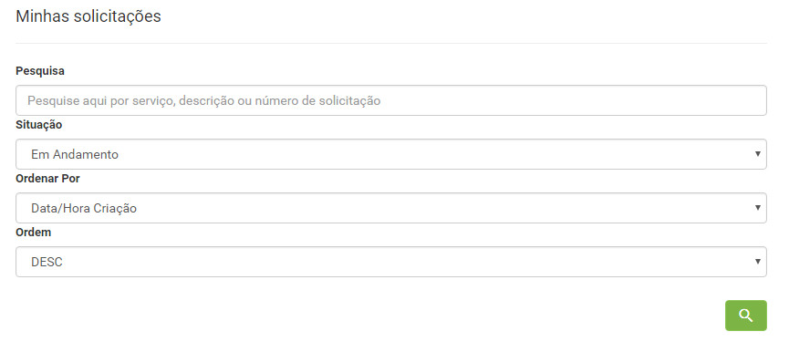
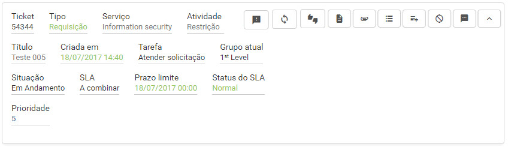
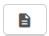
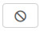
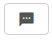
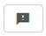
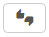
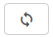

title:  Visualização das minhas solicitações (tickets) pelo Smart Portal
Description: Disponibiliza a visualização de próprias solicitações pelo Smart Portal. 
# Visualização das minhas solicitações (tickets) pelo Smart Portal

Como acessar
------------------

1. Na tela inicial do **Smart Portal**, clique no botão de menu   e logo após clique em **Minhas
solicitações**. 

Pré-condições
----------------

1. Ter solicitações de serviços registradas (ver conhecimento [Cadastro de solicitação de serviço via smart portal][1]).

Filtros
----------

1. Os seguintes filtros possibilitam ao usuário restringir a participação de itens na listagem padrão da funcionalidade, facilitando
a localização dos itens desejados:

     - Pesquisa;
     - Situação;
     - Ordenar Por;
     - Ordem.
     
     
     
     **Figura 1 - Tela de pesquisa de solicitação**
     
Listagem de itens
--------------------

1. Os seguintes campos cadastrais estão disponíveis ao usuário para facilitar a identificação dos itens desejados na listagem 
padrão da funcionalidade: **Ticket, Tipo, Serviço, Solicitação, Criada em, Tarefa, Grupo atual, Situação, SLA, Prazo limite, Status 
do SLA** e **Prioridade**.

2. Existem botões de ação disponíveis ao usuário em relação a cada item da listagem, são eles:

    
    
    **Figura 2 - Tela de listagem de solicitação**
    
     - Verificar a descrição da solicitação de serviço;
    
     - Verificar as ocorrências da solicitação de serviço. Esse ícone somente será exibido na 
    solicitação, se o parâmetro “Exibir as ocorrências da Solicitação/Incidente” estiver habilitado;
    
     - Registrar as ocorrências referente à solicitação de serviço. Esse ícone somente será exibido
    na solicitação, se o parâmetro “Registrar Ocorrência pelo Portal” estiver habilitado;
    
     - Cancelar a solicitação de serviço. Esse ícone somente será exibido na solicitação, se o 
    parâmetro “Habilitar cancelamento de solicitação/incidente pelo portal” estiver habilitado;
    
     - Interagir, através da troca de mensagens, com o responsável pelo atendimento da solicitação
    de serviço. Esse ícone somente será exibido na solicitação, se a mesma já estiver sido capturada para o atendimento e o 
    parâmetro “Requisição/Incidente - Ativar troca de mensagens” estiver habilitado;
    
     - Registrar opinião referente ao atendimento da solicitação de serviço;
    
     - Registrar o grau de satisfação em relação ao atendimento da solicitação de serviço;
    
     - Reabrir a solicitação de serviço. Esse ícone somente será exibido na solicitação, se o 
    parâmetro “Limite de dias para a reabertura de Incidentes/Requisição de serviços” estiver configurado corretamente.
    
    !!! note "NOTA"
    
        É  necessário ter permissão para executar essas ações. Para que o título da atividade apareça na listagem das solicitações 
        de serviço é necessário a configuração do parâmetro 301 - Exibir o título da solicitação/incidente (Valores: "S" ou "N" 
        Default: "N") em Sim e que o título já esteja cadastrado anteriormente.
        
Preenchimento dos campos cadastrais
-------------------------------------

1. Não se aplica.

Veja também

- [Cadastro da Opinião sobre o Atendimento de uma Solicitação de Serviço via Smart Portal][2];

- [Cadastro da Satisfação sobre o Atendimento de uma Solicitação de Serviço via Smart Portal][3];

- [Verificação das Ocorrências de uma Solicitação de Serviço via Smart Portal][4];

- [Cancelamento de Solicitação de Serviço via Smart Portal][5];

- [Reabertura de Solicitação de Serviço via Smart Portal][6].
    
[1]:/pt-br/citsmart-platform-7/processes/portfolio-and-catalog/smart-portal/service-request.html
[2]:/pt-br/citsmart-platform-7/processes/portfolio-and-catalog/smart-portal/opinion.html
[3]:/pt-br/citsmart-platform-7/processes/portfolio-and-catalog/smart-portal/satisfaction.html
[4]:/pt-br/citsmart-platform-7/processes/portfolio-and-catalog/smart-portal/verify-occurrences.html
[5]:/pt-br/citsmart-platform-7/processes/portfolio-and-catalog/smart-portal/service-request-cancellation.html
[6]:/pt-br/citsmart-platform-7/processes/portfolio-and-catalog/smart-portal/reopen.html

