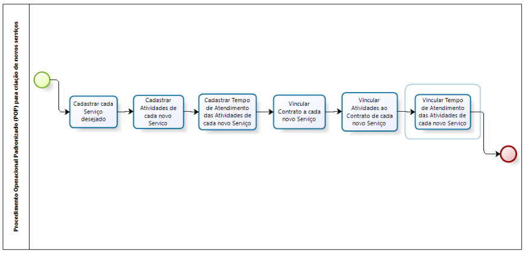

title: Passos recomendados para criar novos serviços
Description: procedimento operacional padronizado (pop) para criação de novos serviços.

# Passos recomendados para criar novos serviços

Procedimento operacional padronizado (pop) para criação de novos serviços

**Figura 1 - Diagrama do POP para criação de novos serviços**

### Pré-condições

1.  O perfil de acesso deve ter sido criado para controlar o acesso dos usuários às funcionalidades do sistema. Acesse o menu **Acesso e Permissão > Perfil de Acesso** e crie o perfil com permissão para pesquisar, gravar e/ou excluir as funcionalidades do sistema (ver conhecimento [Cadastro e pesquisa de perfil de acesso][1]).

2.  Cada colaborador que interagirá com o novo serviço deve ter sido criado. Acesse o menu **Cadastros Gerais > Gerência de Pessoal > Colaborador** (ver conhecimento [Cadastro e pesquisa de colaborador][2]).

3.  Cada colaborador que interagirá com o novo serviço deve ter seu usuário de login criado. Acesse o menu **Cadastros Gerais > Gerência de Pessoal > Usuário** (ver conhecimento [Cadastro e pesquisa de usuário][3]).

4.  A jornada de trabalho relacionada ao novo serviço deve estar criada. Acesse o menu **Cadastros Gerais > Gerência de Pessoal > Jornada de Trabalho** (ver conhecimento [Cadastro e pesquisa de jornadas de trabalho][4]).

5.  O calendário (escalas) de jornada de trabalho que será vinculado nas atividades do novo serviço. Acesse o menu **Cadastros Gerais > Gerência de Pessoal > Calendário** (ver conhecimento [Cadastro e pesquisa de calendário][5]).

6.  Cada cliente (interno ou externo) que poderá solicitar/contratar o novo serviço deve estar cadastrado no sistema. Acesse o menu **Processos ITIL > Gerência de Portfólio de Catálogo > Cliente** (ver conhecimento [Cadastro e pesquisa de cliente][6]).

7.  Cada fornecedor (provedor de serviços, interno ou externo) que poderá apoiar o novo serviço deve estar criado no sistema. Acesse o menu **Processos ITIL > Gerência de Portfólio de Catálogo > Fornecedor** (ver conhecimento [Cadastro e pesquisa de fornecedor][7]).

8.  Cada contrato que pode ser relacionado ao novo serviço deve estar criado no sistema. Acesse o menu **Processos ITIL > Gerência de Portfólio de Catálogo > Cadastro de Contrato** (ver conhecimento [Cadastro e pesquisa de contrato][8]).

    -   Trata-se de um acordo entre duas partes, que se obrigam a cumprir o que
        foi entre elas combinado sob determinadas condições. O contrato pode ser
        do tipo contrato (contrato entre o fornecedor do tipo “provedor de
        serviços” e cliente “externo”), acordo de nível operacional (acordo
        interno entre os departamentos da mesma organização, fornecedor interno
        com cliente interno) ou contrato de apoio (contrato entre o fornecedor
        externo e cliente interno).

9.  Cada grupo de colaboradores que interagirá com o novo serviço deve ter sido criado. Acesse o menu **Acesso e Permissão > Grupo** (ver conhecimento [Cadastro e pesquisa de grupo][9]). E cada grupo criado deve estar vinculado a cada Contrato de cada novo
 Serviço (**Processos ITIL > Gerência de Portfólio de Catálogo > Cadastro de Contratos > Grupos de Usuários**) (ver conhecimento [Cadastro e pesquisa de contrato][8]).

10. Cada Portfólio que conterá o novo serviço deve estar criado. Acesse o menu **Processos ITIL > Gerência de Portfólio e Catálogo > Gerenciamento de Portfólio** (ver conhecimento [Cadastro de portfólio de serviços][10]).

11. A permissão de acesso a cada Portfólio de cada novo Serviço deve estar definida para liberar ou restringir o acesso dos perfis de usuários às funcionalidades existentes na tela de Gerenciamento de Portfólio. Acesse o menu **Acesso e Permissão > Gerência de Portfólio** (ver conhecimento [Permissão de acesso do gerenciamento de portfólio][11]).

### Detalhes das atividades/tarefas do fluxo

***Cadastrar cada Serviço desejado***

Após criar o portfólio, registre os serviços de negócio/TI. Acesse o menu **Processos ITIL > Gerência de Portfólio e Catálogo > Gerenciamento de Portfólio**, clique no botão *Avançar Portfólio* e registre os Serviços de Negócio/TI.

***Cadastrar Atividades de cada novo Serviço***

Para cada Serviço de Negócio/TI são cadastradas as atividades de requisição e incidente. Acesse a tela de Gerenciamento de Portfólio (**Processos ITIL > Gerência de Portfólio e Catálogo > Gerenciamento de Portfólio**), clique no botão *Avançar Portfólio*, *Avançar Serviço* e registre as atividades de Requisição e Incidente.

***Cadastrar Tempo de Atendimento das Atividades de cada novo Serviço***

O tempo de atendimento é definido para controlar o tempo de execução das atividades do serviço. Acesse o menu **Processos ITIL > Gerência de Acordo de Níveis de Serviço > Tempo de Atendimento** e registre o tempo de atendimento.

***Vincular Contrato a cada novo Serviço***

Vincule o contrato que provê o serviço de negócio/TI. Acesse a tela de Gerenciamento de Portfólio (**Processos ITIL > Gerência de Portfólio e Catálogo > Gerenciamento de Portfólio**), clique no botão *Avançar Portfólio*, *Avançar Serviço* e vincule o contrato ao serviço.

***Vincular Atividades ao Contrato de cada novo Serviço***

Após o contrato vinculado ao serviço, vincule as atividades (requisição e incidente) ao contrato do serviço. Acesse a tela de Gerenciamento de Portfólio (**Processos ITIL > Gerência de Portfólio e Catálogo > Gerenciamento de Portfólio**), clique no botão *Avançar Portfólio*, *Avançar Serviço*, *Avançar Contrato* e vincule as atividades de requisição e incidentes.

***Vincular Tempo de Atendimento das Atividades de cada novo Serviço***

Acesse a tela de Gerenciamento de Portfólio (**Processos ITIL > Gerência de Portfólio e Catálogo > Gerenciamento de Portfólio**), clique no botão *Avançar Portfólio*, *Avançar Serviço*, *Avançar Contrato* e entre na tela de registro da atividade de requisição ou da atividade de incidente e informe o tempo de atendimento definido para estas atividades.

**O tempo de atendimento das atividades do serviço será calculado de acordo com
o que foi definido no calendário**.

### Veja também

-   [Cadastro e pesquisa de calendário][5];

-   [Cadastro e pesquisa de jornadas de trabalho][4];

-   [Cadastro e pesquisa de grupo][9];

-   [Cadastro e pesquisa de perfil de acesso][1];

-   [Cadastro e pesquisa de colaborador][2];

-   [Cadastro e pesquisa de usuário][3];

[1]:/pt-br/citsmart-platform-7/initial-settings/access-settings/profile/user-profile.html
[2]:/pt-br/citsmart-platform-7/initial-settings/access-settings/user/employee.html
[3]:/citsmart-platform-7/initial-settings/access-settings/user/user-register.html
[4]:/pt-br/citsmart-platform-7/plataform-administration/time/create-working-day.html
[5]:/pt-br/citsmart-platform-7/plataform-administration/time/create-calendar.html
[6]:/pt-br/citsmart-platform-7/processes/portfolio-and-catalog/client.html
[7]:/pt-br/citsmart-platform-7/processes/portfolio-and-catalog/provider.html
[8]:/pt-br/citsmart-platform-7/additional-features/contract-management/use/register-contract.html
[9]:/pt-br/citsmart-platform-7/initial-settings/access-settings/user/group.html
[10]:/pt-br/citsmart-platform-7/processes/portfolio-and-catalog/register.html
[11]:/pt-br/citsmart-platform-7/processes/portfolio-and-catalog/portfolio-access.html

!!! tip "About"

    <b>Product/Version:</b> CITSmart | 8.00 &nbsp;&nbsp;
    <b>Updated:</b>07/17/2019 – Anna Martins
