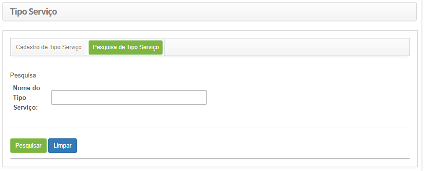
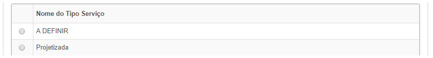
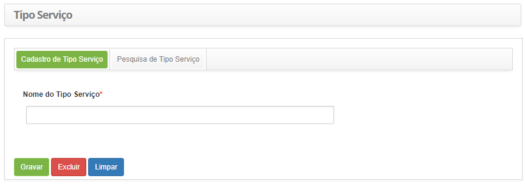

title: Cadastro e pesquisa de tipo de serviço
Description: Esta funcionalidade tem por objetivo registrar os tipos de serviço que serão utilizadas em outras rotinas do sistema.

# Cadastro e pesquisa de tipo de serviço

Esta funcionalidade tem por objetivo registrar os tipos de serviço que serão
utilizadas em outras rotinas do sistema.

Como acessar
------------

1.  Acesse a funcionalidade de Tipo de Serviço através da navegação no menu
    principal **Processos ITIL > Gerência de Portfólio e Catálogo > Tipo
    Serviço**.

Pré-condições
-------------

1.  Não se aplica.

Filtros
-------

1.  O seguinte filtro possibilita ao usuário restringir a participação de itens
    na listagem padrão da funcionalidade, facilitando a localização dos itens
    desejados:

    -   Nome do Tipo de Serviço

2.  Na tela de Tipo de Serviço, clique na aba **Pesquisa de Tipo Serviço**, será
    apresentada a respectiva tela de pesquisa conforme ilustrada na figura
    abaixo:

    

    **Figura 1 - Tela de pesquisa de tipo de serviço**

3.  Realize a pesquisa de tipo de serviço;

    -   Informe o nome do tipo de serviço que deseja pesquisar e clique no
        botão *Pesquisar*. Após isso, será exibido o registro conforme o nome
        informado.

    -   Caso deseje listar todos os registros de tipo de serviço, basta clicar
        diretamente no botão *Pesquisar*.

Listagem de itens
----------------

1.  O seguinte campo cadastral está disponível ao usuário para facilitar a
    identificação dos itens desejados na listagem padrão da
    funcionalidade: **Nome do Tipo Serviço**.

    

    **Figura 2 - Tela de itens**

2.  Após a pesquisa, selecione o registro desejado. Feito isso, será direcionado
    para a tela de cadastro exibindo o conteúdo referente ao registro
    selecionado.

3.  Para alterar os dados do registro de tipo de serviço, basta modificar as
    informações dos campos desejados e clicar no botão *Gravar* para que seja
    gravada a alteração realizada no registro, onde a data, hora e usuário serão
    gravados automaticamente para uma futura auditoria.

Preenchimento dos campos cadastrais
-----------------------------------

1.  Será apresentada a tela de Cadastro de Tipo de Serviço, conforme ilustrada
    na figura abaixo:

    

    **Figura 3 - Tela de cadastro de tipo de serviço**

2.  Preencha o campo conforme orientação abaixo:

    -   Informe o nome do tipo de serviço. Ex.: Rotineira;

3.  Clique no botão *Gravar* para efetuar o registro, onde a data, hora e
    usuário serão gravados automaticamente para uma futura auditoria.

!!! tip "About"

    <b>Product/Version:</b> CITSmart | 8.00 &nbsp;&nbsp;
    <b>Updated:</b>07/17/2019 – Anna Martins
