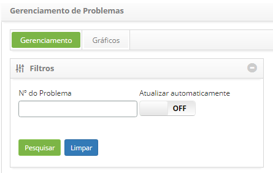
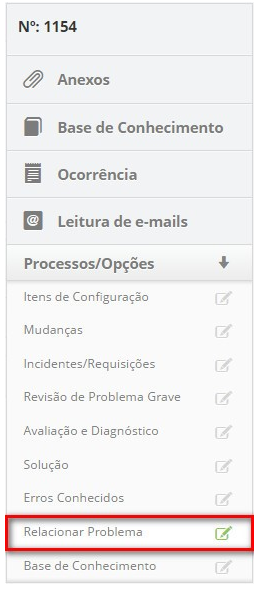
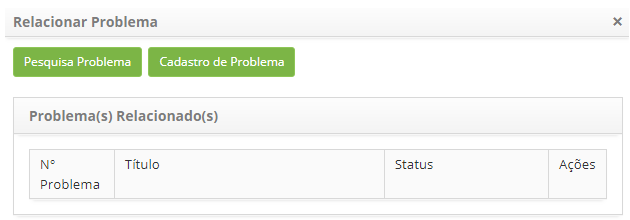
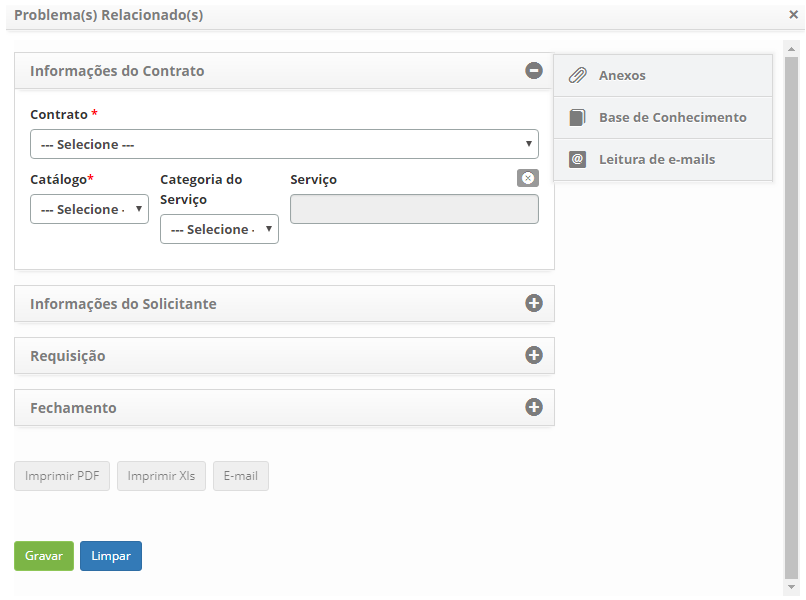
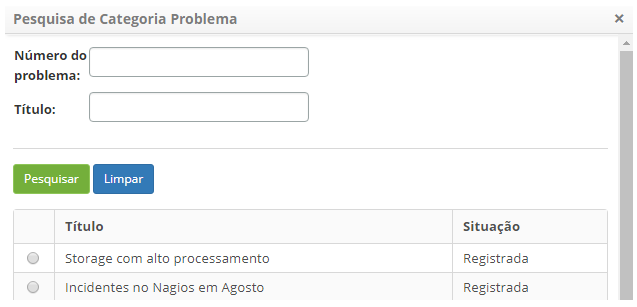

title:Cadastro de problema a partir de outro problema
Description:Esta funcionalidade permite realizar o registro de um problema a partir de um problema.

# Cadastro de problema a partir de outro problema

Esta funcionalidade permite realizar o registro de um problema a partir de um
problema.

Como acessar
------------

1.  Acesse a funcionalidade de registro de problema a partir de um problema
    através da navegação no menu principal **Processos ITIL > Gerência de
    Problema > Gerenciamento de Problema**.

Pré-condições
-------------

1.  Não se aplica.

Filtros
-------

1.  O seguinte filtro possibilita ao usuário restringir a participação de itens
    na listagem padrão da funcionalidade, facilitando a localização dos itens
    desejados:

    -  Nº do Problema

    
    
    **Figura 1 - Tela de pesquisa de problema**

Listagem de itens
-----------------

1.  Os seguintes campos cadastrais estão disponíveis ao usuário para facilitar a
    identificação dos itens desejados na listagem padrão da
    funcionalidade: Número, Título, Contrato, Criada em, Prioridade, Prazo
    limite, Solicitante, Status, Tarefa atual, Grupo
    executor e Responsável atual.

2.  Existem botões de ação disponíveis ao usuário em relação a cada item da
    listagem, são eles: *Visualizar*, *Relatórios* e *Ação*.

    

    **Figura 2 - Tela de listagem de problema**

Preenchimento dos campos cadastrais
-----------------------------------

1.  Na guia **Gerenciamento**, localize o problema desejado, clique no
    botão *Ação* e selecione a opção *Iniciar/Executar tarefa* do mesmo,
    conforme indicado na figura abaixo:

    
    
    **Figura 3 - Botão ação**

1.  Será exibida a tela de **Registro de Problema**, clique na
    guia **Processos/Opções** e logo em seguida em **Relacionar Problema**,
    localizada no canto direito da tela, conforme indicado na figura abaixo:

    

    **Figura 4 - Seleção de problema**

1.  É apresentada a tela de relacionamento de problema;

    
   
    **Figura 5 - Relacionar problema**

1.  Clique no botão *Cadastro de Problema*, será exibida a tela de registro de
    Problema, conforme exemplo ilustrado na figura abaixo:

    

    **Figura 6 - Tela de registro de problema**

    -  Preencha os campos com as informações necessárias e clique no
    botão *Gravar* para efetuar o registro;

    -  Será exibida uma mensagem confirmando o sucesso do registro.

1.  Para vincular um problema a um problema já cadastrado clique no
    botão *Pesquisa Problema*. Será exibida a tela para pesquisa do mesmo,
    conforme exemplo ilustrado na figura abaixo:

    !!! info "IMPORTANTE"

         O sistema permite relacionar um ou mais problemas ao problema principal.
         Os problemas a serem relacionados devem estar com o status diferente de
         "Cancelado" e "Concluído".

   
   
   **Figura 7 - Tela de pesquisa de problema**

   -  Informe o número e/ou título do problema que deseja pesquisar e clique no
    botão *Pesquisar*;

   -  Selecione o registro desejado e o mesmo será apresentado na tela de
    relacionamento de problema;

   -  Feito isso, basta clicar no botão *Gravar e avançar o fluxo* ou *Gravar e
    manter a tarefa atual* caso queira gravar somente as informações registradas
    sobre o relacionamento do incidente e manter a tarefa atual da solicitação.

!!! tip "About"

    <b>Product/Version:</b> CITSmart | 8.00 &nbsp;&nbsp;
    <b>Updated:</b>07/15/2019 – Anna Martins
