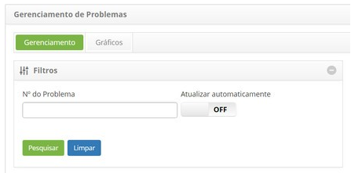
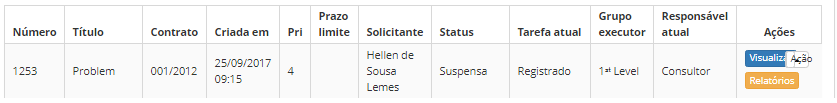
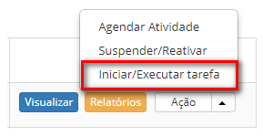

title: Cancelamento de problema
Description: Esta funcionalidade permite realizar o cancelamento do registro de
problema.

# Cancelamento de problema

Esta funcionalidade permite realizar o cancelamento do registro de problema.

Como acessar
------------

1.  Acesse a funcionalidade de cancelamento de registro de problema através da
    navegação no menu principal **Processos ITIL > Gerência de
    Problema > Gerenciamento de Problema**.

Pré-condições
-------------

1.  Ter um problema registrado (ver conhecimento [Cadastro de
    problema]().

Filtros
-------

1.  O seguinte filtro possibilita ao usuário restringir a participação de itens
    na listagem padrão da funcionalidade, facilitando a localização dos itens
    desejados:

    -   Número do problema

    

    **Figura 1 - Tela de filtros**

Listagem de itens
-----------------

1.  Os seguintes campos cadastrais estão disponíveis ao usuário para facilitar a
    identificação dos itens desejados na listagem padrão da
    funcionalidade:** Número, Título, Contrato, Criada em, Prioridade, Prazo
    limite, Solicitante, Status, Tarefa atual, Grupo executor **e** Responsável
    atual.**

2.  Existem botões de ação disponíveis ao usuário em relação a cada item da
    listagem, são eles: *Visualizar*, *Relatórios* e *Ação*.

    

    **Figura 2 - Tela de listagem de problemas**

Preenchimento dos campos cadastrais
-----------------------------------

1.  Não se aplica.

Cancelando registro de problema
-------------------------------

1.  Na guia **Gerenciamento**, localize o registro de problema que se deseja
    cancelar, clique no botão *Ação* e na opção *Iniciar/Executar tarefa*,
    conforme indicado na imagem abaixo:

    

    **Figura 3 - Tela de gerenciamento de problemas**

1.  Será exibida a tela de **Registro de Problema** com os campos preenchidos,
    com conteúdo referente ao problema selecionado. No quadro
    de **Fechamento**, registre as informações necessárias;

-  No campo **Situação**, selecione a opção "Cancelado";

-  No campo **Fechamento**, descreva os detalhes do cancelamento do problema;

-  Após registro das informações do cancelamento do registro do problema,
    clique no botão *Gravar e avançar o fluxo* para efetuar a operação, onde o
    registro de problema será cancelado com sucesso;

-  Caso queira gravar somente as informações registradas sobre o cancelamento
    do problema e manter a tarefa atual, clique no botão *Gravar e manter a
    tarefa atual*;

-  Em ambos os casos anteriores, ao clicar no botão *Gravar* a data, hora e
    usuário serão gravados automaticamente para uma futura auditoria.

!!! tip "About"

    <b>Product/Version:</b> CITSmart | 8.00 &nbsp;&nbsp;
    <b>Updated:</b>07/16/2019 – Anna Martins
