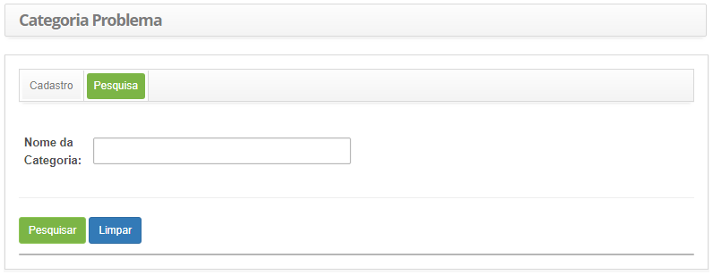
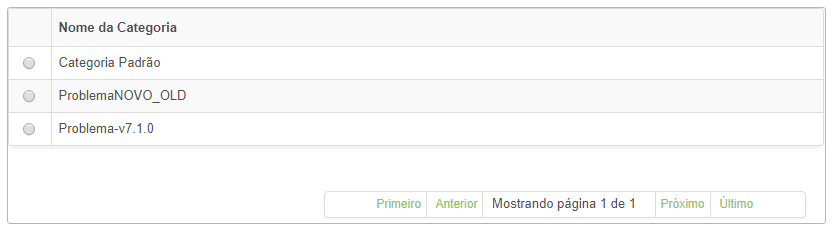
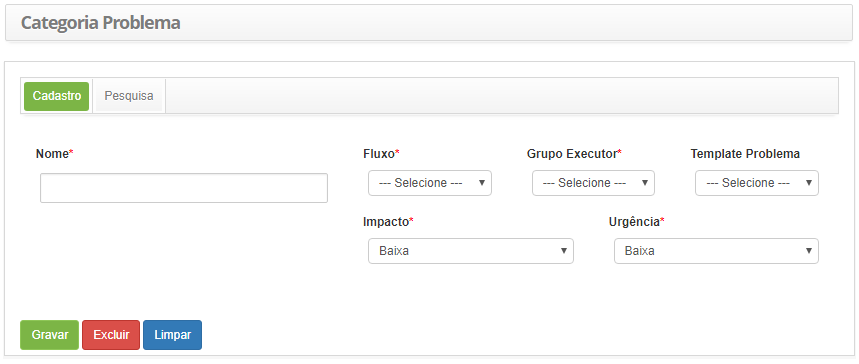

title:Cadastro e pesquisa de categoria de problema
Description:Tem por objetivo registrar a categoria de problema que será utilizado para definir toda a configuração do fluxo de trabalho que o problema irá seguir.

# Cadastro e pesquisa de categoria de problema

Esta funcionalidade tem por objetivo registrar a categoria de problema que será
utilizado para definir toda a configuração do fluxo de trabalho que o problema
irá seguir.

Pré-condições
-------------

1.  Definir o fluxo referente ao gerenciamento de problema (ver
    conhecimento [Manutenção de fluxo de trabalho];

2.  Criar o template de problema;

3.  Cadastrar o grupo executor (ver conhecimento [Cadastro e pesquisa de
    grupo].

Como acessar
------------

1.  Acesse a funcionalidade de categoria de problema através da navegação no
    menu principal **Processos ITIL > Gerência de Problema > Categoria
    Problema**.

Filtros
-------

1.  O seguinte filtro possibilita ao usuário restringir a participação de itens
    na listagem padrão da funcionalidade, facilitando a localização dos itens
    desejados:

    -  Nome da Categoria.

    

    **Figura 1 - Tela de pesquisa de categoria**

2.  Realize a pesquisa de categoria de problema;

    -   Informe o nome da categoria de problema que deseja pesquisar e clique no
        botão *Pesquisar*. Após isso, será exibido o registro da categoria de
        problema conforme o nome informado;

    -   Caso deseje listar todos os registros de categoria de problema, basta
        clicar diretamente no botão *Pesquisa*.

Listagem de itens
-----------------

1.  O seguinte campo cadastral está disponível ao usuário para facilitar a
    identificação dos itens desejados na listagem padrão da
    funcionalidade: **Nome da Categoria**.

    

    **Figura 2 - Tela de listagem de categoria**

2.  Após a pesquisa, selecione o registro desejado. Feito isso, será direcionado
    para a tela de cadastro exibindo o conteúdo referente ao registro
    selecionado;

3.  Para alterar os dados do registro de categoria de problema, basta modificar
    as informações dos campos desejados e clicar no botão *Gravar* para que seja
    gravada a alteração realizada no registro, onde a data, hora e usuário serão
    gravados automaticamente para uma futura auditoria.

Preenchimento dos campos cadastrais
-----------------------------------

1.  Será apresentada a tela de cadastro de categoria de problema, conforme
    ilustrada na figura abaixo:

    

    **Figura 3 - Tela de cadastro de categoria de problema**

2.  Preencha os campos conforme orientações abaixo:

    -   **Nome**: informe o nome da categoria de problema;

    -   **Fluxo**: selecione o fluxo para que o mesmo seja associado à categoria
        de problema que está sendo cadastrada;

    -   **Grupo Executor**: selecione o grupo executor, o qual será o grupo
        padrão, responsável pela execução da atividade de problema;

    -   **Template Problema**: selecione o template de problema, caso seja
        necessário;

    -   **Impacto**: selecione o impacto da categoria de problema;

    -   **Urgência**: selecione a urgência da categoria de problema;

3.  Clique no botão *Gravar* para efetuar o registro, onde a data, hora e
    usuário serão gravados automaticamente para uma futura auditoria.

!!! tip "About"

    <b>Product/Version:</b> CITSmart | 8.00 &nbsp;&nbsp;
    <b>Updated:</b>07/15/2019 – Anna Martins
