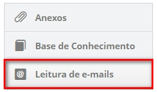
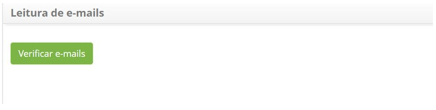

title: Cadastro de problemas via leitura de email
Description: Esta funcionalidade permite realizar o registro de um problema via
leitura de e-mail.

# Cadastro de problemas via leitura de email

Esta funcionalidade permite realizar o registro de um problema via leitura de
e-mail.

Como acessar
------------

1.  Acesse o menu principal **Processos ITIL > Gerência de Problema >
    Gerenciamento de Problema**.

Pré-condições
-------------

1.  Cadastrar contrato (ver conhecimento [Cadastro e pesquisa de
    contrato]();

2.  Cadastrar unidade (ver conhecimento [Cadastro e pesquisa de
    unidade]();

3.  Cadastrar solicitante (colaborador) (ver conhecimento [Cadastro e pesquisa
    de
    colaborador]());

4.  Cadastrar grupo (ver conhecimento [Cadastro e pesquisa de
    grupo](https://itsm.citsmartcloud.com/citsmart/pages/knowledgeBasePortal/knowledgeBasePortal.load#/knowledge/249));

5.  Cadastrar categoria de problema, a qual deverá ter o vínculo com o fluxo
    referente ao problema (ver conhecimento [Cadastro e pesquisa de categoria de
    problema]();

6.  Vincular unidade ao contrato para que a unidade seja listada na tela de
    registro de problema (ver conhecimento [Como relacionar unidade ao
    contrato?]();

7.  Definir o fluxo referente ao gerenciamento de problema (ver
    conhecimento [Manutenção de fluxo de
    trabalho]();

8.  Cadastrar o grupo executor;

9.  Criar o template de problema;

10. Vincular o grupo aos contratos, associando os solicitantes (colaboradores)
    já cadastrados a este grupo, para que sejam listados os contratos e os
    solicitantes relacionados na tela de registro de problema. Caso seja preciso
    criar um novo colaborador, é necessário incluí-lo ao grupo de solicitante no
    qual esteja relacionado ao contrato para que o mesmo consiga registrar um
    problema, ou seja, para que o nome dele seja listado na tela de registro de
    problema (ver conhecimento [Como relacionar grupo ao
    contrato?]();

11. Configurar os parâmetros 23, 24, 25, 26, 27, 28 e 72 (ver
    conhecimento [Regras de parametrização -
    E-mail]().

Filtros
-------

1.  Não se aplica.

Listagem de itens
-----------------

1.  Não se aplica.

Preenchimento dos campos cadastrais
-----------------------------------

1.  Após os parâmetros configurados, na tela de **Gerenciamento de
    Problemas** clique no botão *Novo Problema*. Será exibida a tela
    de**Registro de Problemas**, informe o contrato para qual será feito o
    registro de problema e clique no botão *Leitura de e-mails*localizado na
    parte superior da tela de registro de problema conforme indicado na figura
    abaixo:

     

     **Figura 1 - Seleção de leitura de e-mails**

1.  Será exibida uma tela para verificar os e-mails recebidos, conforme
    ilustrada na figura abaixo:

    

    **Figura 2 - Tela de leitura de e-mails**

1.  Clique no botão *Verificar e-mails*. Serão exibidos os e-mails, conforme
    mostrado na figura abaixo:

    

    **Figura 3 - Leitura de e-mails**

    -  Clique no botão *Carregar E-mail*, o qual permite que o problema seja criado
    com base no e-mail escolhido;

    -  Caso o remetente do e-mail escolhido seja um colaborador cadastrado no
    sistema, após clicar no botão *Carregar E-mail*, os
    campos **Solicitante**, **Nome do
    Contato**, **E-mail**, **Unidade** e **Origem** serão preenchidos
    automaticamente com as informações referente ao colaborador, conforme
    ilustrado na figura abaixo. Mas caso o remetente não seja um colaborador
    cadastrado no sistema, deverá preencher os campos com as informações
    necessárias;

    -  Independente se o remetente é ou não um colaborador cadastrado no sistema, o
    campo **Descrição** será preenchido com o conteúdo do e-mail, após clicar no
    botão *Carregar E-mail*, conforme mostrado na figura abaixo;

    

    **Figura 4 - Tela de registro de problema**

    -  Registre as demais informações do problema e clique no botão *Gravar* para
    efetuar o registro, onde a data, hora e usuário serão gravados
    automaticamente para uma futura auditoria;

    -  Será exibida uma mensagem confirmando o sucesso do registro de problema.

!!! note "NOTA"

    Ao registrar um problema através da leitura de e-mail, o e-mail escolhido
    não será apresentado novamente na listagem de e-mails.

!!! tip "About"

    <b>Product/Version:</b> CITSmart | 8.00 &nbsp;&nbsp;
    <b>Updated:</b>07/15/2019 – Anna Martins
