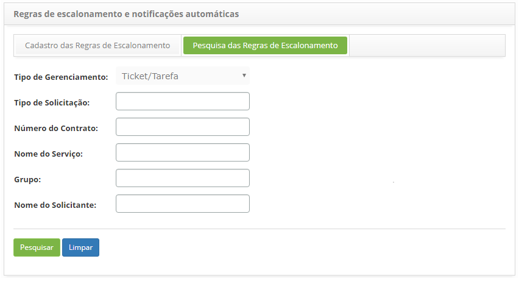
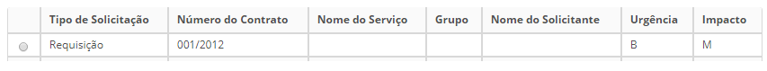
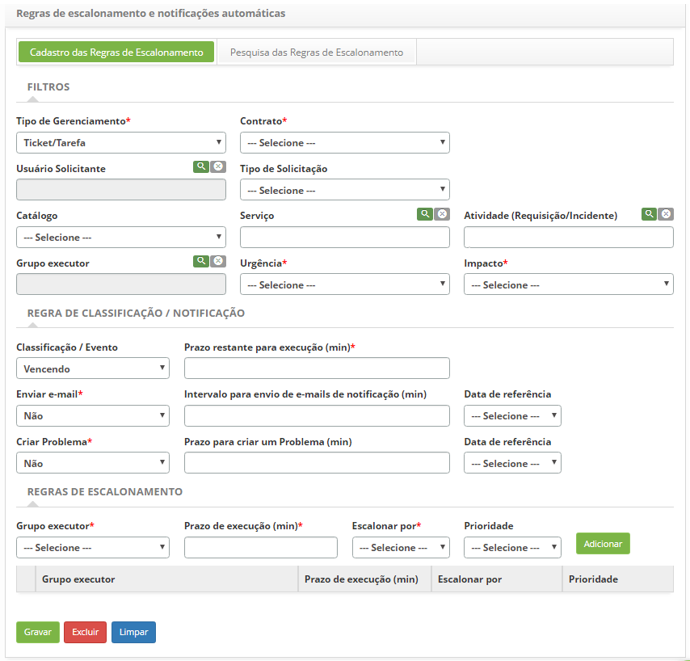

title: Cadastro e pesquisa de regras de escalonamento de um problema
Description:

# Cadastro e pesquisa de regras de escalonamento de um problema

Como acessar
------------

1.  Acesse o menu principal **Processos ITIL  > Gerência de
    Problema > Regras de Escalonamento**.

Pré-condições
-------------

1.  No arquivo citsmart.cfg, ter configurado a
    propriedade **START_MONITORA_INCIDENTES** informando o parâmetro **TRUE**.

2.  Informe o conteúdo abaixo no parâmetro (ver conhecimento [Regras de
    parametrização - ticket][1]);

    -   Parâmetro 190: com o valor S

1.  Ter o contrato cadastrado (ver conhecimento [Cadastro e pesquisa de
    contrato][2]);

2.  Ter o colaborador cadastrado (ver conhecimento [Cadastro e pesquisa de
    colaborador][3]);

3.  Ter o grupo cadastrado (ver conhecimento [Cadastro e pesquisa de
    grupo][4]);

4.  Ter o portfólio de serviços definido.(ver conhecimento [Cadastro de
    portfólio de serviços][5]).

Filtros
-------

1.  Os seguintes filtros possibilitam ao usuário restringir a participação de
    itens na listagem padrão da funcionalidade, facilitando a localização dos
    itens desejados:

    -  Tipo de Gerenciamento;

    -  Tipo de Solicitação;

    -  Número do Contrato;

    -  Nome do Serviço;

    -  Grupo;

    -  Nome do Solicitante.

2.  Clique na guia **Pesquisa das Regras de Escalonamento**, será apresentada a
    tela de pesquisa, conforme ilustrada na figura abaixo:

    

    **Figura 1 - Tela de pesquisa das regras de escalonamento**

3.  Realize a pesquisa do registro de regras de escalonamento:

    -   Informe o tipo de gerenciamento, tipo de solicitação, número do
        contrato, nome do serviço, grupo e/ou nome do solicitante referente a
        regra de escalonamento que deseja pesquisar e clique no
        botão *Pesquisar*. Após isso, será exibido o registro de regras de
        escalonamento conforme o(s) dado(s) informado(s).

    -   Caso deseje listar todos os registros de regras de escalonamento, basta
        clicar diretamente no botão *Pesquisar*.

Listagem de itens
-----------------

1.  Os seguintes campos cadastrais estão disponíveis ao usuário para facilitar a
    identificação dos itens desejados na listagem padrão da
    funcionalidade: Tipo de Solicitação, Número do Contrato, Nome do Serviço,
    Grupo, Nome do Solicitante, Urgência e Impacto.

    

    **Figura 2 - Tela de lista de itens**

2.  Após a pesquisa, selecione o registro desejado. Feito isso, será direcionado
    para tela de cadastro exibindo o conteúdo referente ao registro selecionado.

Preenchimento dos campos cadastrais
-----------------------------------

1.  Será apresentada a tela de **Cadastro das Regras de Escalonamento**,
    conforme ilustrada na figura abaixo:

    

    **Figura 3 - Tela de cadastro de regras de escalonamento**

2.  Preencha os campos conforme orientação abaixo:

    a. Informe os dados de Filtros:

       -   **Tipo de Gerenciamento**: selecione a opção “Solicitação” para o qual será
    aplicado a regra;

       -   **Contrato**: selecione o contrato;

       -   **Usuário Solicitante**: informe o solicitante, caso deseje filtrar por
    solicitante;

       -  **Tipo de Solicitação**: informe um tipo de solicitação, caso deseje filtrar
    por tipo de solicitação;

       -   **Catálogo**: selecione o tipo de catálogo, caso deseje filtrar por
    catálogo;

       -   **Serviço**: informe o serviço do catálogo, caso deseje filtrar por serviço;

       -   **Atividade (Requisição/Incidente)**: informe o tipo de serviço (requisição
    ou incidente) para qual será aplicado o filtro;

       -   **Grupo Executor**: informe um grupo executor, caso deseje filtrar por grupo
    executor;

       -   **Urgência**: informe o nível de urgência, caso deseje filtrar por grau de
    urgência;

       -   **Impacto**: informe o nível de impacto, caso deseje filtrar por grau de
    impacto.

    b. Informe os dados da Regra de Classificação/Notificação:

      -  **Classificação/Evento**: selecione a opção desejada para ser enviada
    notificação para o responsável:

       * Se a opção selecionada for “Vencendo” será habilitado o campo “Prazo
         restante p/ execução (min)”. Informe o tempo, em minutos, que deve
         restar para o término da atividade a partir da data de criação para ser
         enviado uma notificação;

       * Se a opção selecionada for “Percentual SLA” será habilitado o campo
        “Valor (%)”. Informe, em porcentagem, em quanto tempo o SLA da atividade
        deve estar para ser enviado uma notificação;

       -  **Enviar e-mail**: habilite esta opção caso queira enviar mensagens de
    notificação via e-mail para o usuário solicitante da atividade;

       -  **Prazo para enviar e-mails de notificação (min)**: informe o tempo, em
    minutos, que o usuário será informado via e-mail das ocorrências dos itens
    selecionados;

       -  **Data de referência**: informe a data de referência para envio do e-mail;

       -  **Criar Problema**: habilite esta opção caso queira lançar uma ocorrência do
    tipo problema, obedecendo ao prazo para criação de problema;

       -  **Prazo para criar um Problema (min)**: informe o prazo, em minutos, que o
    sistema irá lançar uma ocorrência do tipo problema, desde que esteja
    habilitado o campo **Criar Problema**;

       -  **Data de referência**: informe a data de referência para criação do
    problema.

    c. Informe os dados das Regras de Escalonamento:

      -   **Grupo Executor**: informe para qual grupo será escalonado os itens
    filtrados pela regra de escalonamento;

      -   **Prazo de Execução (min)**: defina quando se deve escalonar os itens
    filtrados para o **Grupo Executor** informado;

      -   **Escalonar por**: defina a data da atividade que será usada para calcular o
    prazo de execução para o escalonamento.

      -   **Prioridade**: defina a prioridade do escalonamento;

      -   Clique em *Adicionar* para inserção da regra de escalonamento.

3.  Após os dados informados, clique no botão *Gravar* para efetuar o registro,
    onde a data, hora e usuário serão gravados automaticamente para uma futura
    auditoria.

[1]:/pt-br/citsmart-platform-7/plataform-administration/parameters-list/parametrizaion-ticket.html
[2]:/pt-br/citsmart-platform-7/additional-features/contract-management/use/register-contract.html
[3]:/pt-br/citsmart-platform-7/initial-settings/access-settings/user/employee.html
[4]:/pt-br/citsmart-platform-7/initial-settings/access-settings/user/group.html

!!! tip "About"

    <b>Product/Version:</b> CITSmart | 8.00 &nbsp;&nbsp;
    <b>Updated:</b>07/15/2019 – Anna Martins
