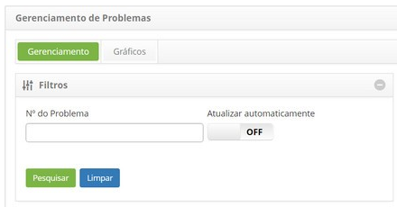

title: Execução de problema
Description: Esta funcionalidade permite realizar a execução de problema.

# Execução de problema

Esta funcionalidade permite realizar a execução de problema.

Como acessar
------------

1.  Acesse a funcionalidade de execução de problema através da navegação no menu
    principal **Processos ITIL > Gerência de Problema > Gerenciamento de
    Problema**.

Pré-condições
-------------

1.  Ter um problema registrado (ver conhecimento [Cadastro de
    problema]().

Filtros
-------

1.  O seguinte filtro possibilita ao usuário restringir a participação de itens
    na listagem padrão da funcionalidade, facilitando a localização dos itens
    desejados:

-   Número do problema.

    

    **Figura 1 - Tela de filtros**

Listagem de itens
-----------------

1.  Os seguintes campos cadastrais estão disponíveis ao usuário para facilitar a
    identificação dos itens desejados na listagem padrão da
    funcionalidade: Número, Título, Contrato, Criada em, Prioridade, Prazo
    limite, Solicitante, Status, Tarefa atual, Grupo executor e Responsável
    atual.

2.  Existem botões de ação disponíveis ao usuário em relação a cada item da
    listagem, são eles: *Visualizar*, *Relatórios* e *Ação*.

    [Criar](images/execution-2.png)

    **Figura 2 - Tela de listagem de problema**

Executando problema
-------------------

   **!!! note "NOTA"**

   **Nesta etapa, é realizada a classificação do problema e designará a área
   apropriada para tratar o problema de acordo com o Catálogo de Serviços de
   TI.**

!!! info "IMPORTANTE"

   **Deve vincular o problema a incidentes existentes e registrar o problema
   para facilitar a priorização de soluções de problemas. Avaliar o impacto
   sobre os negócios e determinar a urgência da solução. Essa avaliação
   determina a classificação do problema.**

!!! info " IMPORTANTE "

   **Deve assegurar que todas as informações necessárias para investigação e
   diagnostico estejam registradas no problema.**

   !!! info " IMPORTANTE "

   **As ações de execução da tarefa, somente serão permitidas aos usuários que
   estejam contidos dentro do grupo de execução.**

1.  Na guia **Gerenciamento**, localize o registro de problema que se deseja
    registrar a execução da tarefa, clique no botão *Ação* e na
    opção *Iniciar/Executar tarefa*, conforme indicado na imagem abaixo:

    [Criar](images/execution-3.png)

    **Figura 3 - Tela de gerenciamento de problemas**

1.  Será exibida a tela de **Registro de Problema** com os campos preenchidos,
    com o conteúdo referente ao registro selecionado;

-   No quadro de **Fechamento**, registre as informações necessárias da execução
    da tarefa:

    -   Clique no botão *Adicionar Registro de Execução*;

    -   Descreva as informações sobre a execução do problema.

Vinculando itens de configuração ao problema
--------------------------------------------

1.  Informe o(s) item (itens) de configuração (IC's) afetado(s) pelo problema:

-   Clique na guia **Processos/Opções** e logo em seguida em **Itens de
    Configuração**, localizada no canto direito da tela, conforme indicado na
    figura abaixo:
     
    [Criar](images/execution-4.png)

    **Figura 4 - Seleção de itens de configuração**

-   Será apresentada a tela de relacionamento de item de configuração. Clique no
    ícone [Criar](images/execution-5.png) para adicionar o item de configuração.

-   Será apresentada a janela para pesquisa de itens de configuração. Realize a
    pesquisa, selecione o item de configuração referente ao problema;

-   Será exibida uma janela para descrever resumidamente o problema do item de
    configuração. Descreva o problema e clique em *OK* para efetuar a operação.
    Após isso, o item de configuração será relacionado ao problema;

    [Criar](images/execution-6.png)

    **Figura 5 - Relacionamento de item de configuração ao problema**

-   Caso queira remover um item de configuração que foi relacionado à requisição
    de mudança, basta clicar no ícone [Criar](images/execution-7.png)   do mesmo.

Vinculando um conhecimento ao problema
--------------------------------------

1.  Relacione um conhecimento referente ao problema:

-   Clique na guia **Processos/Opções** e logo em seguida em **Base de
    Conhecimento**, localizada no canto direito da tela, conforme indicado na
    figura abaixo:

    [Criar](images/execution-8.png)

    **Figura 6 - Seleção de base de conhecimento**

-   Clique no botão *Adicionar Conhecimento* para adicionar o conhecimento;

-   Será exibida uma janela para pesquisa de conhecimento. Realize a pesquisa e
    selecione o conhecimento. Feito isso, será relacionado o conhecimento ao
    problema;

    [Criar](images/execution-9.png)
    
    **Figura 7 - Relacionamento de conhecimento ao problema**

-   Caso queira criar registrar um novo conhecimento referente ao problema,
    basta clicar no botão *Cadastro de Conhecimento*;

-   Caso queira remover um conhecimento que foi relacionado, basta clicar no
    ícone [Criar](images/execution-7.png) .

Vinculando anexos
-----------------

1.  Caso queira anexar um arquivo à execução do problema, proceda da seguinte
    maneira:

-   Clique na guia **Anexos**, localizada no canto superior direito da tela,
    conforme indicado na figura abaixo:

    [Criar](images/execution-10.png)

    **Figura 8 - Seleção de anexos**

-   É apresentada a tela de anexo de arquivos, conforme ilustrada na figura
    abaixo:

    [Criar](images/execution-11.png)

    **Figura 9 - Tela de anexos**

-   Clique no botão *Escolher arquivo* e selecione o arquivo desejado;

-   Informe a descrição do arquivo e clique no botão *Adicionar*;

-   Após adição do arquivo, clique no botão *Fechar* para retornar à tela de
    registro de problema.

Vinculando ocorrência ao problema
---------------------------------

1.  Caso queira inserir uma ocorrência ao registro de problema, proceda da
    seguinte maneira:

-   Clique na guia **Ocorrência**, localizada no canto superior direito da tela,
    conforme indicado na figura abaixo:

    [Criar](images/execution-12.png)

    **Figura 10 - Seleção de ocorrência**

-   Será exibida a tela de **Ocorrências** contendo duas abas, uma para exibição
    da relação de ocorrências registradas e outra para registro de novas
    ocorrências. Clique na aba de **Cadastro de Ocorrências** e preencha os
    campos conforme orientações abaixo:

    [Criar](images/execution-13.png)

    **Figura 11 - Registro de ocorrência**

1.  **Categoria**: selecione a categoria da ocorrência. Caso não seja encontrada
    a categoria, é possível realizar um cadastro rápido clicando no ícone [Criar](images/execution-14.png) de
    Categoria;

    -   **Origem**: selecione a origem da ocorrência. Caso não seja encontrada a
        origem, é possível realizar um cadastro rápido clicando no ícone [Criar](images/execution-14.png) de
        Origem;

    -   **Tempo Gasto (min)**: informe o tempo gasto da ocorrência em minutos;

    -   **Registrado por**: preenchido automaticamente pelo usuário que está
        executando a atividade;

    -   **Descrição**: informe a descrição da ocorrência;

    -   **Ocorrências**: informe a ocorrência;

    -   **Informações de Contato**: descreva as informações para contato;

    -   Após os dados informados, clique no botão *Gravar* para efetuar a
        operação, onde a data, hora e usuário serão gravados automaticamente
        para uma futura auditoria;

    -   Será exibida uma mensagem confirmando o sucesso da operação e retornará
        à tela de registro de problema.

2.  Após registro das informações da execução da tarefa de problema, clique no
    botão *Gravar e avançar o fluxo*, para efetuar a operação, onde o problema
    será encaminhado para fase de investigação e diagnóstico;

3.  Caso queira gravar somente as informações registradas sobre a execução da
    tarefa de problema e manter a tarefa atual, clique no botão *Gravar e manter
    a tarefa atual*;

4.  Em ambos os casos anteriores, ao clicar no botão *Gravar* a data, hora e
    usuário serão gravados automaticamente para uma futura auditoria.

!!! tip "About"

    <b>Product/Version:</b> CITSmart | 8.00 &nbsp;&nbsp;
    <b>Updated:</b>07/16/2019 – Anna Martins
