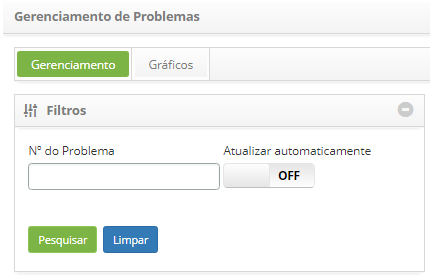
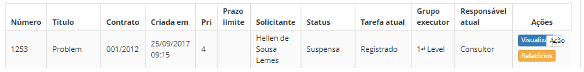
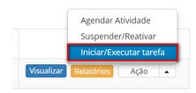
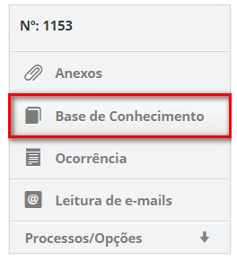
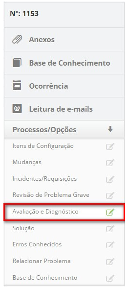
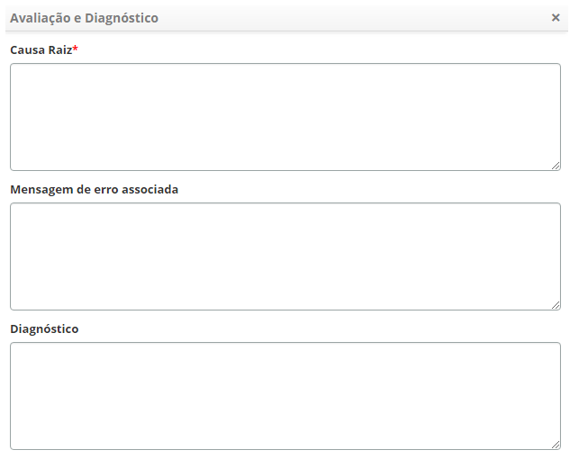
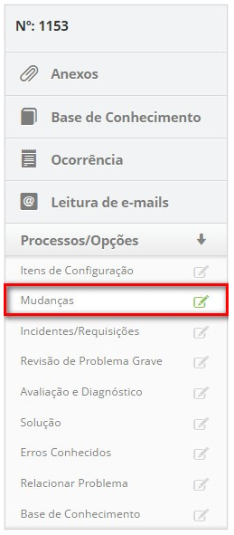
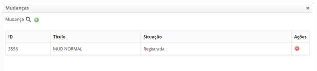
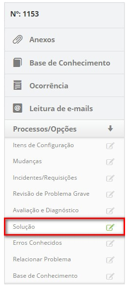
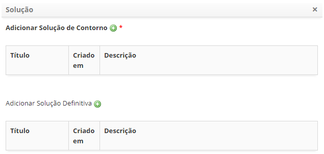

title: Investigação e diagnóstico de problema
Description: Esta funcionalidade tem por objetivo investigar e diagnosticar
problema.

# Investigação e diagnóstico de problema

Esta funcionalidade tem por objetivo investigar e diagnosticar problema.

Como acessar
------------

1.  Acesse a funcionalidade de investigação e diagnóstico de problema através da
    navegação no menu principal **Processos ITIL > Gerência de
    Problema > Gerenciamento de Problema**.

Pré-condições
-------------

1.  Ter um problema registrado (ver conhecimento [Cadastro de
    problema]().

Filtros
-------

1.  O seguinte filtro possibilita ao usuário restringir a participação de itens
    na listagem padrão da funcionalidade, facilitando a localização dos itens
    desejados:

-   Nº do Problema.

    

    **Figura 1 - Tela de pesquisa de problema**

Listagem de itens
-----------------

1.  Os seguintes campos cadastrais estão disponíveis ao usuário para facilitar a
    identificação dos itens desejados na listagem padrão da
    funcionalidade:** Número, Título, Contrato, Criada em, Prioridade, Prazo
    limite, Solicitante, Status, Tarefa atual, Grupo executor** e **Responsável
    atual**.

2.  Existem botões de ação disponíveis ao usuário em relação a cada item da
    listagem, são eles: *Visualizar*, *Relatórios* e *Ação*.

    

    **Figura 2 - Tela de listagem de problema**

Preenchimento dos campos cadastrais
-----------------------------------

1.  Não se aplica.

Realizando investigação e diagnóstico de problema
-------------------------------------------------

Nesta etapa, é realizada a investigação do problema e o diagnóstico da causa
principal. Serão utilizados todos os recursos e técnicas de resolução de
problemas disponíveis para identificar a causa raiz, a falha apontada e uma
solução.

!! info "IMPORTANTE"

      O membro do grupo designado para realizar a investigação e diagnóstico
      deve capturar o problema e iniciar a atividade.

1.  Na guia **Gerenciamento**, localize o registro de problema que deseja
    registrar a investigação e diagnóstico, clique no botão *Ação* e selecione a
    opção *Iniciar/Executar tarefa*, conforme indicado na imagem abaixo:

    

    **Figura 3 - Tela de gerenciamento de problemas**

1.  Será exibida a tela de **Registro de Problema** com os campos preenchidos,
    com o conteúdo referente ao problema selecionado;

2.  Consulte a base de conhecimento a fim de obter o conhecimento necessário
    para resolução do problema;

3.  Clique na guia **Base de Conhecimento**, localizada no canto superior
    direito da tela, conforme indicado na figura abaixo:

    
    
    **Figura 4 - Guia de base conhecimento**

    -  Será apresentada a tela de consulta à base de conhecimento para realizar a
    pesquisa do conhecimento necessário, conforme ilustrada na figura abaixo:

    

    **Figura 5 - Base de conhecimento**

1.  Registre as informações sobre avaliação e diagnóstico do problema:

    -  Clique na guia **Processos/Opções** e logo em seguida em **Avaliação e
    Diagnóstico**, localizada no canto direito da tela, conforme indicado na
    figura abaixo:

    

    **Figura 6 - Guia de avaliação e diagnóstico**

    -  É apresentada a tela de cadastro de avaliação e diagnóstico, conforme
    ilustrada na figura abaixo:

    

    **Figura 7 - Registro de avaliação e diagnóstico**

    -  **Causa Raiz**: informe a causa principal do problema ocorrido;

    -  **Mensagem de erro associada**: descreva a mensagem de erro associada ao
    problema;

    -  **Diagnóstico**: descreva o diagnóstico do problema realizado.

1.  Informe a mudança, caso for necessário para resolução do problema:

    -  Clique na guia **Processos/Opções** e logo em seguida em **Mudanças**,
    localizada no canto direito da tela, conforme indicado na figura abaixo:

    

    **Figura 8 - Guia de mudanças**

    -  Clique no ícone  para realizar a pesquisa da mudança que será feita para
    solucionar o problema;

    -  Será exibida uma tela para pesquisa de mudanças. Realize a pesquisa e
    selecione a mudança desejada. Após isso, a mudança será relacionada ao
    problema;

    

    **Figura 9 - Tela de relacionamento de mudanças**

    -  Caso queira remover uma mudança que foi relacionada para solucionar o
    problema, basta clicar no ícone  da mesma;

    -  Caso não encontre a mudança e haja a necessidade de registrar uma requisição
    de mudança, poderá registrá-la no sistema a partir dessa tela, basta clicar
    no ícone  de mudança.

1.  Após o registro das informações de avaliação e diagnóstico, informe a
    solução de contorno:

   !!! info "IMPORTANTE"

       Uma solução de contorno deverá ser temporária até que seja encontrada uma
       solução definitiva para o problema.

-   Clique na guia **Processos/Opções** e logo em seguida em **Solução**,
    localizada no canto direito da tela, conforme indicado na figura abaixo:

    

    **Figura 10 - Guia de solução**

-   É apresentada a tela de cadastro de solução, conforme ilustrada na figura
    abaixo:

    

    **Figura 11 - Registro de solução de contorno do problema**

-   Clique no ícone  de solução de contorno para registrar as informações de uma
    solução de contorno;

-   Será exibida uma tela para registrar as informações da solução de contorno;

    -   **Título**: defina o título da solução de contorno;

    -   **Descrição**: descreva a solução de contorno proposta;

    -   Após os dados informados, clique no botão *Gravar* para efetuar o
        registro das informações de solução de contorno, onde a data, hora e
        usuário serão gravados automaticamente para uma futura auditoria.

-   Caso tenha uma solução definitiva para o problema, clique no ícone  de
    solução definitiva para registrar as informações de uma solução definitiva;

-   Será exibida uma tela para registrar as informações da solução definitiva;

    -   **Título**: defina o título da solução definitiva;

    -   **Descrição**: descreva a solução definitiva proposta;

    -   Após os dados informados, clique no botão *Gravar* para efetuar o
        registro das informações de solução definitiva, onde a data, hora e
        usuário serão gravados automaticamente para uma futura auditoria.

1.  Após registro das informações da investigação e diagnóstico do problema,
    clique no botão *Gravar e avançar o fluxo*, para efetuar a operação, onde o
    problema será encaminhado para fase de registro do erro conhecido;

2.  Caso queira gravar somente as informações registradas sobre a investigação e
    diagnóstico do problema e manter a tarefa atual, clique no botão *Gravar e
    manter a tarefa atual*;

!!! note "NOTA"

    Em ambos os casos anteriores, ao clicar no botão Gravar a data, hora e
    usuário serão armazenados automaticamente.

!!! tip "About"

    <b>Product/Version:</b> CITSmart | 8.00 &nbsp;&nbsp;
    <b>Updated:</b>07/16/2019 – Anna Martins
