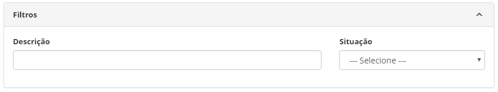
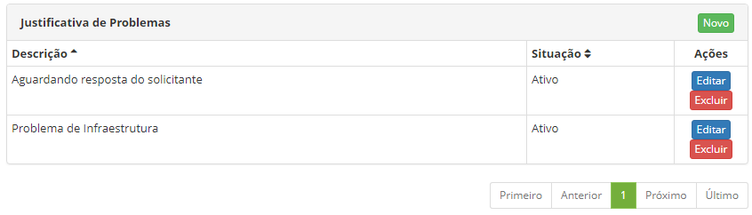
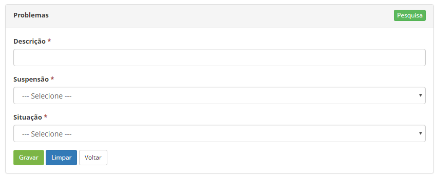

title: Cadastro e pesquisa de justificativa de problema
Description: Esta funcionalidade tem por objetivo registrar as justificativas de
problemas que serão utilizadas em outras rotinas do Sistema.

# Cadastro e pesquisa de justificativa de problema

Esta funcionalidade tem por objetivo registrar as justificativas de problemas
que serão utilizadas em outras rotinas do sistema.

Como acessar
------------

1.  Acesse a funcionalidade de Justificativa de Problemas através da navegação
    no menu principal **Processos ITIL > Gerência de
    Problema > Justificativa de Problemas**.

Pré-condições
-------------

1.  Não se aplica.

Filtros
-------

1.  Os seguintes filtros possibilitam ao usuário restringir a participação de
    itens na listagem padrão da funcionalidade, facilitando a localização dos
    itens desejados, conforme ilustrado na figura abaixo:

    -  Descrição;

    -  Situação.

1.  Na tela de **Cadastro de Justificativa de Problemas**, clique no
    botão *Pesquisa*. Feito isso, será apresentada a tela de **Justificativa de
    Problemas**, conforme ilustrada na figura a seguir. Nesta tela, são exibidas
    as justificativas de problemas cadastradas para visualização.

    

    **Figura 1 - Tela de pesquisa de justificativa de problemas**

1.  Para realizar a pesquisa de uma justificativa de problema, informe a
    descrição e/ou situação da mesma.

Listagem de itens
-----------------

1.  Os seguintes campos cadastrais estão disponíveis ao usuário para facilitar a
    identificação dos itens desejados na listagem padrão da
    funcionalidade: **Descrição** e **Situação**.

2.  Existem botões de ação disponíveis ao usuário em relação a cada item da
    listagem, são eles: *Editar* e *Excluir*.

    

    **Figura 2 - Tela de lista de itens**

1.  Após a pesquisa, será exibido o registro conforme os dados informados.

Preenchimento dos campos cadastrais
-----------------------------------

1.  Será apresentada a tela de **Justificativa de Problemas**. Clique no
    botão *Novo*. Feito isso, será apresentada a tela de **Cadastro de
    Justificativa de Problemas**, conforme ilustrada na figura a seguir:

     

    **Figura 3 - Tela de cadastro de justificativa de problemas**

1.  Preencha os campos conforme orientações abaixo:

    -   **Descrição**: informe a descrição da justificativa de problema;

    -   **Suspensão**: defina se a justificativa é para suspensão do problema;

    -   **Situação**: selecione a situação da justificativa de problema.

2.  Após os dados informados, clique no botão *Gravar* para efetuar o registro,
    onde a data, hora e usuário serão gravados automaticamente para uma futura
    auditoria.

!!! tip "About"

    <b>Product/Version:</b> CITSmart | 8.00 &nbsp;&nbsp;
    <b>Updated:</b>07/15/2019 – Anna Martins
