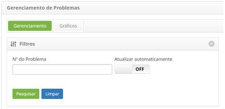
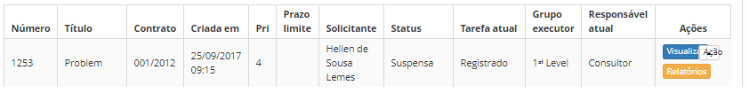
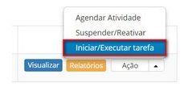
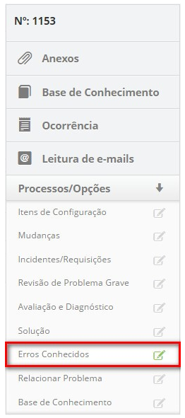
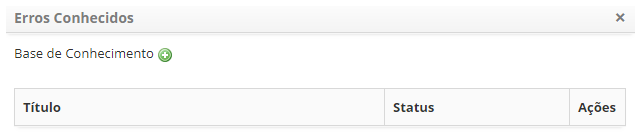

title:Cadastro de erros conhecidos
Description:Esta funcionalidade permite realizar o registro do erro conhecido na base de conhecimento.

# Cadastro de erros conhecidos

Esta funcionalidade permite realizar o registro do erro conhecido na base de
conhecimento.

Como acessar
------------

1.  Acesse a funcionalidade de registro de erros conhecidos através da navegação
    no menu principal **Processos ITIL > Gerência de
    Problema > Gerenciamento de Problema**.

Pré-condições
-------------

1.  Ter um problema registrado (ver conhecimento [Cadastro de
    problema]().

Filtros
-------

1.  O seguinte filtro possibilita ao usuário restringir a participação de itens
    na listagem padrão da funcionalidade, facilitando a localização dos itens
    desejados:

    -  Número do problema.

    

    **Figura 1 - Tela de filtros**

Listagem de itens
-----------------

1.  Os seguintes campos cadastrais estão disponíveis ao usuário para facilitar a
    identificação dos itens desejados na listagem padrão da
    funcionalidade: Número, Título, Contrato, Criada em, Prioridade, Prazo
    limite, Solicitante, Status, Tarefa atual, Grupo executor e Responsável
    atual.

2.  Existem botões de ação disponíveis ao usuário em relação a cada item da
    listagem, são eles: *Visualizar*, *Relatórios* e *Ação*.

    

    **Figura 2 - Tela de listagem de problemas**

Preenchimento dos campos cadastrais
-----------------------------------

Nesta etapa, é feita avaliação da solução proposta para a correção do erro
conhecido e realizado o registro do erro conhecido na base de conhecimento,
permitindo que as equipes de suporte, incluindo o Service Desk, tenham acesso às
informações para auxiliar na resolução de incidentes ou problemas.

!!! info "IMPORTANTE"

     O membro do grupo designado para registrar erros conhecidos deve capturar
     o problema e iniciar a atividade.

1.  Na guia **Gerenciamento**, localize o registro de problema que deseja
    registrar o erro conhecido, clique no botão *Ação* e selecione a
    opção *Iniciar/Executar tarefa*, conforme indicado na imagem abaixo:

    

    **Figura 3 - Tela de gerenciamento de problemas**

1.  Será exibida a tela de **Registro de Problema** com os campos preenchidos,
    com o conteúdo referente ao problema selecionado;

    -  Registre as informações necessárias da execução da tarefa de registro de
    erro conhecido;

        -  No quadro de **Fechamento**, clique no botão *Adicionar Registro de
        Execução* e descreva as informações sobre a execução de sua atividade.

    -  Realize registro do erro conhecido na base de conhecimento:

        -  Clique na guia **Processos/Opções** e logo em seguida em **Erros
           Conhecidos**, localizada no canto direito da tela, conforme indicado na
           figura abaixo:

    

    **Figura 4 - Seleção de erro conhecido**

    -  É apresentada a tela de erro conhecido. Clique no ícone   e será exibida a
    tela de base de conhecimento para registro das informações do erro
    conhecido;

        -  Registre as informações necessárias sobre o erro conhecido;

        -  Após registro das informações do erro conhecido, clique no
        botão *Gravar* para efetuar a operação e retornar à tela de erros
        conhecidos:

    

    **Figura 5 - Relacionamento de erro conhecido ao problema**

    -  Para editar as informações do erro conhecido na base de conhecimento, basta
    clicar no ícone   do mesmo;

    -  Caso queira remover um registro de erro conhecido que foi relacionado ao
    problema, basta clicar no ícone   do mesmo.

1.  Após registro das informações de erro conhecido, clique no botão *Gravar e
    avançar o fluxo*, para efetuar a operação, onde o problema será encaminhado
    para fase de resolução;

2.  Caso queira gravar somente as informações registradas sobre a erro conhecido
    e manter a tarefa atual, clique no botão *Gravar e manter a tarefa atual*;

3.  Em ambos os casos anteriores, ao clicar no botão *Gravar* a data, hora e
    usuário serão gravados automaticamente para uma futura auditoria.

!!! tip "About"

    <b>Product/Version:</b> CITSmart | 8.00 &nbsp;&nbsp;
    <b>Updated:</b>07/15/2019 – Anna Martins
