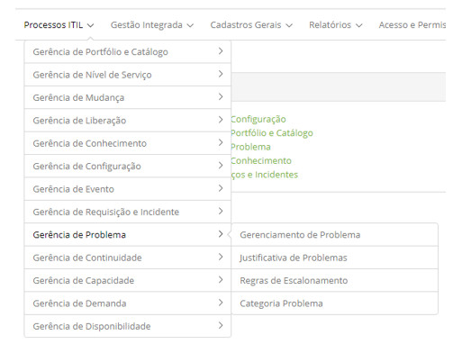

title:  Módulo Gerenciamento de Problema
Description: O principal objetivo do Gerenciamento de Problemas é minimizar o impacto adverso de incidentes e problemas. 
# Módulo Gerenciamento de Problema

Objetivo do módulo
--------------------

O processo de Gerenciamento de Problemas é responsável pela resolução definitiva e prevenção das falhas por trás dos incidentes que
afetam o funcionamento normal dos serviços de TI.

Segundo a ITIL, o principal objetivo do Gerenciamento de Problemas é minimizar o impacto adverso de incidentes e problemas causados
por erros na infraestrutura de TI no negócio e prevenir a reincidência destes erros. Esse processo busca encontrar a causa
principal dos problemas e iniciar a ação que eliminará o erro.

Onde estão suas funcionalidades
----------------------------------

Acesse o menu principal **Processos ITIL > Gerência de Problema**.

**Figura 1 - Menu do módulo Gerência de Problema.**

Principal funcionalidade (em destaque)
----------------------------------------

Na seção "Veja também" é possível acessar a(s) funcionalidade(s) principal(is) deste módulo, desta forma se pode obter um
conhecimento mais detalhado.

!!! abstract "SAIBA MAIS"

    Dependendo da sua permissão de acesso, é possível realizar uma série de ações nos registros de problemas, sendo: visualizar as 
    informações do registro de problema, agendar atividade referente ao problema, capturar problema para resolução, suspender o 
    atendimento do problema, reativar o problema que foi suspenso para atendimento, cancelar registro de problema, executar o 
    atendimento do problema e entre outras.
    
Veja também
-------------

- [Cadastro de problema](/pt-br/citsmart-platform-7/processes/problem/register-problem.html).

!!! tip "About"

    <b>Product/Version:</b> CITSmart | 7.00 &nbsp;&nbsp;
    <b>Updated:</b>07/29/2019 - Larissa Lourenço
