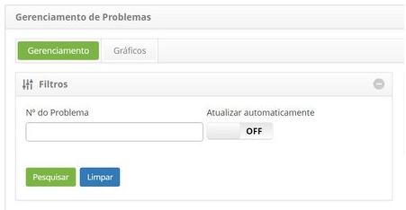
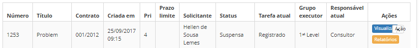
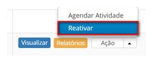

title: Reativação de problema
Description: Esta funcionalidade permite reativar um problema que foi suspenso.

# Reativação de problema

Esta funcionalidade permite reativar um problema que foi suspenso.

Como acessar
------------

1.  Acesse a funcionalidade de reativação de problema através da navegação no
    menu principal **Processos ITIL > Gerência de
    Problema > Gerenciamento de Problema**.

Pré-condições
-------------

1.  Ter problemas registrados (ver conhecimento [Cadastro de
    problema];

Filtros
-------

1.  O seguinte filtro possibilita ao usuário restringir a participação de itens
    na listagem padrão da funcionalidade, facilitando a localização dos itens
    desejados:

    -   Número do problema.

    

    **Figura 1 - Tela de filtros**

Listagem de itens
-----------------

1.  Os seguintes campos cadastrais estão disponíveis ao usuário para facilitar a
    identificação dos itens desejados na listagem padrão da
    funcionalidade: Número, Título, Contrato, Criada em, Prioridade, Prazo
    limite, Solicitante, Status, Tarefa atual, Grupo
    executor e Responsável atual.

2.  Existem botões de ação disponíveis ao usuário em relação a cada item da
    listagem, são eles: *Visualizar*, *Relatórios* e *Ação*.

    

    **Figura 2 - Tela de listagem de problemas**

Preenchimento dos campos cadastrais
-----------------------------------

1.  Não se aplica.

Reativando problema
-------------------

1.  Na guia **Gerenciamento**, localize o registro de problema que se deseja
    reativar, clique no botão *Ação* e na opção *Reativar*, conforme indicado na
    imagem abaixo:

    

    **Figura 3 - Tela de gerenciamento de problemas**

1.  Será exibida uma mensagem para confirmação da reativação. Clique
    em *OK* para efetuar a operação. A situação do problema será atualizada na
    lista de registro de problemas.

!!! tip "About"

    <b>Product/Version:</b> CITSmart | 8.00 &nbsp;&nbsp;
    <b>Updated:</b>07/16/2019 – Anna Martins

