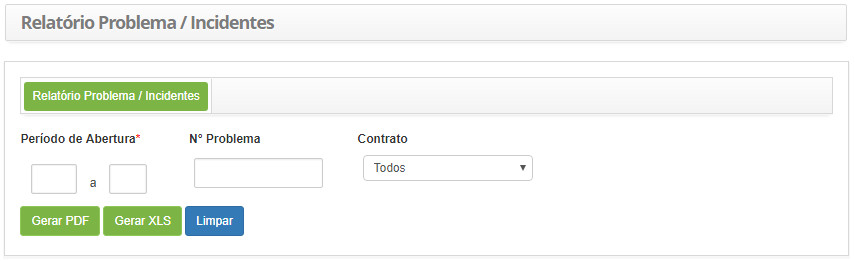
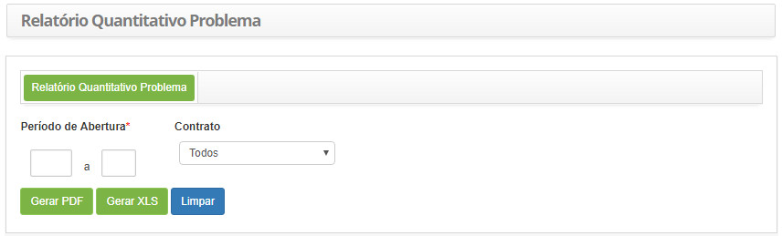
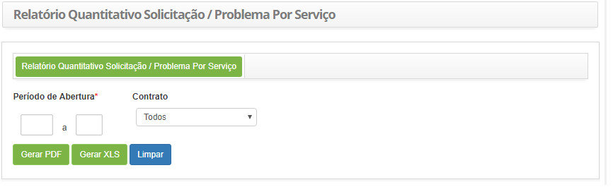

title:  Geração de relatórios - Gerência de Problemas
Description: Nos tópicos a seguir são apresentados os relatórios referentes ao gerenciamento de problemas. 
# Geração de relatórios - Gerência de Problemas

Nos tópicos a seguir são apresentados os relatórios referentes ao gerenciamento de problemas:

- Relatório de Problema/Incidentes;
- Relatório Quantitativo de Problema;
- Relatório Quantitativo de Solicitação/Problema por Serviço.

Em todos os casos existem opções de exportação:

- Clique no botão "Gerar PDF" para gerar o relatório problema/incidentes no formato PDF.
- Clique no botão "Gerar XLS" para gerar o relatório problema/incidentes no formato Excel.

Gerando relatório de problema/incidentes
------------------------------------------

*Esse relatório tem o objetivo de apresentar os incidentes relacionados ao problema*.

*Como acessar*

1. Acesse a funcionalidade de Relatório de Problema/Incidentes através da navegação no menu principal 
**Relatórios > Gerência de Problemas > Problema/Incidentes**.

*Filtros*

1. Os seguintes filtros possibilitam ao usuário restringir a participação de itens na listagem padrão da funcionalidade, 
facilitando a localização dos itens desejados:

    - **Período de Abertura**: informe o período que deseja verificar os incidentes relacionados ao problema;
    - **Nº Problema**: informe o número de identificação do problema para verificar os incidentes relacionados;
    - **Contrato**: informe o contrato referente ao problema, caso seja necessário.
    
2. Será apresentada a tela de **Geração de Relatório de Problema/Incidentes**, conforme ilustrada na figura a seguir:

    
    
    **Figura 1 - Tela de geração do relatório de problema/incidentes**
    
3. Defina os filtros conforme sua necessidade.

Gerando relatório quantitativo de problema
-----------------------------------------------

*Esse relatório tem o objetivo de apresentar a quantidade de problemas ocorridos*.

*Como acessar*

1. Acesse a funcionalidade de Relatório Quantitativo de Problema através da navegação no menu principal
**Relatórios > Gerência de Problemas > Quantitativo de Problema**.

*Filtros*

1. Os seguintes filtros possibilitam ao usuário restringir a participação de itens na listagem padrão da funcionalidade, 
facilitando a localização dos itens desejados:

    - **Período de Abertura**: informe o período que deseja gerar o relatório quantitativo de problema;
    - **Contrato**: selecione o contrato, caso queira verificar a quantidade de problemas registrados relacionados ao contrato.
    
2. Será apresentada a tela de **Geração de Relatório Quantitativo de Problema**, conforme ilustrada na figura a seguir:

    
    
    **Figura 2 - Tela de geração do relatório quantitativo de problema**
    
3. Defina os filtros conforme sua necessidade.

Gerando relatório quantitativo de solicitação/problema por serviço
--------------------------------------------------------------------

*Esse relatório tem o objetivo de apresentar a quantidade de solicitações e problemas que foram registrados, por serviço*.

*Como acessar*

1. Acesse a funcionalidade de Relatório Quantitativo de Solicitação/Problema por Serviço através da navegação no menu principal 
**Relatórios > Gerência de Problemas > Solicitação/Problema por Serviço**.

*Filtros*

1. Os seguintes filtros possibilitam ao usuário restringir a participação de itens na listagem padrão da funcionalidade, 
facilitando a localização dos itens desejados:

    - **Período de Abertura**: informe o período desejado para verificar a quantitativo de solicitações e problemas registrados,
    por serviço;
    - **Contrato**: informe o contrato para verificar a quantidade de solicitações e problemas de serviços relacionados.

2. Será apresentada a tela de **Geração de Relatório Quantitativo de Solicitação/Problema por Serviço**, conforme ilustrada na 
figura a seguir:

   
   
   **Figura 3 - Tela de geração de relatório quantitativo de solicitação/problema por serviço**
   
3. Defina os filtros conforme sua necessidade.

!!! tip "About"

    <b>Product/Version:</b> CITSmart | 7.00 &nbsp;&nbsp;
    <b>Updated:</b>08/02/2019 - Larissa Lourenço
