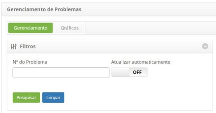
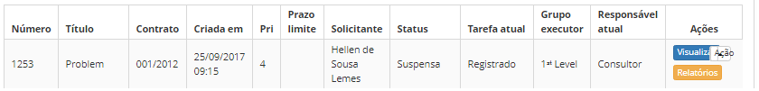
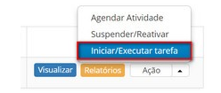
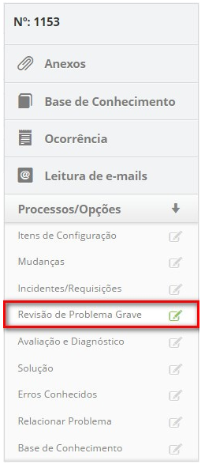
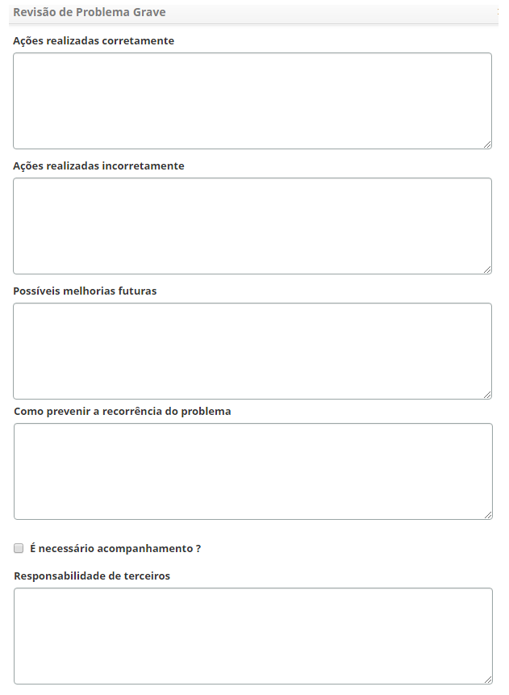
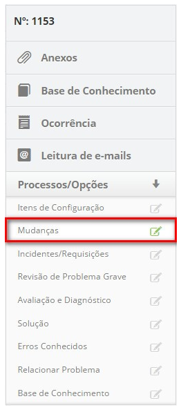
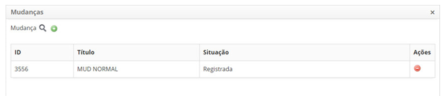

title: Cadastro de resolução de problema grave
description: Esta funcionalidade permite realizar o registro de resolução de problema grave

# Cadastro de resolução de problema grave

Esta funcionalidade permite realizar o registro de resolução de problema grave.

Como acessar
------------

1.  Acesse a funcionalidade de registro de resolução de problema grave através
    da navegação no menu principal **Processos ITIL > Gerência de
    Problema > Gerenciamento de Problema**.

Pré-condições
-------------

1.  Não se aplica.

Filtros
-------

1.  O seguinte filtro possibilita ao usuário restringir a participação de itens
    na listagem padrão da funcionalidade, facilitando a localização dos itens
    desejados:

    -   Número do problema

    
    
    **Figura 1 - Tela de filtros**

Listagem de itens
-----------------

1.  Os seguintes campos cadastrais estão disponíveis ao usuário para facilitar a
    identificação dos itens desejados na listagem padrão da
    funcionalidade: Número, Título, Contrato, Criada em, Prioridade, Prazo
    limite, Solicitante, Status, Tarefa atual, Grupo
    executor e Responsável atua.

2.  Existem botões de ação disponíveis ao usuário em relação a cada item da
    listagem, são eles: *Visualizar*, *Relatórios* e *Ação*.

    

    **Figura 2 - Tela de listagem de problema**

Preenchimento dos campos cadastrais
-----------------------------------

Nesta etapa, deve verificar se a solução aplicada resolveu o problema. Verificar
se será necessária uma mudança, caso seja, submeter uma requisição de mudança
(RDM) para o processo de Gerenciamento de Mudanças. Caso não seja necessária uma
mudança, executar as ações necessárias para resolução do problema e recuperação
do serviço. Registrar os detalhes completos da solução e ações no Problema.

1.  Na guia **Gerenciamento**, localize o registro de problema que deseja
    registrar a resolução, clique no botão *Ação* e selecione a
    opção *Iniciar/Executar tarefa*, conforme indicado na imagem abaixo:

    

    **Figura 3 - Tela de gerenciamento de problemas**

2.  Será exibida a tela de **Registro de Problema** com os campos preenchidos,
    referente ao registro selecionado.

    -  No quadro de **Fechamento**, registre as informações necessárias da execução
    da tarefa;

    -  Clique no botão *Adicionar Registro de Execução*;

    -  Descreva as informações sobre a execução da sua atividade.

    -  Registre as informações de revisão de problema grave;

    -  Clique na guia **Processos/Opções** e logo em seguida em **Revisão de
    Problema Grave**, localizada no canto direito da tela, conforme indicado na
    figura abaixo:

    

    **Figura 4 - Guia de revisão de problema grave**

    -  É apresentada a tela de cadastro de revisão de problema grave, conforme
    ilustrada na figura abaixo:

    

    **Figura 5 - Tela de registro de revisão de problema grave**

    -  Preencha os campos com as informações necessárias.

    -  Informe a mudança, caso for necessário para resolução do problema.

    -  Clique na guia **Processos/Opções** e logo em seguida em **Mudanças**,
    localizada no canto direito da tela, conforme indicado na figura abaixo:

    

    **Figura 6 - Guia de mudanças**

    -  Clique no ícone  para realizar a pesquisa da mudança que será feita para
    solucionar o problema;

    -  Será exibida uma tela para pesquisa de mudanças. Realize a pesquisa e
    selecione a mudança desejada. Após isso, a mudança será relacionada ao
    problema;

    

    **Figura 7 - Tela de relacionamento de mudanças**

    -  Caso queira remover uma mudança que foi relacionada para solucionar o
    problema, basta clicar no ícone  da mesma.

    -  Caso não encontre a mudança e haja a necessidade de registrar uma requisição
    de mudança, poderá registrá-la no sistema a partir dessa tela, basta clicar
    no ícone  de mudança.

    -  No quadro de **Fechamento**, registre as informações sobre a solução que foi
    realizada:

       * **Causa**: selecione a causa do problema;

       * **Categoria de Solução**: selecione a categoria de solução do problema, ou
    seja, o que foi usado para resolver o problema;

       * **Fechamento**: informe os detalhes da solução encontrada para o problema.

    -  Após registro das informações sobre a resolução do problema, clique no
    botão *Gravar e avançar o fluxo* para efetuar a operação, onde o problema e
    os incidentes relacionados serão finalizados com sucesso;

    -  Caso queira gravar somente as informações registradas sobre a resolução do
    problema e manter a tarefa atual, clique no botão *Gravar e manter a tarefa
    atual*;

    -  Em ambos os casos anteriores, a data, hora e usuário serão gravados
    automaticamente para uma futura auditoria.

!!! tip "About"

    <b>Product/Version:</b> CITSmart | 8.00 &nbsp;&nbsp;
    <b>Updated:</b>07/15/2019 – Anna Martins
