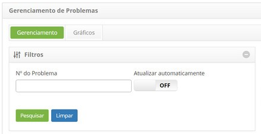
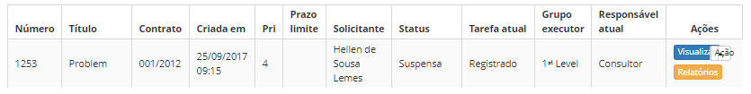
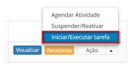

title: Cadastro de resolução do problema
Description:Esta funcionalidade permite realizar o registro de resolução de problema.

# Cadastro de resolução do problema

Esta funcionalidade permite realizar o registro de resolução de problema.

Como acessar
------------

1.  Acesse a funcionalidade de registro de resolução de problema através da
    navegação no menu principal **Processos ITIL > Gerência de
    Problema > Gerenciamento de Problema**.

Pré-condições
-------------

1.  Não se aplica.

Filtros
-------

1.  O seguinte filtro possibilita ao usuário restringir a participação de itens
    na listagem padrão da funcionalidade, facilitando a localização dos itens
    desejados:

    -   Número do problema.

    
    
    **Figura 1 - Tela de filtros**

Listagem de itens
-----------------

1.  Os seguintes campos cadastrais estão disponíveis ao usuário para facilitar a
    identificação dos itens desejados na listagem padrão da
    funcionalidade:** Número, Título, Contrato, Criada em, Prioridade, Prazo
    limite, Solicitante, Status, Grupo Executor **e **Responsável atual.**

2.  Existem botões de ação disponíveis ao usuário em relação a cada item da
    listagem, são eles: *Visualizar*, *Relatório *e *Ação*.

    

    **Figura 2 - Tela de listagem de problemas**

Preenchimento dos campos cadastrais
-----------------------------------

Nesta etapa, deve verificar se a solução aplicada resolveu o problema. Verificar
se será necessária uma mudança, caso seja, submeter uma requisição de mudança
(RDM) para o processo de Gerenciamento de Mudanças. Caso não seja necessária uma
mudança, executar as ações necessárias para resolução do problema e recuperação
do serviço. Registrar os detalhes completos da solução e ações no Problema*.*

**O membro do grupo designado para resolução deve capturar o problema e iniciar
a atividade.**

1.  Na guia **Gerenciamento**, localize o registro de problema que deseja
    registrar a resolução, clique no botão *Ação* e selecione a
    opção *Iniciar/Executar tarefa*, conforme indicado na imagem abaixo:

    

    **Figura 3 - Tela de gerenciamento de problemas**

1.  Será exibida a tela de **Registro de Problema** com os campos preenchidos,
    referente ao problema selecionado. No quadro de **Fechamento**, registre as
    informações necessárias;

-   Registre as informações da execução da tarefa de resolução do problema;

    -   Clique no botão *Adicionar registro de execução* e descreva as
        informações sobre a execução de sua atividade.

-   Registre as informações sobre a solução que foi realizada:

    -   **Causa**: selecione a causa do problema;

    -   **Categoria de Solução**: selecione a categoria de solução do problema,
        ou seja, o que foi usado para resolver o problema;

    -   **Fechamento**: informe os detalhes da solução encontrada para o
        problema.

-   Após registro das informações sobre a resolução do problema, clique no
    botão *Gravar e avançar o fluxo* para efetuar a operação, onde o problema e
    os incidentes relacionados serão finalizados com sucesso;

-   Caso queira gravar somente as informações registradas sobre a resolução do
    problema e manter a tarefa atual, clique no botão *Gravar e manter a tarefa
    atual*;

-   Em ambos os casos anteriores, a data, hora e usuário serão gravados
    automaticamente para uma futura auditoria.

!!! tip "About"

    <b>Product/Version:</b> CITSmart | 8.00 &nbsp;&nbsp;
    <b>Updated:</b>07/15/2019 – Anna Martins
