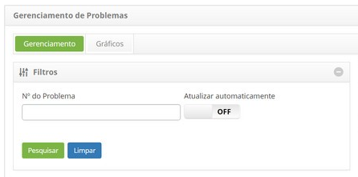
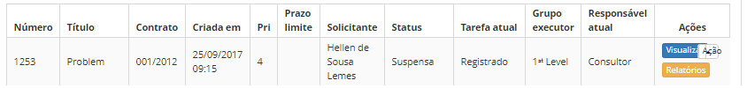
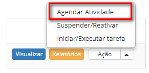
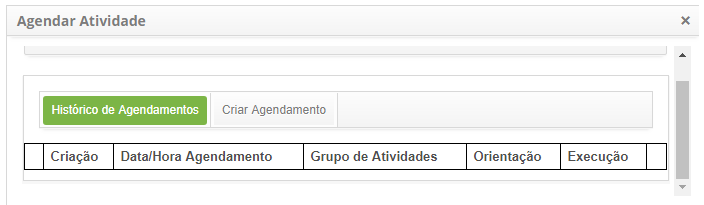
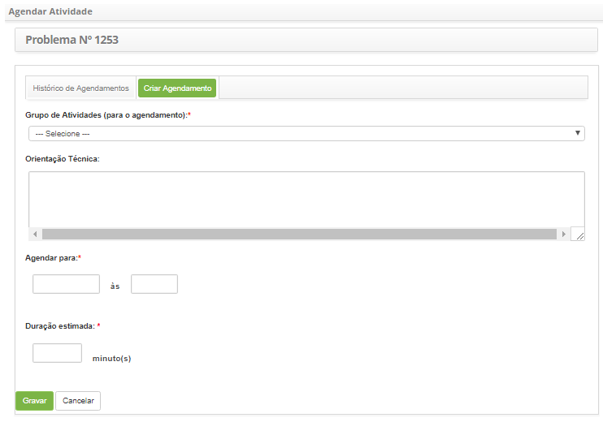

title: Agendamento de atividade de problema
Description:Esta funcionalidade permite criar e visualizar agendamento de atividades referente ao registro de problema.

# Agendamento de atividade de problema

Esta funcionalidade permite criar e visualizar agendamento de atividades
referente ao registro de problema.

Como acessar
------------

1.  Acesse a funcionalidade de agendamento de atividade através da navegação no
    menu principal **Processos ITIL > Gerência de Problema > Gerenciamento de Problema**.

Pré-condições
-------------

1.  Ter ao menos um problema cadastrado (ver conhecimento [Cadastro de
    problema];

2.  Ter os grupo de atividade periódica cadastrada (ver conhecimento [Cadastro e
    pesquisa de grupo de atividade periódica].

Filtros
-------

1.  O seguinte filtro possibilita ao usuário restringir a participação de itens
    na listagem padrão da funcionalidade, facilitando a localização dos itens
    desejados:

    -  Número do problema;

    

    **Figura 1 - Tela de pesquisa de problemas**

Listagem de itens
-----------------

1.  Os seguintes campos cadastrais estão disponíveis ao usuário para facilitar a
    identificação dos itens desejados na listagem padrão da
    funcionalidade: Número, Título, Contrato, Criada em, Prioridade, Prazo
    limite, Solicitante, Status, Tarefa atual, Grupo
    executor e Responsável atual.

2.  Existem botões de ação disponíveis ao usuário em relação a cada item da
    listagem, são eles: *Visualizar*, *Relatórios* e *Ação*.

    

    **Figura 2 - Tela de listagem de problemas**

Preenchimento dos campos cadastrais
-----------------------------------

1.  Não se aplica.

Agendando atividade
-------------------

1.  Na guia **Gerenciamento de Problemas**, localize o registro de problema que
    se deseja agendar a atividade, clique no botão *Ação* e selecione a
    opção *Agendar Atividade*, conforme indicado na imagem abaixo:

    

    **Figura 3 - Tela de gerenciamento de problemas**

1.  Será exibida uma janela para agendar atividades contendo duas abas, uma
    para **Histórico de Agendamentos** e outra para **Criar Agendamento**;

-   Na aba **Histórico de Agendamentos**, serão listados os Agendamentos das
    atividades que foram criados;

    

    **Figura 4 - Histórico de agendamento de atividades**

Preenchimento dos campos cadastrais
-----------------------------------

1.  Na aba **Criar Agendamento**, possui campos que devem ser preenchidos para
    agendamento da atividade referente ao registro de problema, conforme segue
    abaixo:

    

    **Figura 5 - Criar agendamento de atividades**

    -  **Grupo de Atividades (para o agendamento)**: selecione o Grupo de
    Atividades para o agendamento da atividade;

    -  **Orientação Técnica**: informe a Orientação técnica da atividade;

    -  **Agendar para**: informe a data e hora, período que será agendado para
    realizar a atividade;

    -  **Duração estimada**: informe a duração estimada em minutos, ou seja, o
    tempo que levará para realizar a atividade;

1.  Clique no botão *Gravar* para efetuar a operação, onde a data, hora e
    usuário serão gravados automaticamente para uma futura auditoria;

2.  Será exibida uma mensagem confirmando o sucesso do agendamento da atividade.

!!! tip "About"

    <b>Product/Version:</b> CITSmart | 8.00 &nbsp;&nbsp;
    <b>Updated:</b>07/15/2019 – Anna Martins
