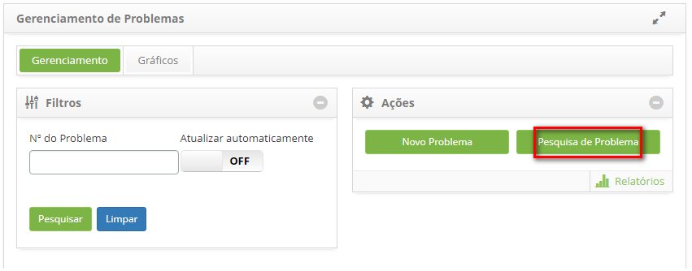
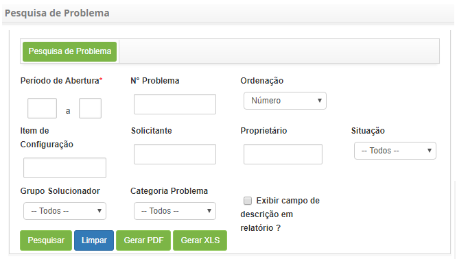
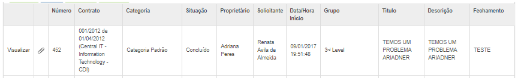
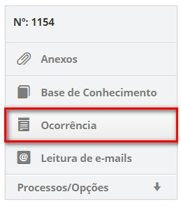
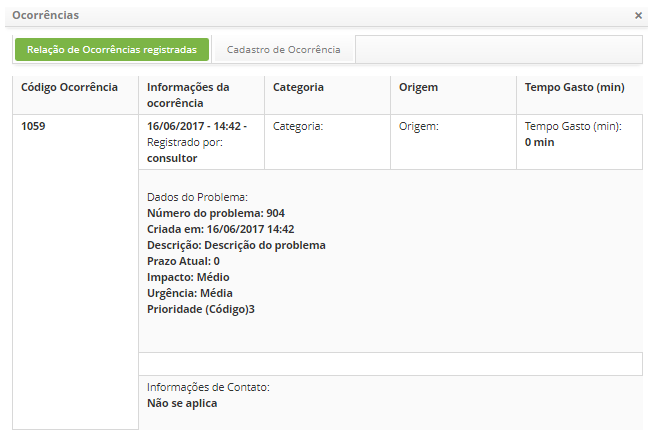

title: Pesquisa de problema
Description: Buscar os problemas ocorridos de acordo com filtros definidos pelo
usuário.

# Pesquisa de problema

Buscar os problemas ocorridos de acordo com filtros definidos pelo usuário.

Como acessar
------------

1.  Acesse a funcionalidade de pesquisa de problema através da navegação no menu
    principal Processos ITIL  Gerência de Problema  Gerenciamento de Problema.

Pré-condições
-------------

1.  Não se aplica.

Filtros
-------

1.  Os seguintes filtros possibilitam ao usuário restringir a participação de
    itens na listagem padrão da funcionalidade, facilitando a localização dos
    itens desejados:

    -   Número do Problema.

1.  Na guia de **Gerenciamento**, clique no botão *Pesquisa de
    Problema* conforme indicado na figura abaixo:

    

    **Figura 1 - Tela de gerenciamento de problemas**

1.  É apresentada a tela de **Pesquisa de Problema** contendo campos onde poderá
    definir os filtros necessários para sua pesquisa;

    
    
    **Figura 2 - Tela de pesquisa de problemas**

    -  **Período de abertura**: informe o período desejado;

    -  **Nº Problema**: informe o número do registro do problema;

    -  **Ordenação**: selecione a ordenação;

    -  **Item de Configuração**: informe o item de configuração referente ao
    problema que deseja pesquisar;

    -  **Solicitante**: informe o solicitante referente ao problema que deseja
    pesquisar;

    -  **Proprietário**: informe o proprietário referente ao problema que deseja
    pesquisar;

    -  **Situação**: selecione o status referente ao problema que deseja pesquisar;

    -  **Grupo Solucionador**: selecione o grupo solucionador referente ao problema
    que deseja pesquisar;

    -  **Categoria Problema**: selecione a categoria do problema;

    -  Caso queira que a descrição do problema seja exibida no relatório, marque a
    opção **Exibir campo de descrição em relatório?**;

1.  Após os filtros definidos, clique no botão *Pesquisar* para efetuar a
    operação;

2.  Serão listados os registros de problemas, conforme os filtros escolhidos,
    abaixo dos botões *Pesquisar*, *Limpar* e *Gerar relatórios;*

3.  Ao lado de cada registro de problema da lista, há ícones que permite
    realizar as seguintes ações: visualizar as informações e os anexos do
    registro do problema;

4.  Caso seja necessário, clique no botão *Gerar PDF* para gerar o relatório de
    problema em formato PDF;

5.  Caso seja necessário, clique no botão *Gerar XLS* para gerar o relatório de
    problema em formato Excel.

Listagem de itens
-----------------

1.  Os seguintes campos cadastrais estão disponíveis ao usuário para facilitar a
    identificação dos itens desejados na listagem padrão da
    funcionalidade: Número, Contrato, Categoria, Situação, Proprietário, Solicitante,  Data/Hora
    Início, Grupo, Título, Descrição e Fechamento.

2.  Existem botões de ação disponíveis ao usuário em relação a cada item da
    listagem, são eles: *Visualizar* e *Visualizar anexos*.

        
    
    **Figura 3 - Tela de listagem de pesquisa de problemas**

1.  Para visualizar os anexos da solicitação, clique no ícone  . Será aberta uma
    janela exibindo o registro do determinado problema para visualização.

Preenchimento dos campos cadastrais
-----------------------------------

1.  Não se aplica.

Visualizando as informações do registro de problema
---------------------------------------------------

1.  Após a pesquisa, é possível visualizar as informações do registro de
    problema, basta clicar em *Visualizar* (conforme a figura anterior):

    -  Será exibida a tela de registro do determinado problema para
    visualização. Clique na guia **Ocorrência**, localizada no canto superior
    direito da tela, conforme indicado na figura abaixo:

    
    
    **Figura 4 - Guia de ocorrências**

    -  Será exibida a tela de ocorrências, conforme exemplo ilustrado na figura
    abaixo:

    

    **Figura 5 - Tela de histórico de ocorrência**

!!! tip "About"

    <b>Product/Version:</b> CITSmart | 8.00 &nbsp;&nbsp;
    <b>Updated:</b>07/16/2019 – Anna Martins
