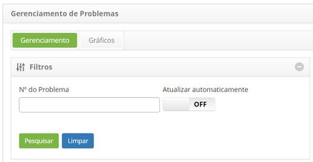
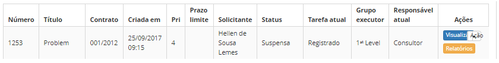
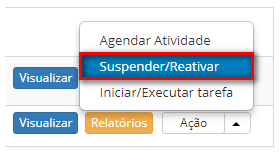
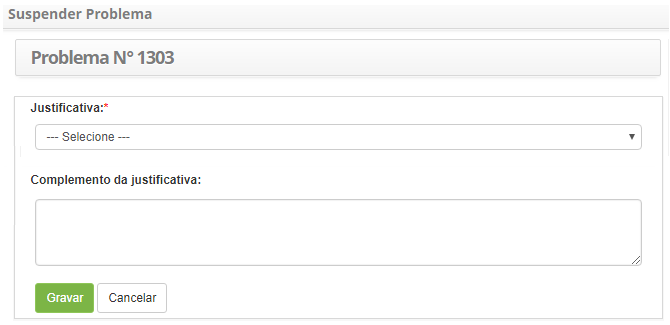
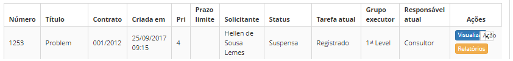

title: Suspensão de problema
Description: Esta funcionalidade permite reativar um problema que foi suspenso.

# Suspensão de problema

Esta funcionalidade permite suspender o registro de problema.

Como acessar
------------

1.  Acesse a funcionalidade de suspensão de problema através da navegação no
    menu principal **Processos ITIL > Gerência de Problema > Gerenciamento de
    Problema**.

Pré-condições
-------------

1.  Ter um problema registrado (ver conhecimento [Cadastro de
    problema]();

2.  Cadastrar justificativa de problema (ver conhecimento [Cadastro e pesquisa
    de justificativa de
    problema]().

Filtros
-------

1.  O seguinte filtro possibilita ao usuário restringir a participação de itens
    na listagem padrão da funcionalidade, facilitando a localização dos itens
    desejados:

    -   Número do problema.

    

    **Figura 1 - Tela de pesquisa de problema**

Listagem de itens
-----------------

1.  Os seguintes campos cadastrais estão disponíveis ao usuário para facilitar a
    identificação dos itens desejados na listagem padrão da
    funcionalidade: Número, Título, Contrato, Criada em, Prioridade, Prazo
    limite, Solicitante, Status, Tarefa atual, Grupo executor e Responsável
    atual.

2.  Existem botões de ação disponíveis ao usuário em relação a cada item da
    listagem, são eles: *Visualizar*, *Relatórios* e *Ação*.

    

    **Figura 2 - Tela de listagem de problema**

Preenchimento dos campos cadastrais
-----------------------------------

1.  Não se aplica.

Suspendendo problema
--------------------

1.  Na guia **Gerenciamento**, localize o registro de problema que se deseja
    suspender, clique no botão *Ação* e na opção *Suspender/Reativar*, conforme
    indicado na figura abaixo:

     

    **Figura 3 - Tela de gerenciamento de problemas**

1.  Será exibida uma janela para registro da justificativa de suspensão do
    problema:

    

    **Figura 4 - Registro da justificativa de suspensão do problema**

    -  **Justificativa**: selecione a Justificativa de suspensão do problema. Esta
    justificativa já deve estar previamente cadastrada no sistema para que possa
    selecioná-la;

    -  **Complemento da Justificativa**: informe o complemento da justificativa de
    suspensão do problema;

    -  Após os dados informados, clique no botão *Gravar*. Será exibida uma
    mensagem para confirmação da suspensão, clique no botão *OK* para efetuar a
    operação, onde a data, hora e usuário serão gravados automaticamente para
    uma futura auditoria;

1.  A situação do problema será atualizada na lista de registros de problema
    para Suspensa, conforme ilustrado na figura abaixo:

    

    **Figura 5 - Tela de gerenciamento de problemas**

!!! tip "About"

    <b>Product/Version:</b> CITSmart | 8.00 &nbsp;&nbsp;
    <b>Updated:</b>07/16/2019 – Anna Martins
