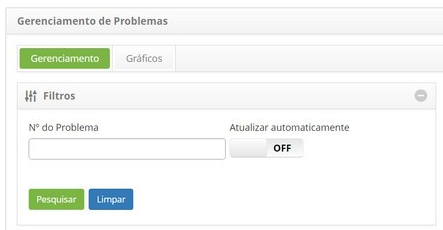
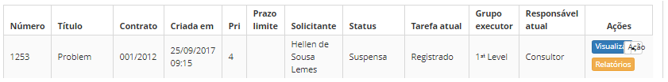
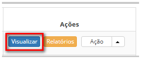

title: Visualização de problema
Description: Esta funcionalidade permite visualizar as informações do registro
de problema.

# Visualização de problema

Esta funcionalidade permite visualizar as informações do registro de problema.

Como acessar
------------

1.  Acesse a funcionalidade de visualização de registro de problema através da
    navegação no menu principal **Processos ITIL > Gerência de Problema >
    Gerenciamento de Problema**.

Pré-condições
-------------

1.  Ter um problema registrado (ver conhecimento [Cadastro de
    problema]().

Filtros
-------

1.  Os seguintes filtros possibilitam ao usuário restringir a participação de
    itens na listagem padrão da funcionalidade, facilitando a localização dos
    itens desejados:

-   Número do problema

    

    **Figura 1 - Tela de pesquisa de problemas**

Listagem de itens
-----------------

1.  Os seguintes campos cadastrais estão disponíveis ao usuário para facilitar a
    identificação dos itens desejados na listagem padrão da
    funcionalidade: Número, Título, Contrato, Criada em, Prioridade, Prazo
    limite, Solicitante, Status, Tarefa atual, Grupo executor e Responsável
    atual.

2.  Existem botões de ação disponíveis ao usuário em relação a cada item da
    listagem, são eles: *Visualizar*, *Relatórios* e *Ação*.

    

    **Figura 2 - Tela de listagem de problema**

Preenchimento dos campos cadastrais
-----------------------------------

1.  Não se aplica.

Visualizando um problema
------------------------

1.  Na guia **Gerenciamento**, localize o registro de problema que deseja
    visualizar e clique no botão *Visualizar* do mesmo, conforme indicado na
    imagem abaixo:

    

    **Figura 3 - Tela de Gerenciamento de Problemas**

1.  Será aberta a tela para visualização das devidas informações;

2.  Se desejar realizar a impressão das informações do registro de problema,
    clique no botão *Imprimir PDF* ou *Imprimir Xls*.

!!! tip "About"

    <b>Product/Version:</b> CITSmart | 8.00 &nbsp;&nbsp;
    <b>Updated:</b>07/16/2019 – Anna Martins
