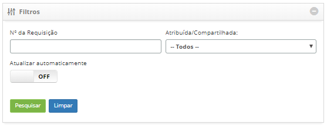
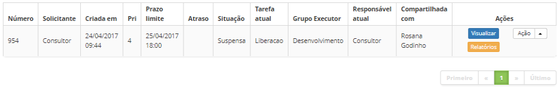
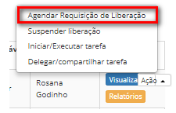
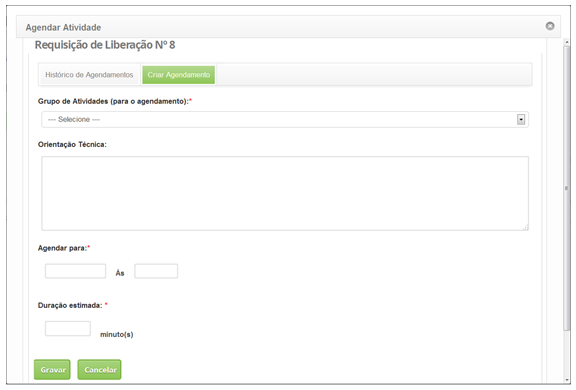

title: Agendamento de atividade de liberação
Description:Permite agendar atividades referente à requisição de liberação para execução.

# Agendamento de atividade de liberação

Esta funcionalidade permite agendar atividades referente à requisição de
liberação para execução.

Como acessar
------------

1.  Acesse a funcionalidade de Gerenciamento de Liberação através da
    navegação no menu principal **Processos ITIL > Gerência de
    Liberação > Gerenciamento de Liberação**.

Pré-condições
-------------

1.  Ter requisição de liberação registrada (ver conhecimento [Cadastro e
    pesquisa de requisição de
    liberação]();

2.  Ter o grupo de atividade periódica cadastrado (ver conhecimento [Cadastro e
    pesquisa de grupo de atividade
    periódica]().

Filtros
-------

1.  O seguinte filtro possibilita ao usuário restringir a participação de itens
    na listagem padrão da funcionalidade, facilitando a localização dos itens
    desejados:

    -   Número da requisição;

    -   Atribuída/Compartilhada.

    

    **Figura 1 - Tela de pesquisa**

Listagem de itens
-----------------

1.  Os seguintes campos cadastrais estão disponíveis ao usuário para facilitar a
    identificação dos itens desejados na listagem padrão da
    funcionalidade: **Número**, **Solicitante**, **Criada em**, **Prioridade**,
    **Prazo limite**, **Atraso**, **Situação**, **Tarefa atual**, **Grupo**
    **executor**, **Responsável atual** e **Compartilhada com**.

2.  Existem botões de ação disponíveis ao usuário em relação a cada item da
    listagem, são eles: *Visualizar* e *Relatórios*.

**Figura 2 - Tela de listagem de itens**

Agendando uma atividade
-----------------------

1.  Será apresentada a tela de Gerenciamento de Liberação;

2.  Na guia **Gerenciamento**, localize a requisição de liberação que se deseja
    agendar a atividade, clique no botão *Ações* e selecione a opção *Agendar
    Requisição de Liberação*:

**Figura 3 - Agendamento de atividade da requisição de liberação**

Preenchimento dos campos cadastrais
-----------------------------------

1.  Ao selecionar a opção Agendar Requisição de Liberação (segundo a figura
    anterior), será exibida a tela de Agenda de Atividade. Clique na aba **Criar
    Agendamento**.

2.  Feito isso, será apresentada a tela onde poderá agendar a atividade
    referente a requisição de liberação, conforme a figura abaixo:

    

    **Figura 4 - Agendamento de atividades**

1.  Preencha os seguintes campos:

    -   **Grupo de Atividades (para o agendamento)**: selecione o grupo que irá
    executar a atividade de liberação;

    -   **Orientação Técnica**: informe a orientação técnica para execução da
    atividade;

    -   **Agendar para**: informe a data e hora que será executada a atividade;

    -   **Duração estimada**: informe a duração estimada, em minutos, ou seja, o
    tempo que levará para realizar a atividade.

1.  Após os dados informados, clique no botão *Gravar* para efetuar a operação,
    onde a data, hora e usuário serão gravados automaticamente para uma futura
    auditoria.

!!! tip "About"

    <b>Product/Version:</b> CITSmart | 8.00 &nbsp;&nbsp;
    <b>Updated:</b>07/12/2019 – Anna Martins
