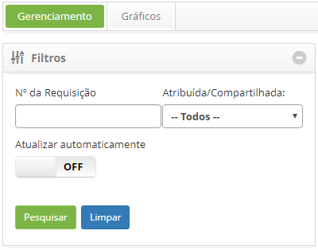
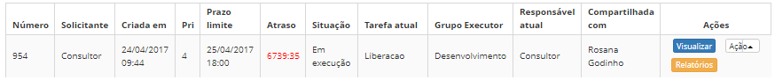

title: Autorização da execução de liberação

Description: Esta funcionalidade permite autorizar a execução da liberação.

# Autorização da execução de liberação

Esta funcionalidade permite autorizar a execução da liberação.

Como acessar
------------

1.  Acesse a funcionalidade de Gerenciamento de Liberação através da
    navegação no menu principal **Processos ITIL \> Gerência de
    Liberação \> Gerenciamento de Liberação**.

Pré-condições
-------------

1.  Ter permissão para executar a liberação (ver conhecimento [Cadastro e
    pesquisa de perfil de
    acesso]()

Filtros
-------

1.  Os seguintes filtros possibilitam ao usuário restringir a participação de
    itens na listagem padrão da funcionalidade, facilitando a localização dos
    itens desejados:

    -   Número da liberação;

    -   Atribuída/Compartilhada.

**Figura 1 - Tela de pesquisa liberação**

Listagem de items
-----------------

1.  Os seguintes campos cadastrais estão disponíveis ao usuário para facilitar a
    identificação dos itens desejados na listagem padrão da
    funcionalidade: **Número, Solicitante, Criada em, Prioridade, Prazo limite,
    **Atraso, Situação, Tarefa atual, Grupo Executor, Responsável**
    **atual** e **Compartilhado com**.

2.  Existem botões de ação disponíveis ao usuário em relação a cada item da
    listagem, são eles: *Visualizar*, *Relatórios *e *Ação*.

    

    **Figura 2 - Tela de listagem de liberação**

    !!! info "IMPORTANTE"

     **Somente o “solicitante” pode autorizar a execução da liberação**

1.  Será apresentada a tela de Gerenciamento de
    Liberação. Na guia **Gerenciamento**, localize a liberação que será liberada
    para execução, clique no botão *Ações* e selecione a opção *Iniciar/Executar
    tarefa*, conforme indicado na figura abaixo:

    

    **Figura 3 - Autorizar liberação para execução**

1.  Será exibida a tela de **Registro de Liberação** com os campos preenchidos,
    com o conteúdo referente à liberação selecionada;

2.  Verifique se as informações do registro de liberação estão corretas e clique
    no botão *Gravar e avançar o fluxo* para efetuar a operação, onde a
    liberação será encaminhada para o grupo executor realizar sua execução,
    neste caso a data, hora e usuário serão armazenados automaticamente para uma
    futura auditoria.

Preenchimento dos campos cadastrais
-----------------------------------

1.  Não se aplica.

!!! tip "About"

    <b>Product/Version:</b> CITSmart | 8.00 &nbsp;&nbsp;
    <b>Updated:</b>07/12/2019 – Anna Martins
